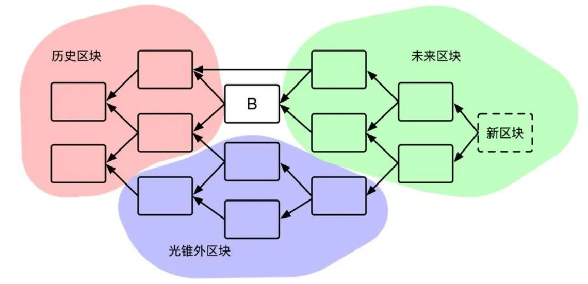
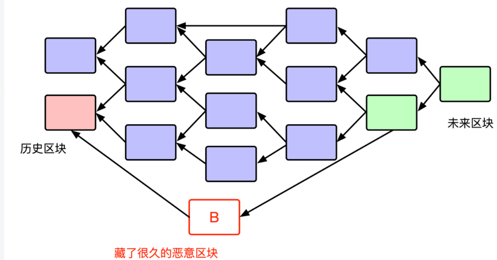

本文参考文件为：[CFX黄皮书导读](https://blog.csdn.net/weixin_44282220/article/details/109759233)  

> 从11月底开始，对于每一周的笔记，命名为CFX[周数]-[这周的第几次笔记]

## 第七章 存储抵押

[存储押金机制](mp.weixin.qq.com/s/7wxDxnXkaNhTFfr7ASlHNQ)

**交易信息临时占用存储，合约变量信息永久占用存储。**

Gas 所代表的计算资源，是在交易**执行期间**，被一个又一个**指令执行消耗**掉的。

存储押金所代表的存储资源，是在交易执行结束后，将执行结果从缓存写入到硬盘时，才开始消耗的。

<!--more-->

>对于全节点而言，交易信息对存储的占用是**临时的**。交易发生一段时间后，全节点可以安全地删除交易信息，让档案节点提供查询服务，自己专注于通过共识协议维护区块链系统的正常运行。**然而，智能合约的变量信息需要被所有全节点永久存储，需要所有存活的全节点持续付出存储成本。**如果将存储费用一次性支付给打包该笔交易的节点（矿工），则无法体现其他全节点实际付出的存储成本。

在账本模型的区块链下，之前的转账交易信息不是处理新交易所必须的信息。CFX设计中，转账记录在足够长时间后，转账记录会被全节点删去，只留下相应区块的哈希值。

```python
'''
区块头:树图结构+工作量证明+含有这个区块交易和交易执行结果的默克尔树根（Merkle Root）。
这里的默克尔树根实际上就是一个代表了当前的数据内容的哈希值。Conflux 的每个区块头包含 3 个这样哈希值：

 交易哈希根 (Transaction Root)：对应于区块内所有交易内容。

 状态哈希根 (State Root)：对应于交易执行后的“世界状态”，包括每个账户地址的余额和所有智能合约的状态。（由于采用了延迟执行的策略，在 Conflux 里区块头里的状态根对应的是执行了之前区块里的交易后的状态，该区块内的交易将延迟到更晚的区块才会执行。）

 交易收据哈希根 (Receipt Root)：对应于合约执行过程中产生的收据。包括执行是否成功，执行过程中是否触发了转账等。
 
如同手机用户不知道自己的交易数据记录，但是知道自己的话费（账本余额）。

如果某个用户想要获得较早的交易数据和执行结果，则他可以从“档案节点”那里查询，并通过比对区块头中的哈希值来判断档案节点提供的数据是否正确。（这里每一个哈希值本质上都是一个 Merkle Tree 的 Root Hash，所以档案节点只需提供被查询数据的默克尔证明 Merkle Proof 就可以了，而不用传输整个区块。）
'''
```

执行交易时所必须读取的信息：账户余额信息+智能合约的**变量信息**。

当执行智能合约时，如果由于修改变量占用了存储空间，交易发起人就要支付存储押金。当被修改的变量被置为 0 时，Conflux 将不再存储相应变量的内容（也就是说，没有被显式地存储的变量默认值即为0），此时，**为该变量支付的存储押金会被退还给当初的支付者**。

### **7.1.2 用押金的利息给矿工存储费**

这样，为占用存储空间支付的钱将成为押金而非费用。在存储空间的使用期间，**押金会产生年化 4.08% 的利息**，这些利息将直接分配给矿工，用于补偿矿工们的存储成本。存储押金的价格锁定为 **1 CFX/KB**。例如，如果当前共有 **100 GB** 的数据需要存储，那么存储押金总量大约是**一亿 CFX**，平均每个区块产生的利息约为 **0.06 CFX**。


如果一个用户修改了智能合约的变量，而这个变量之前已经有另一个人付过押金了，那么智能合约就会将先前支付的押金退还，并要求这个修改变量的用户支付押金。

7.3 多层合约调用

**在 Conflux 的存储押金机制设计中，无论合约经过了几层调用，都由最初发起交易的用户支付整个交易执行期间产生的所有存储押金**。

该机制带来的两种交易执行失败：

- 所占用的存储空间超过了 Storage Limit
- 用户的余额**不足以支付 Storage Limit 的存储押金**

### 7.1.3 存储押金和Gas的差异

执行前的不收取，不锁定；执行中的不实时检查；执行后，执行结果写入硬盘时才收取。

存储押金在交易执行前**不会被锁定**。打个比方说，如果交易发起人的账户有 10 CFX，交易费需要支付 5 CFX，那么在交易执行期间，发起人可用的余额只有 5 CFX。但如果交易的发起人付完交易费的账户余额有 5 CFX，Storage Limit 是 3KB (需要 3 CFX) 的存储押金，那么交易执行期间，**账户可用的余额是 5 CFX 而不是 2 CFX**。

在交易执行中，**实时检查剩余的 Gas** 是否足够，一旦不足，会立刻停止执行。

而修改合约变量时，却不会立即收取存储押金，也不会实时检查存储押金是否充足。也就是说，如果一笔交易的执行过程中，申请了大量的存储，但在同一笔交易中又释放了这些存储空间，那么这笔交易不会被收取任何存储押金费用，也不会因为 Storage Limit 不足而失败。正如之前所说，**存储资源的消耗是在交易执行结束，交易执行结果从缓存写入硬盘后才产生的**。所以，存储押金的收取也是在整个交易执行结束后进行，而 Storage Limit 检查是在关注“新增存储占用 减 新增存储释放”的差值。

---


### 7.2.1 代付机制和存储押金机制的结合

[存储押金代付视频讲解](https://www.chaindd.com/3329319.html)

继Conflux-Notebook4的**CFX的Sponsorship**节内容，

对gas fee和collateral的赞助者地址，赞助余额，但是只有一个gas fee的单笔赞助上限，和一个代付白名单。

合约的余额和赞助余额是两个概念。

1.用户指定的storage limit过高时，超过了存储押金赞助余额，就要求由用户支付，而不是合约支付一部分，用户付一部分。由于7.1.2节的内容，方便界定钱是谁付的。

2.conflux里的内置合约规定，新赞助地址替代老赞助地址时，需要由新返还老全部余额。押金只会由一个人来支付，**不支持增量的赞助**，对于赞助者地址切换情形不友好。对于开发者，建议自己使用另外的合约，这样可以灵活赞助。

## 第八章 内置合约

更好地进行系统维护和链上治理，Conflux 网络引入了一些内置合约。

目前，内置合约有三种：AdminControl 合约，SponsorWhitelistControl 合约以及 Staking 合约。本章节的主要内容，是关于如何使用这些内置合约。

> 参考[《Conflux 内置合约功能介绍》](juejin.im/post/6876330619798814728)

### 8.1 AdminControl合约

一个合约不可成为管理者。

`AdminControl` 合约是一款用于合约开发的调试工具。 在交易过程中创建合约时，当前交易的发送者会自动成为合约的管理者（admin）。发送者可以把管理权益转交给其他的**普通用户地址**或**零地址**。非零的管理者地址，ConfluxScan会将合约标记为调试模式。**因此请记住，如果你认为你的合约已经准备好进入实际生产环境，你应当将管理者地址设置为零地址。**

### 8.2 SponsorControl**合约**

一个合约账户也被允许成为赞助者。

在进行子调用（Message Call）时，Conflux不会再次检查赞助情况。例如，如果一个普通用户地址 `A` 调用合约 `B` ，然后合约 `B` 调用合约 `C`, Conflux仅仅会检查 `A` 是否被合约 `B` 赞助。如果 `A` 被赞助，`B` 会在交易执行过程中负担全部的燃料费用和/或存储抵押费用，包含 `B` 调用 `C` 的费用。换句话说，只有交易的发送者才能被赞助，`B` 不可能被赞助。

- `whitelist` ：有资格获得补贴的普通用户地址列表，全零地址则代表所有用户地址。只有合约自身和管理员有权限改动该列表。

 提供燃料补贴的账户和存储押金补贴的账户都可以通过与 **SponsorControl** 合约交互完成。合约当前的赞助账户可以直接追加补贴余额，也可以在满足一定条件下提高 `sponsor_limit_for_gas_fee`。其他普通用户账户如果提供高于当前余额的资金，可以将原先的赞助者取而代之。更具体的细节如下。

#### 8.2.2 赞助者替换

为了替换合约的 `sponsor_for_gas` ，新的赞助者需要调用函数 `setSponsorForGas(address contractAddr, uint upperBound)` 并向内置合约转移一笔资金。只有在满足下述条件时才能完成燃料费用赞助者的替换：

1. 转移的资金应当比合约当前的 `sponsor_balance_for_gas` 高。
2. `sponsor_limit_for_gas_fee` 的新值（被指定为 `upperBound` 参数）应当不小于原赞助者的限制，除非原本的 `sponsor_balance_for_gas` 无法负担原赞助者的限制。
3. 转移的资金应为新限额的1000倍以上，以便足以补贴至少 `1000` 次调用合约的交易。

对 `sponsor_for_collateral` 的替换与替换燃料赞助者的方式类似，处理没有燃料限额的逻辑。方法是 `setSponsorForCollateral(address contractAddr)` 。新的赞助者需要向合约转移一笔比目前余额更多的资金。随后当前 `sponsor_for_collateral` 赞助的金额会被全部退还，即 `sponsor_balance_for_collateral` 和合约当前所有存储抵押金之和，两个与存储押金赞助相关的字段将按照新赞助者的要求进行相应的变更。

#### 8.2.3 提高赞助额度

赞助者可以在无需更换赞助者的情况下提供额外的赞助资金。在该情况下，赞助人需要调用函数 `setSponsorForGas(address contractAddr, uint upperBound)` 或 `setSponsorForCollateral(address contractAddr)` 并满足赞助者替换的三条要求中的条件 2,3. 如果满足相关需求，交易的赞助资金会被加入赞助余额中且 `sponsor_limit_for_gas_fee` 也会相应地被更新。

#### 8.2.4 白名单列表维护

只有合约本身或合约管理者可以更新合约白名单列表。赞助者则无权变更白名单列表。

合约可以通过调用 `addPrivilege(address[] memory)` 将任何地址加入到白名单列表中。这意味着如果 `sponsor_for_gas` 被设置，合约会为白名单列表中的账户支付存储押金。全零地址是一个特殊的地址 `0x0000000000000000000000000000000000000000` 。如果该地址被加入白名单列表，则所有调用该合约的交易都会被赞助，要谨慎使用。合约还可以调用方法 `removePrivilege(address[] memory)` 将部分正常账户从白名单列表中移除。移除一个不存在的地址不会导致错误或异常。

**需要注意的细节：**

1. 一个合约地址也可被加入到白名单列表中，但该操作无任何意义，因为只有交易的发送者可以被赞助。

### 8.3 Staking合约

Conflux引入权益质押机制的原因有两个：一、权益机制提供了一种对占用存储空间更好的收费方式（相比于“一次付费，永久占用”）。二、该机制还有助于定义分散治理中的投票权。

#### 利率

目前的年化利率为4.08%。 复利是以区块的颗粒度来实现的。

如果在执行区块 `B` 中的交易时，尝试提取 价值 `v` 并且在区块 `B'` 中抵押的资金，其利息计算公式如下：

```
interest issued = v * (1 + 4% / 63072000)^T - v
```

其中 `T = BlockNo(B)−BlockNo(B')` 是以区块数目衡量的质押时长，而 `63072000` 是在区块生成时间为 `0.5` 秒前提下 `365` 天生成区块数目的期望值。

##### 锁定与投票权

通过锁定质押余额，用户可获取*投票权*以进一步进行链上治理。通过调用 `voteLock(uint amount, uint unlock_block_number)` 函数，一个帐户可以做出如下承诺：“我的 `stakingBalance` 在未来 `unlock_block_number` 中将始终具有至少 `amount` 的资金”。

**一旦做出承诺，无法取消！**但是该账户可通过锁定更多的金额覆盖原有的承诺。每当账户尝试提取 `stakingBalance` 时，内部合约会检查剩余余额是否与锁定承诺吻合。锁定对利息无任何影响。当账户成功取出抵押余额时，利息会将照常计算。

在任何时间，每一个锁定的金额将根据其解锁时间被分配0到1的*表决权*。锁定期超过1年的部分将拥有全额的投票权利。


[推测区块的生成时间——曾经的尝试](https://blog.csdn.net/weixin_44282220/article/details/104957969)

## 如何判断一个区块是否足够老？

要判断一个区块是否**足够老**，最简单的判别依据自然是收到这个区块的时间。所有基于工作量证明的共识系统都必须假设每个区块广播到全网（绝大部分诚实节点）所需的时间都是有上限的。因此，诚实节点生成的区块到达（绝大多数）全节点的时间误差不会超过一次广播的延迟 d。

那些被雪藏了很久的区块也很容易被辨别出来。因为一个区块不可能引用生成时间比它更晚的区块，所以我们可以根据“没有引用的区块”来推测一个区块是否被雪藏了很久。如果一个区块**漏掉了很多足够老的区块没有引用**，那么这个区块本身肯定也不会年轻到哪里。


在一个有向无环图里，两个区块 A 和 B 的关系有三种：1) 从 A 出发可以抵达 B；2) 从 B 出发可以抵达 A；3) 其他——A 和 B之间没有有向道路连接。于是，对于一个树图结构中的给定区块 B，我们可以按照上述三种关系把树图中其他区块分为三类：历史区块，未来区块，光锥外区块。



1.根据未来区块判断一个诚实的区块是否**足够老**，问题如下：



2.用“光锥外区块+未来区块”数量推测区块的年龄的隐患


坏人可以预先制造并储备大量的“光锥外区块”，从而让一个新生成的好人区块显得**足够老**。