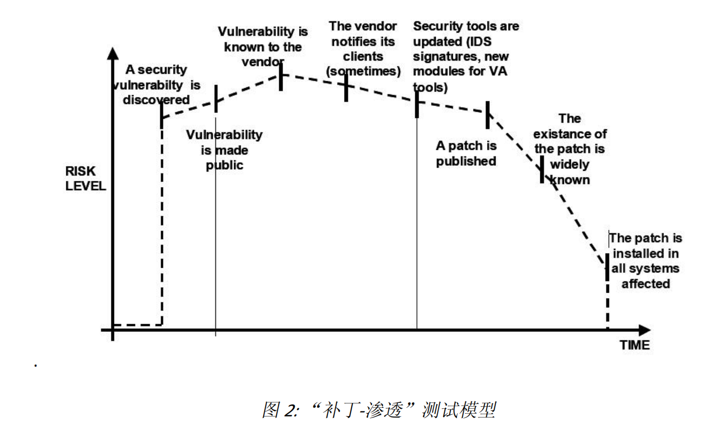

> http://www.owasp.org.cn/OWASP-CHINA/owasp-project/download/OWASP_testing_guide.pdf

应用安全测试最重要的方面可能就是必须**在有限的时间**内**尽可能多地覆盖**应用程序的各个方面，安全问题深度隐藏在业务逻辑和定制应用设计中。

## 何时测试？

通用软件开发生命周期(SDLC)模型：定义-->设计-->开发-->部署-->维护

最佳的方法之一是将安全测试融入到软件开发生命周期每一个阶段以防止安全漏洞的出现

安全是一个过程，不是某个产 品。

安全威胁模型（帮助区分系统中的哪些部分的 特定资源是危险的）

## 测试流程

### 1.了解测试软件

结构，数据流程图，使用情况等，书面确定保存下来；

### 2.自动化通用漏洞例行扫描

### 2.2适当时候要看到源码。

3.