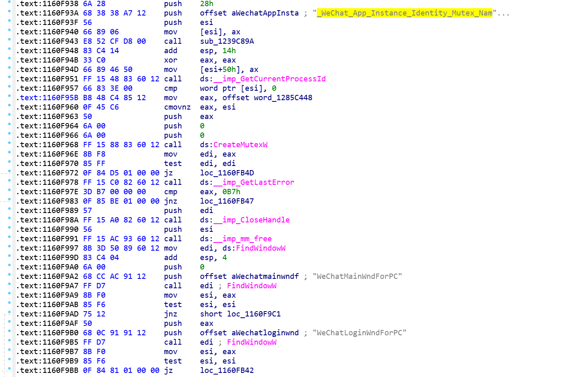

 ADVAPI.dll  提供高级系统功能,Advanced，如 注册表、安全性、事件日志、服务管理等 ；

查看API对应的源代码路径：

```
C:\Program Files (x86)\Windows Kits\10\Include\10.0.19041.0\um
```

## 只运行一个实例

```c
CreateMutexA
FindWindowA
使用共享Section
```

5.1节的Serial.exe只能运行一个实例。


修改FindWindow后面的判断逻辑即可。一开始改为了75(jnz)

此时可以运行多个，但是运行前需要找到已存在的一个窗口才能继续创建，再次修改程序，把jz改成jmp。

## 微信

先根据break定位关闭微信的函数`CloseWechat`，进而找到关键函数sub_405FD0，它控制着返回结果。


关键函数`int __stdcall sub_405FD0(DWORD a1, int a2, int a3, int a4)`

跟进去后，可以看到一开始检查注册表语言配置和更新配置。


微信整体打开，靠WechatWin.dl里的函数。


打开WechatWin.dll，发现其导入表里存在实例判断函数。


双击进入后，等待库加载完成，需要几分钟，之后x查看两个函数的上下文：

注意这里一定要多等一会，不然调用`CreateMutex`的地址可能检索不全。


调用`FindWindowW`函数的上下文十分明显：



对于上图尾行的这个大跳，是一个经典的判断Mutex是否存在的代码段。

> Mutex存在，则GetLastError返回 `ERROR_ALREADY_EXISTS`.，不存在时，返回0.


把jnz StartNewInstance改变成为jmp。

爆破成功。

