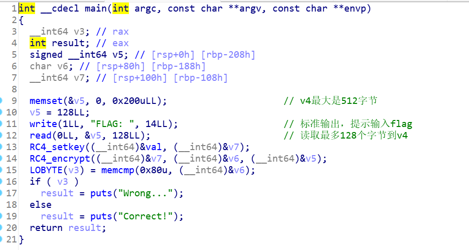
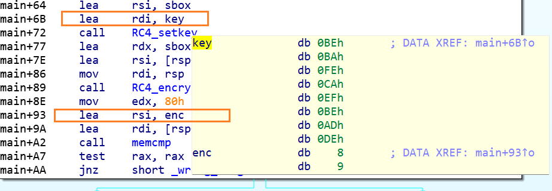
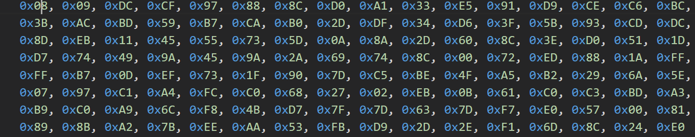
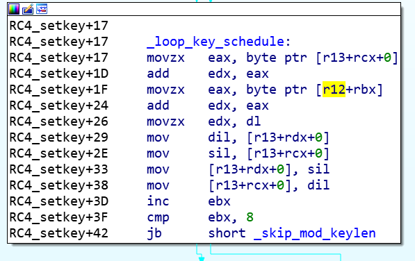
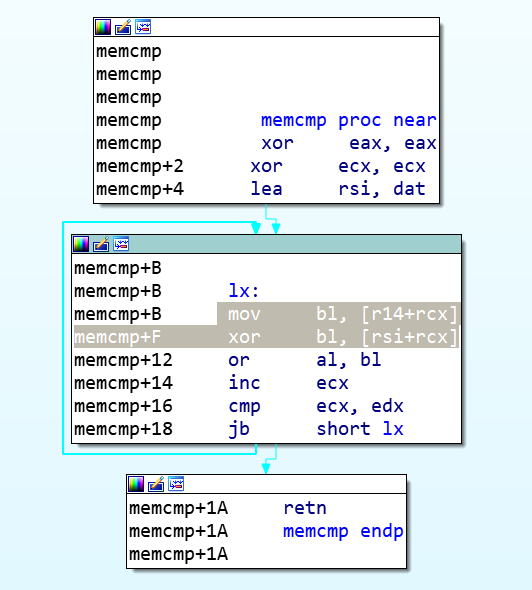
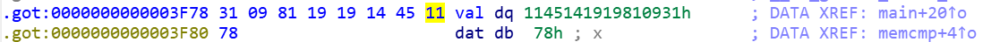
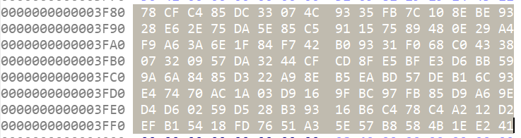

这道题是一道已知RC4的密文和密钥，反求明文的伪装成逆向的密码题。



​																	图1

## 思考

反汇编时，要深入每个关键函数看一看，不能想当然。

IDA给出的伪代码代码大部分时候还是十分正确的，直接看伪代码比反汇编代码正确率要来得高。

## 干扰项：



在IDA的反汇编界面看代码，会误以为密钥为key

```
key_rodata = b"\xBE\xBA\xFE\xCA\xEF\xBE\xAD\xDE"
```

也会误认为密文为enc



不管任何一个弄错，都会使得结果错误。

干扰原因：按照C调用约定，在call之前的部分应该是函数的参数部分，但是
```
__int64 __usercall RC4_setkey@<rax>(__int64 RC4_key@<r12>, __int64 RC4_keytable@<r13>)
char __usercall memcmp@<al>(unsigned int a1@<edx>, __int64 a2@<r14>)
```

这里是作者自定义的call行为，call之前的内容并不全是函数的参数。

对于RC4_setkey，其真正的RC4_key是r12,。



而r12早就被赋予了值，其值为val，在got表中。

```
main         push    rbp
main+1      sub     rsp, 200h
main+8      mov     ecx, 200h
main+D      xor     eax, eax
main+F      mov     rdi, rsp
main+12     repne stosb
main+14     mov     ebx, 6
main+19     lea     rbp, flag       ; "FLAG: "
main+20     lea     r12, val
main+27     mov     r15, rsp
main+2A     lea     r14, [r15+80h]
main+31     lea     r13, [r15+100h]
```

对于memcmp，也类似，在其函数内部，再次修改rsi，其真正比较的是dat和r14.



正确的密钥和密文都在got表里

如图1所示，密钥应该为图1所示的val所对应的内容，密文应该为dat对应内容。




## 密文获取

`memcmp`里返回dat数组和传入的结果数组的比较情况，真正的密文应该是dat数组。

```
 result |= *((_BYTE *)&dat + v3) ^ *(_BYTE *)(a2 + v3);
```

点击第一处字节后，按下(Alt+L)，再点击最后一处字节，就可以选定待导出的密文部分。



Shift+E，导出Array数组，复制粘贴到python代码里。


## 解密代码：

```python
# 已知的密钥表和加密文本
RC4_key=     b"\x31\x09\x81\x19\x19\x14\x45\x11"
cmp_data =bytes([
  0x78, 0xCF, 0xC4, 0x85, 0xDC, 0x33, 0x07, 0x4C, 0x93, 0x35, 
  0xFB, 0x7C, 0x10, 0x8E, 0xBE, 0x93, 0x28, 0xE6, 0x2E, 0x75, 
  0xDA, 0x5E, 0x85, 0xC5, 0x91, 0x15, 0x75, 0x89, 0x48, 0x0E, 
  0x29, 0xA4, 0xF9, 0xA6, 0x3A, 0x6E, 0x1F, 0x84, 0xF7, 0x42, 
  0xB0, 0x93, 0x31, 0xF0, 0x68, 0xC0, 0x43, 0x38, 0x07, 0x32, 
  0x09, 0x57, 0xDA, 0x32, 0x44, 0xCF, 0xCD, 0x8F, 0xE5, 0xBF, 
  0xE3, 0xD6, 0xBB, 0x59, 0x9A, 0x6A, 0x84, 0x85, 0xD3, 0x22, 
  0xA9, 0x8E, 0xB5, 0xEA, 0xBD, 0x57, 0xDE, 0xB1, 0x6C, 0x93, 
  0xE4, 0x74, 0x70, 0xAC, 0x1A, 0x03, 0xD9, 0x16, 0x9F, 0xBC, 
  0x97, 0xFB, 0x85, 0xD9, 0xA6, 0x9E, 0xD4, 0xD6, 0x02, 0x59, 
  0xD5, 0x28, 0xB3, 0x93, 0x16, 0xB6, 0xC4, 0x78, 0xC4, 0xA2, 
  0x12, 0xD2, 0xEF, 0xB1, 0x54, 0x18, 0xFD, 0x76, 0x51, 0xA3, 
  0x5E, 0x57, 0xB8, 0x58, 0x4B, 0x1E, 0xE2, 0x41
])

def RC4_setkey(key, keytable):
    keytable_length = 256#len(keytable)

    # 初始化密钥表
    for i in range(keytable_length):
        keytable[i] = i

    # KSA (密钥调度算法)
    j = 0
    for i in range(keytable_length):
        j = (j + keytable[i] + key[i % len(key)]) % keytable_length
        keytable[i], keytable[j] = keytable[j], keytable[i]

    return keytable

#zer0pts要求的字符范围
def filter_printable_chars(flag):
    filtered_flag = bytearray()
    for byte in flag:
        if 0x20 <= byte <= 0x7E:
            filtered_flag.append(byte)
        #else:
            #print("ERROR")
            #break
    return filtered_flag

def gen_keytable(keytable, enc_text):
    flag_length = len(enc_text)
    v4 = 0
    v5 = 0
    for v3 in range(flag_length):
        v4 = (v4 + 1) % 256
        v5 = (keytable[v4] + v5) % 256
        keytable[v4], keytable[v5] = keytable[v5], keytable[v4]
        #flag[v3] = enc_text[v3] ^ keytable[(keytable[v5] + keytable[v4]) % 256]
    return v4,v5

def RC4_decrypt(keytable, enc_text,v4,v5):
    flag_length = len(enc_text)
    flag = bytearray([0] * flag_length)


    for v3 in range(flag_length-1,-1,-1):
        flag[v3] = enc_text[v3] ^ keytable[(keytable[v5] + keytable[v4]) % 256]
        keytable[v4], keytable[v5] = keytable[v5], keytable[v4]
        v5 = (v5-keytable[v4]) % 256
        v4 = (v4 - 1) % 256 

    return flag


# 获得密钥表
RC4_keytable = bytearray([0] * 520)

# 设置密钥表
RC4_setkey(RC4_key, RC4_keytable)
hex_string = ' '.join([f'\\x{byte:02X}' for byte in RC4_keytable])
# 打印密钥表
print("密钥表:\n", hex_string)

#获得解密需要的初始值
v4,v5=gen_keytable(RC4_keytable,cmp_data)
hex_string = ' '.join([f'\\x{byte:02X}' for byte in RC4_keytable])
# 打印密钥表
#print("密钥表:\n", hex_string)
print(v4,v5)

# 解密获取flag
flag = RC4_decrypt(RC4_keytable, cmp_data,v4,v5)
filtered_flag=filter_printable_chars(flag)
# 打印flag
print("Flag:", filtered_flag.decode())
```

最终结果：

```
Flag: zer0pts{d0n'7_4lw4y5_7ru57_d3c0mp1l3r}
```

