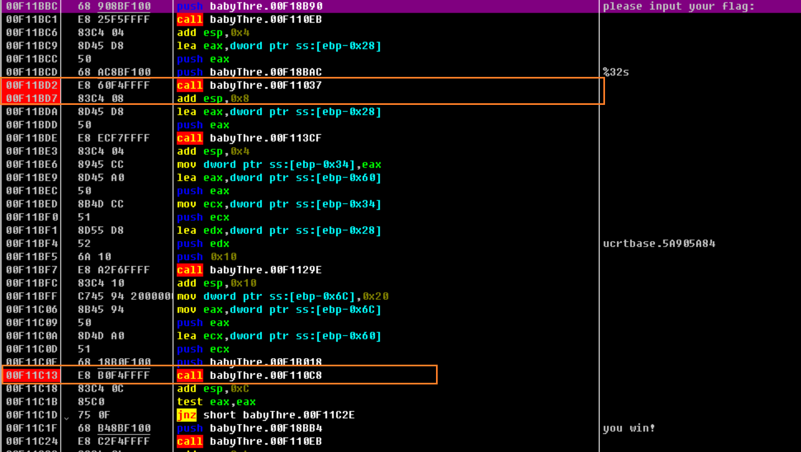
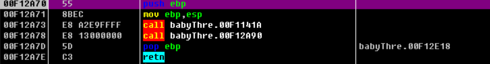
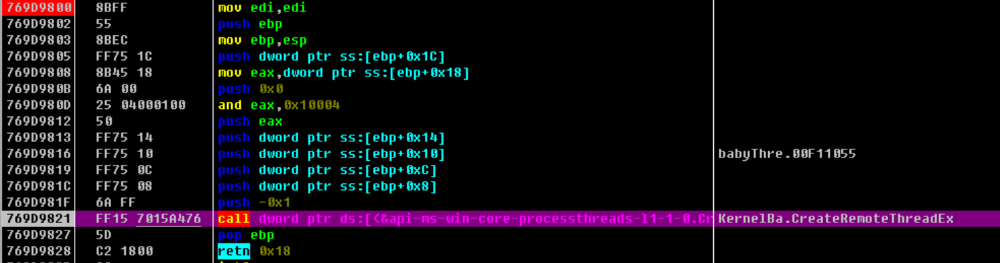
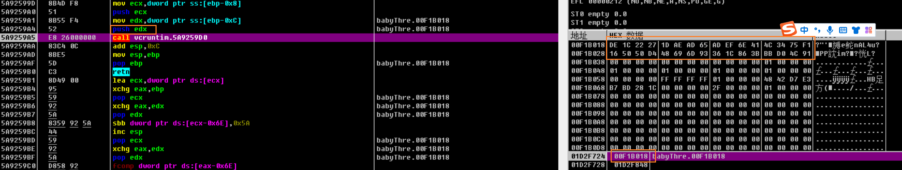
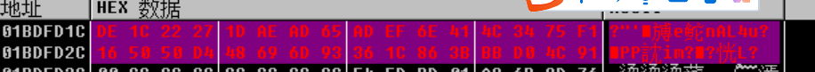
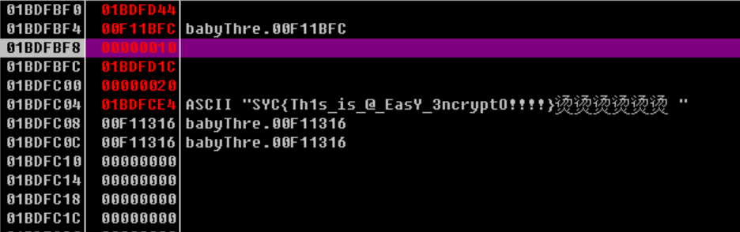

## 本题难点

1.这道题要给线程下断点，

2.而且还要跳过一个IsDebuggerPresent的反调试，

3.在进入线程后，输入阶段也有一个跳转需要修改。

## 静态反汇编，

一路跟踪跳转关系，

```c
int Main_func()
{
  sub_41141A();                                 // 给函数指针赋值
  return sub_412A90();                          // 得到flag
}
//sub_412A90() line 36

//int sub_412D60() line 9
 int Key_func()
{
  CreateThread(0, 0, (LPTHREAD_START_ROUTINE)StartAddress, 0, 0, 0);
  hHandle = (HANDLE)sub_41127B();
  CreateThread(0, 0, (LPTHREAD_START_ROUTINE)sub_411316, 0, 0, 0);
 }
//sub_411316 line3
//定位到关键函数
__int64 __stdcall sub_411B80(int a1)
{
  int v1; // edx
  __int64 v2; // ST08_8
  char v4; // [esp+0h] [ebp-13Ch]
  size_t Size; // [esp+D0h] [ebp-6Ch]
  char Buf2; // [esp+DCh] [ebp-60h]
  int v7_32; // [esp+108h] [ebp-34h]
  char flag; // [esp+114h] [ebp-28h]
  int savedregs; // [esp+13Ch] [ebp+0h]

  sub_41137F((int)&unk_41D0F4);
  WaitForSingleObject(hObject, 0xFFFFFFFF);
  Check_Run_Error(&v4 == &v4);
  Print_str((int)"please input your flag:", v4);
  Input_str("%32s", (unsigned int)&flag);
  v7_32 = j_strlen(&flag);
  Enc_str(16, (int)&flag, v7_32, (int)&Buf2);
  Size = 32;
  if ( !j_memcmp(&unk_41B018, &Buf2, 32u) )
    Print_str((int)"you win!", v4);
  else
    Print_str((int)"you lose!", v4);
  SetEvent(hObject);
  Check_Run_Error(&v4 == &v4);
  HIDWORD(v2) = v1;
  LODWORD(v2) = 1;
  sub_411217((int)&savedregs, (int)&dword_411C7C);
  return v2;
}

```

​    猜测memcmp比较的：unk_41B018是程序的密文，Buf2存储根据输入生成的密文。

跟入前面的处理函数，

```c
unsigned __int64 __cdecl sub_411DA0(int a1_16, int flag, int a3_32, int cipher)
{
  size_t v4; // eax
  __int64 v5; // rax
  char v6; // STEB_1
  unsigned __int8 v7; // STDF_1
  unsigned __int64 v8; // ST04_8
  char v10[264]; // [esp+E8h] [ebp-16Ch]
  int v11; // [esp+1F0h] [ebp-64h]
  int v12; // [esp+1F4h] [ebp-60h]
  int v13; // [esp+1F8h] [ebp-5Ch]
  int v14; // [esp+1FCh] [ebp-58h]
  int v15; // [esp+200h] [ebp-54h]
  int v16; // [esp+20Ch] [ebp-48h]
  int j; // [esp+218h] [ebp-3Ch]
  int i; // [esp+224h] [ebp-30h]
  unsigned int v19; // [esp+230h] [ebp-24h]
  char v20; // [esp+23Ch] [ebp-18h]
  char v21; // [esp+23Dh] [ebp-17h]
  char v22; // [esp+23Eh] [ebp-16h]
  char v23[21]; // [esp+23Fh] [ebp-15h]
  int savedregs; // [esp+254h] [ebp+0h]

  sub_41137F((int)&unk_41D0F4);
  v11 = 1;
  v12 = 0x55;
  v13 = 0x1C39;
  v14 = 0x95EED;
  v15 = 0x31C84B1;
  v19 = 0;
  for ( i = 0; ; i += 4 )
  {
    v4 = j_strlen(Dest);
    if ( v19 >= v4 )
      break;
    v16 = 0;
    for ( j = 0; j < 5; ++j )
    {
      if ( Dest[j + v19] == 0x7A )
        *(&v20 + j + i) = 0;
      else
        v16 += *(&v11 + 4 - j) * (Dest[j + v19] - 33);
    }
    v23[i] = v16;
    *(&v22 + i) = BYTE1(v16);
    *(&v21 + i) = BYTE2(v16);
    *(&v20 + i) = HIBYTE(v16);
    v19 += 5;
  }
  v5 = sub_411127((int)&v20, a1_16, (int)v10);
  v19 = 0;
  i = 0;
  for ( j = 0; j < a3_32; ++j )
  {
    v19 = (signed int)(v19 + 1) % 256;
    i = (i + (unsigned __int8)v10[v19]) % 256;
    v6 = v10[v19];
    v10[v19] = v10[i];
    v10[i] = v6;
    v7 = v10[((unsigned __int8)v10[i] + (unsigned __int8)v10[v19]) % 256];
    HIDWORD(v5) = v7;
    *(_BYTE *)(j + cipher) = v7 ^ *(_BYTE *)(j + flag);// cipher[j]=v7^flag[j]
  }
  v8 = __PAIR__(HIDWORD(v5), j);
  Check_Stack((int)&savedregs, (int)&dword_411FF8);
  return v8;
}
```

可以看到前面根据一系列操作，生成了v7，然后用v7和flag异或得到了正确的cipher。

## 所以动态调试，

1.先搜索字符串，下好断点，一个是输入位置，一个是比较位置。



### 考点1

多线程下好断点。


### 考点2

2.一开始直接`jmp F12E10`。



3.进入到F12A90。

F9运行，断到了线程函数执行前。



按几下F9，成功断到了关键函数处。


此时的线程状态：


### 考点3

跟入F11037，在F12860的跳转处，强制让其不跳转。


断在输入位置0x411BDE位置，


先随便输入32个1，根据对比函数里的栈地址，找到密文unk_41B018，



```
00F1B018  DE 1C 22 27 1D AE AD 65 AD EF 6E 41 4C 34 75 F1  ?"'enAL4u?
00F1B028  16 50 50 D4 48 69 6D 93 36 1C 86 3B BB D0 4C 91  PP訦im??恍L?
```

整理如下：

```
DE1C22271DAEAD65ADEF6E414C3475F1165050D448696D93361C863BBBD04C91
```

再次运行程序，先断到长度函数处。


修改这里的输入值，将前面的密文输入进去。



再断到加密函数位置处：


经过异或处理后，此时memcmp的Buf2里, 就是flag值。

## flag




### Run跟踪

- 跟踪一个call运行了哪些代码，有递归所有call和只对一层call的方法，操作方式分别是CTRL+F11和CTRL+F12。 

### 给线程下断的另一种方式

