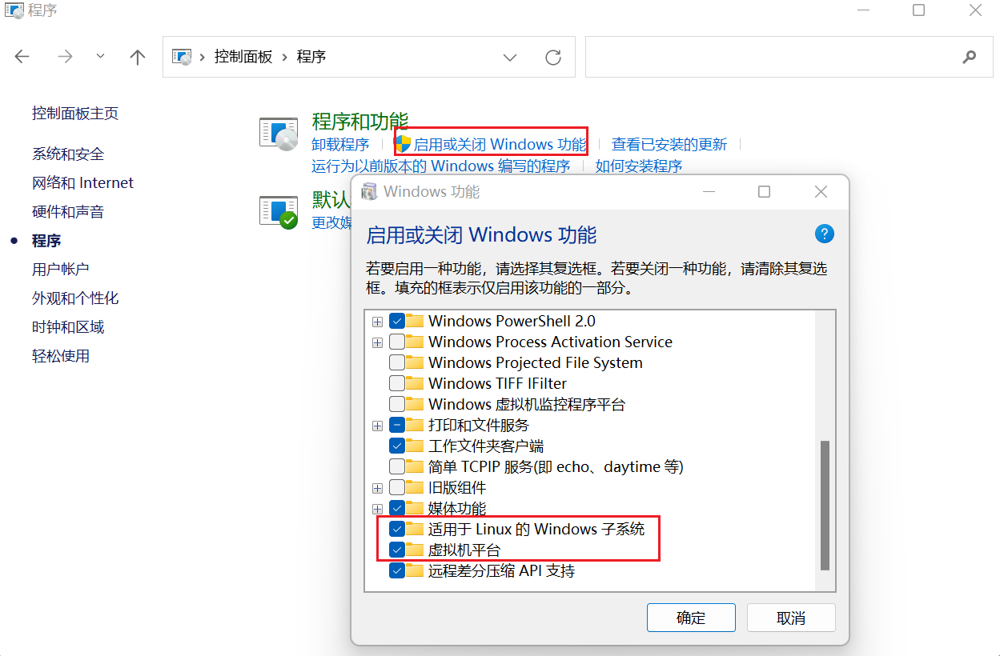

>https://blog.csdn.net/Ashken/article/details/108974058

## 1.安装wsl子系统

1.安装如下的两个Windows功能，重启系统。



2.dos命令行，列出可以安装的子系统类型

```
$:wsl -l -o
NAME            FRIENDLY NAME
Ubuntu          Ubuntu
Debian          Debian GNU/Linux
kali-linux      Kali Linux Rolling
openSUSE-42     openSUSE Leap 42
SLES-12         SUSE Linux Enterprise Server v12
Ubuntu-16.04    Ubuntu 16.04 LTS
Ubuntu-18.04    Ubuntu 18.04 LTS
Ubuntu-20.04    Ubuntu 20.04 LTS
```

3.下载Ubuntu18.04子系统

```
wsl --install -d Ubuntu-18.04
```

## 2.在Windows上安装CUDA on WSL驱动

1.打开INVIDA-[wsl驱动下载界面](https://www.nvidia.com/Download/index.aspx?lang=en-us)

2.输入你的配置，下载对应的驱动程序。

3.我下载的是[这个](https://www.nvidia.com/content/DriverDownload-March2009/confirmation.php?url=/Windows/516.94/516.94-notebook-win10-win11-64bit-international-dch-whql.exe&lang=us&type=geforcem)

4.双击程序安装。

## 3.wsl安装cuda Toolkit

在dos命令行输入wsl，会自动启动之前安装的子系统。

在子系统的命令行里，一个一个执行下面的语句。

这里我使用了cuda11.3，因为[pytorch官网](https://pytorch.org/get-started/locally/)目前给出的cuda版本有10.2，11.3,11.6.取最新版的前一版用就可以。

```
#这里需要导入两个pubkey；
sudo apt-key adv --fetch-keys http://developer.download.nvidia.com/compute/cuda/repos/ubuntu1804/x86_64/3bf863cc.pub

sudo apt-key adv --fetch-keys http://developer.download.nvidia.com/compute/cuda/repos/ubuntu1804/x86_64/7fa2af80.pub

sudo sh -c 'echo "deb http://developer.download.nvidia.com/compute/cuda/repos/ubuntu1804/x86_64 /" > /etc/apt/sources.list.d/cuda.list'

sudo apt-get update

sudo apt-get install -y cuda-toolkit-11-3 

#网上其他教程缺少下面的步骤
sudo apt --fix-broken install
```

## 4.安装Pytorch

1.下载conda。

在子系统的命令行里执行，安装Miniconda

```
mkdir /home/$(whoami)/Downloads
cd /home/$(whoami)/Downloads
wget https://repo.anaconda.com/miniconda/Miniconda3-latest-Linux-x86_64.sh
sudo ./Miniconda3-latest-Linux-x86_64.sh
```

2.给conda建立软链接

```
sudo ln -s /root/Miniconda3/bin/conda /usr/bin/conda
```

3.下载cuda11.3版本的pytorch

```
conda install pytorch torchvision torchaudio cudatoolkit=11.3 -c pytorch
```

5.验证安装是否成功

在子系统里执行下面的语句。

```
#给root改名
sudo passwd root
#切换到root用户
su
#执行python
python
#判断cuda安装成功与否
(base) root@BlackGame:~# python
Python 3.9.12 (main, Apr  5 2022, 06:56:58)
[GCC 7.5.0] :: Anaconda, Inc. on linux
Type "help", "copyright", "credits" or "license" for more information.
>>> import torch as t
>>> t.cuda.is_available()
True
```


## diskpart

> 新建和隐藏分区符

```
list disk
sel disk 0
list vol
sel vol 2
assign letter=Z
remove Z
```

## wls子系统

```
wsl --set-default-version 2
```

## grub界面恢复到win11启动

```
insmod part_gpt
insmod chain
set root=(hd0,gpt1)
chainloader /EFI/Microsoft/Boot/bootmgfw.efi
boot
```

## 其他

```
wsl --set-default-version 2
wsl --shutdown Ubuntu18.04
sudo service ssh start
cd /mnt/c/Users/22154/Downloads 
cd ~/Downloads
```

