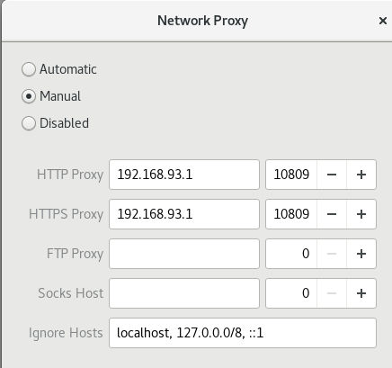
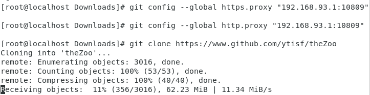
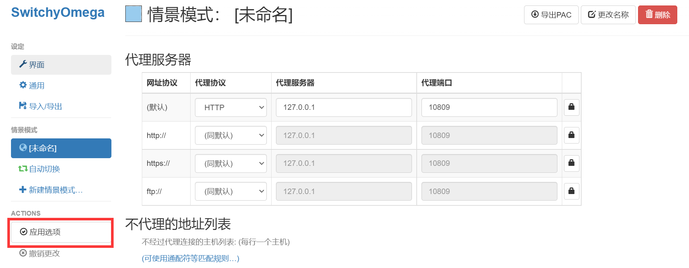
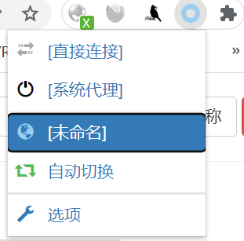

这部分内容常用，所以做了一个系统整理；之后会陆续增加点其他内容

查看左边栏的目录进行快速跳转。

防火墙ban了大部分国外服务器的IP，可以轻易检测出没有伪装过的vmess流量，考虑效益，我购买了某机场的会员，价格为30元一个季度，每个月200GB流量。


我的真机系统为Win11，使用v2rayN管理连接的服务器和代理端口。

如图所示，我的socks代理端口为10808，http端口为10809。这两种端口，http端口使用的最为频繁。

- 设置v2rayNG->系统代理->清除系统代理；
- 设置v2rayNG->路由->PAC分流模式。

## 虚拟机走代理

百度都是直接关闭防火墙，这样不安全，所以写下这一部分内容记录一下步骤。

<!--more-->

1.虚拟机配置为NAT模式

2.查看虚拟机和主机IP


3.配置主机防火墙


输入10809，选择TCP协议其他的默认点击确定即可。

4.(可选)若是真机上有装杀毒软件，实测还需要开启杀毒软件的防火墙端口。

以Micafee为例，防火墙-->端口和系统服务-->填写`服务名：如代理`和`本地TCP/IP端口：10809`，点击确认。

5.现在可以通过配置虚拟机的系统代理，firefox安装插件，命令行走代理等多种途径使用主机的代理了。

还记得第一步查看到的真机IP吗，虚拟机的系统代理地址如下：



灵活的将[第2、3部分](# 2.pip走代理)结合在虚拟机中使用代理，例如git走代理

```
git config --global http.proxy "192.168.93.1:10809"  
git config --global https.proxy "192.168.93.1:10809"  
```



起飞！

## 浏览器走代理

1.安装omega插件，各个浏览器都有。


2.配置



3.选择



## pip走代理

### 2.2 临时走代理

以下载xgboost这个库为例

```sh
pip3 --proxy 127.0.0.1:10809 install xgboost
```

### 2.3 [指定某个源安装]

#### 2.3.1临时

阿里云 ：http://mirrors.aliyun.com/pypi/simple/
中国科学技术大学：https://pypi.mirrors.ustc.edu.cn/simple/
清华大学：https://pypi.tuna.tsinghua.edu.cn/simple/
豆瓣：http://pypi.douban.com/simple/

```sh
pip3 install -i http://pypi.douban.com/simple/ xgboost --trusted-host pypi.douban.com
```

#### 2.3.2永久

```
notepad C:\Users\22154\pip\pip.ini
```
在该文件里写入下面的内容：

[global]
timeout = 6000
index-url = https://pypi.python.org/simple
trusted-host = pypi.python.org


## git走代理

### 3.1 持久配置

```sh
git config --global http.proxy "127.0.0.1:10809"  
git config --global https.proxy "127.0.0.1:10809"  
```


### 3.2不用的时候取消代理

```sh
git config --global --unset http.proxy
git config --global --unset https.proxy
```


## conda走代理


## Rust cargo走代理

在 `C:\Users\用户名\.cargo` 下创建 `config` 文件
内容为

```
[http]
proxy = "127.0.0.1:10809"

[https]
proxy = "127.0.0.1:10809"
```

## Ubuntu走代理

## apt走代理

```
#主机代理
sudo apt-get -o Acquire::http::proxy="http://192.168.130.1:10809" update
```


客户端下载地址：https://github.com/Dreamacro/clash/releases/download/v1.2.0/clash-linux-amd64-v1.2.0.gz

#### 配置

1.创建你想要的存放文件的目录，解压gz包，我存放的路径是/root/clash，可以将解压文件重命名为clash便于阅读

```sh
unzip /clash-linux-amd64-v0.18.0.gz
```

2.赋予文件执行权限

```sh
chmod +x clash
```

3.启动文件

```sh
./clash
```

第一次启动会在用户目录下自动生成Config.yaml 和Country.mmdb两个文件。

生成的Config.yaml文件为空，需要后续填写自己的代理信息。

我这里生成的目录是/root/.config/clash，如果不一致的话可以使用find命令查找一下

4.添加 Clash 配置订阅

到官网订阅中心选择复制订阅，然后在浏览器中访问【 订阅地址后面加&flag=clash 】 ，然后右击浏览器页面，选择“另存为”保存页面

然后给保存的文件修改为Config.yaml （格式也要修改）

然后我们编辑下文件内容

首先把`port: 7890`这一行前面的全删掉

然后把`</body></html>`这一行删掉

修改完成以后保存 替换掉刚才解压出的空的Config.yaml文件

5.启动clash

配置完成后重新执行命令启动clash，以加载修改的配置文件

打开下面的网址访问管理页面

http://clash.razord.top/#/proxies

6.设置虚拟机网络，配置代理

以 centos7.4 为例，打开系统设置，选择网络，点击网络代理，选择手动，按照yml配置文件中设置的端口进行配置，填写 HTTP 和  HTTPS 代理为 127.0.0.1:7890，填写 Socks 主机为 127.0.0.1:7891，即可启用系统代理

#### 设置分流

点击窗口左侧的 Proxies (代理)

默认情况下，Clash 使用 Rule (规则) 模式。不推荐选择 Global (全局) 与 Direct (直连) 模式。

## npm走代理

```
npm install -g cnpm --registry=https://registry.npm.taobao.org
#开启代理
npm config set proxy=http://127.0.0.1:10809
npm config set registry=http://registry.npmjs.org

#取消代理
npm config delete proxy
npm config delete https-proxy
```

