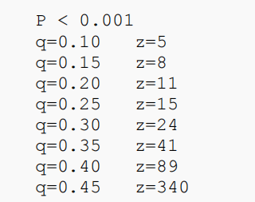

```
0.比特币的安全性证明
1.ethash基本原理，
2.ETH的工作量证明
3.CFX,ETH的POW基本介绍
```

[TOC]

## 术语统一：


T0 至 T2 的时间一般是**秒级**，TPS 跑满时，CFX的T2 到 T3 的时间间隔也会在 1 分钟以内。

延迟包括：块确认延迟（指T3到T5），交易确认延迟（比特币中和块确认延迟一致，但是CFX中是延迟确认），块广播延迟，交易广播延迟。

**GHAST这篇论文数学性太强，太抽象，无法看懂，还是以CFX的黄皮书为准进行研究。**

## 0.比特币安全性证明

为什么比特币确认交易时等待6个块就足够安全？

> 参考[《Bitcoin: A Peer-to-Peer Electronic Cash System》]( http://bitcoin.org/bitcoin.pdf)第11节

### 0.1二项随机漫步

>参考https://blog.csdn.net/fireguard/article/details/16111603


### 0.2 赌徒破产问题

> 

诚实节点和攻击节点是互斥的，每10分钟只能有其中之一节点发现一个区块，即使他们可能在两个分叉上。


### Nakamoto共识机制的前提预设

- 诚实节点不接受包含无效交易的块，即块一旦包含无效交易，则这个块也无效

- 攻击者与诚实者的链的竞争可以用二项随机漫步（ Binomial Random Walk）来刻画，成功事件为诚实链lead+1,失败事件为攻击者链加1，即gap-1。

- 攻击者赶上诚实者链长等价为赌徒破产问题(Gambler's Ruin Problem)。
- 攻击者产生下一个块的概率为q,诚实节点找到下一个块的概率为p,p>q，否则攻击者的链肯定能赶上诚实者的链。
- 假设首个包含交易的块出现后，z个块链接其后。
- 设事件X|Y,为落后z个块后，攻击者赶上的概率为：
  - 

### 攻击办法

交易发起者即为攻击者，在收款人产生新的公钥发给攻击者后，攻击者在**含有相矛盾的交易（如双花，把这笔钱给自己）**的并行的链上挖块，试图让该链长于主链。

>中本聪从固定时间间隔的角度出发，他认为，诚实节点T0内挖出一个区块的概率是p，那么平均而言，T0 / p 的时间间隔肯定能挖出一个区块，那么诚实节点挖出z块，共消耗了To * z / p的时间间隔。攻击节点T0内挖出一个区块的概率是q，那么T0 * z / p的时间间隔内，平均而言肯定能挖出q * z / p块，而且每个T0 *z / p的时间间隔内，挖出的块数差不多。将T0 * z / p当做一个单位时间间隔，那么求解的问题是：单位时间内随机事件发生的次数的概率分布。而泊松分布就是描述这个概率的工具。λ 表示单位时间间隔内发生的次数，即为q * z / p。

攻击者赶上诚实者块差的概率和为

利用概率和为1，把z块后的概率和变为1-z块以前的块的概率和。


攻击者攻击成功的概率如上图所示，表示成代码：

```c++
#include <math.h>
double AttackerSuccessProbability(double q, int z)
{
 double p = 1.0 - q;
 double lambda = z * (q / p);
 double sum = 1.0;
 int i, k;
 for (k = 0; k <= z; k++)
 {
     double poisson = exp(-lambda);
     for (i = 1; i <= k; i++)
     {
         poisson *= lambda / i;
     }
     sum -= poisson * (1 - pow(q / p, z - k));
     }
 }
 return sum;
}
int main{
    printf("%lf",AttackerSuccessProbability(0.10,5));
    return 0;
}
```


在攻击成功概率<0.1%时，在足够远离q=0.10的情况下，z=6;

**总结：比特币的“6个区块确认最长链”的准则是基于攻击节点拥有10%的算力假设**。指的是在打包了交易的块后再接续5个块。

> 参考[比特币最长链共识为什么是6个块确认???4个,8个,11个不行吗???](https://www.jianshu.com/p/5effdcf79114)，[比特币51%攻击是什么？比特币6个确认数是怎么得到的](http://m.elecfans.com/article/713369.html)

其他时候，比如攻击者算力占45%时，需要等340个块接到含交易的块之后。



在 [Analysis of hashrate-based double-spending ](https://arxiv.org/pdf/1402.2009.pdf?)和

>GARAY, J., KIAYIAS, A., AND LEONARDOS, N. The bitcoin backbone protocol: Analysis and applications. In *Annual International* *Conference on the Theory and Applications of Cryptographic Techniques* (2015), Springer, pp. 281–310.，提供同步网络模型下的比特币的严格安全分析 

中有对区块链共识机制的更完备的证明


### 难度值

在每个区块头中都有一个“Bits”字段，被称为“目标位”，也就是所谓的难度值。如下所示：


**难度目标值（target）计算公式**

target以指数形式存在，以十六进制表示，总共有8位，前2位为指数，后6位为系数。

所以上图中，指数为0x17，系数为0x1320bc

计算公式为：

**难度值（target） = 系数 \* 2^(8 \* (指数 - 3))**


因此上图中的难度值为：

难度值（target） = 0x1320bc * 2^(8 * (0x17 - 3))

这个算出来是个很大的数，结果为：

十进制为：1832085838499075985755083973639154607251969422303166464

十六进制为：0x1320bc0000000000000000000000000000000000000000

在比特币系统中，难度值越小，挖矿难度就越大，因为哈希值可落的范围会越小；反之难度值越大，挖矿难度就越小。


## 1.Ethash算法

以太坊的挖矿算法，它的前身是Dagger Hashimoto算法。；

### 1.1 Dagger Hashimoto

Dagger Hashimoto的目的是：

- 抵制矿机（ASIC，专门用于挖矿的芯片）
  - 塞一堆数据到内存中，让多核平行处理发挥不出来，降低硬件的运算优势，只与内存大小有关，这样无论是PC机还是ASIC、GPU以及FPGAs，都可达到平等挖矿的诉求，这也是ASIC-resistant原理
- 轻客户端验证
- 全链数据存储

> 参考https://blog.csdn.net/vloong/article/details/79947625，


### 1.2 Ethash基本原理

> 参考https://zhuanlan.zhihu.com/p/136159331

以太坊中共识设计的主要思想是设计一大一小的2个数据集，初始大小是：

小：16M的cache 大：1G的dataset（DAG）

设计一大一小的目的是：大的数据集是小的cahce通过计算生成的，矿工为了能更快的挖矿只能保存大的dataset，以免重复计算耽误时间，而轻节点只需保存保存小的cache即可验证。


**小cache：**

初始大小为16M，容量大小以后每3W个区块会更改一次。

通过Seed种子进行一些运算得到第一个数，之后在小cache中的每个数都是前一个数取哈希后得到的。

一般轻节点存储此小cache。

**大DAG：**

大的数据集中的元素都是通过小的cahe计算得到的，小cache中通过伪随机顺序先得到一个位置的元素A的值，再通过A计算哈希得到B位置的值，循环迭代256次后得到了大数据集中的第一个元素，依次类推直到得到全部的DAG元素。

**挖矿过程**

在以太坊中挖矿成功的条件跟比特币一样，找到一个nonce值，需要满足H(header) <= target.

尝试一个随机数nonce时，在大的DAG中，通过header及nonce计算出一个初始的哈希值映射到初始位置A，然后读取A位置元素和A的相邻后一个位置A'的元素，再通过（A和A'）计算出位置（B和B'），依次类推，迭代64次后，一共读取出128个数，最后计算这128个数的哈希值与目标值target比较，若满足<=target，则挖矿成功；否则重新尝试nonce。


## 5.CFX安全性证明


### 基础假设：

*λ*，d, β。

- 所有参与者的块产生速率是*λ*.
- 攻击者算力占总算力的比例是 β，攻击者的产生块的速度是 βλ.
- 一个块传输给所有诚实节点存在一个最大延迟d（T4）（**block propagation delay *d，一个块传输给P2P网络中的所有参与者***）
- 攻击者能力描述：最大有49%的算力，在d以内任意操纵任意块到任意参与者的延迟


### CFX的前提预设：

1.抵抗存活性攻击，不是无效化攻击者的块，而是放慢出块速度。

2.什么时候放慢？参考第4点。策略位是强迫选择，节点无法自己设置，只能根据过去的视图设置。**策略位和过去视图不符的被视为无效块，被所有诚实节点丢弃。**

攻击者只能通过假装没有看到一些块，即修改自己的过去视图来改变自己的策略。

3.怎么放慢？**On trees, chains and fast transactions in the blockchain.** 证明了在**同步网络模型**下慢的块产生速率下GHOST无存活性缺陷，设置一个权重η，将权重低于这个阈值的块都忽略，则此时块的产生速率相当于被放慢了η倍，CFX采取的是**部分同步网络模型**？？？，借助第5点

4。存活性攻击的认定：

- 一个块无子块具有明显优势；
- 这个块足够老，产生已经有相当长的时间。认定块足够老借助第5点

5.把区块链协议拿过来作为一个timer chain，提供服务，只用来认定一个块是否足够老。

Tree-Graph结构中的每个块都包含计时器链中最长分支叶块的哈希值，

根据这个哈希值找到计时器块，计时器块的高度不精确的表明了时间戳。所以有了本地视图G和一个给定的块，

如果该块的时间戳和本地视图的最大时间戳（最新区块）相差过大，这个块就足够老。

6.为实现第5点，把时钟链嵌入树图结构，所以GHAST共识协议有两个工作量证明任务。

为防止攻击者专注于其中一个任务，影响链的安全性，要求参与者同时进行两项任务。

即根据得到的块hash值决定该块的类型（树图块或者计时器块，其中，计时器块也被GHAST认作有效的树图块）。

> 第5点可参见：A  Analysis of the blockchain protocol in asynchronous networks

### CFX的模型

- Model=(一组算法，已排序的块)，

- 允许每个节点（诚实或损坏）每轮查询宏 H一次，H包括四个算法，分别是求hash，校验一组哈希值【hash(x)=y】,求weight和timer。

- 本地状态B，C确定性地将B中的块排序

一个块开挖前的结构：，

在算出nonce值s后，计算前四项的hash值得到h，若，其中是谜题困难参数，挖矿成功。

- 块被认为有效：1.父区块非空 2.hash值与其他组件一致3.解出难题；

- 有效视图：块集合中的各个块的依赖块都在这个集合里。

### 证明骨架

e=(r,b,t)，在第r轮，对于一个块r，发生了一个事件t。当这样一个元组e发生后，攻击者的状态S变化。

事件t有四类：

- 诚实节点生成块并广播
- 恶意节点生成块
- 恶意节点把块广播给第一个诚实节点
- 块被所有诚实节点收到


### 结论：

在等待*O*(*d* *·*log(1*/ε*))后，confidence *≥* 1 -ε；


在攻击成功概率<0.1%时，GHAST在无攻击情形下确认需要等3d，比特币中约为360d。而比特币是等6个块，60min*60/360=10s，所以这里的d大约是10s？GHAST等待确认时间为30s?


---


## 

## 2.ETH的工作量证明

ETH有两个共识算法，一个是权益证明的[clique](https://yangzhe.me/2019/02/01/ethereum-clique/)，另一个是POW的ethash

>以太坊源码解析：共识算法之ethash（理论介绍篇）https://www.jianshu.com/p/0b0ff481bcb3

## 5.CFX的工作量证明

比特币中使用SHA256作为工作量证明函数。


| 比对项\币种                           | Bitcoin   | ETH  | CFX  |
| ------------------------------------- | --------- | ---- | ---- |
| Block Header Size                     |           |      |      |
| Transaction Size                      |           |      |      |
| Block Size/ Block generation interval | 1MB/10min |      |      |
| Transaction Delay                     |           |      |      |
| Confirmation Speed                    |           |      |      |
| Broadcast Delay                       |           |      |      |
| Incentive                             |           |      |      |
|                                       |           |      |      |
|                                       |           |      |      |


安全性证明过程介绍；完整

## GHAST论文里的一些常识

1.网络延迟的影响取决于协议参数；

2.只要协议消息能够被即使传达，参与者无需知道其他参与者的存在。

3.调整预设难度就可以调整块产生速率；

4.块得到确认等价于，块被从历史中剔除的可能性低于阈值。

4.比特币中块的确认，意味着其中的交易不可逆。

5.比特币里要求T4<1/λ，传输延迟要足够小，块产生间隔(1/λ)要远大于传输延迟，确保块传输过程中不会有大量的块生成。

### GHAST做的事情

- 减少中本聪共识机制里的确认延迟：低确认延迟
- 解决GHSOT里的存活性攻击(liveness issue）问题，对数的活性保证

### 提高块生成速率带来的影响？

不理解的GHAST论文里的表述：

```
If the block generation interval is much higher than the time propagating a message in network, with a high probability, no one will generate a new block when the participants
have inconsistent local blocks.
```

直译：块的产生间隔不能过大，即超出网络上传播消息的时间太多，否则会由于参与者不具有一致的本地块视图而使整个链无法生成新块。


- 块生成速度块，在固定时间内的吞吐量高；
- 块生成速度高，块确认延迟低。

- 块产生速度块，带来视图不一致性问题。


为什么矿工愿意加入？激励机制研究

