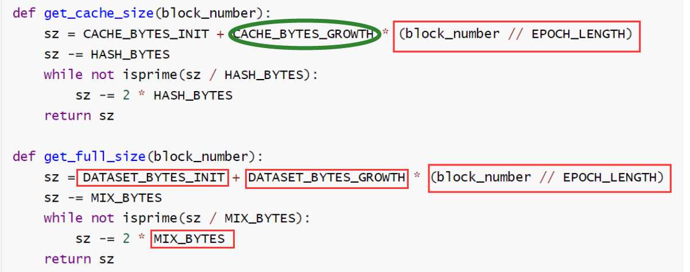
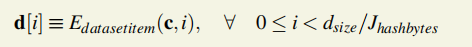

本周解决问题

```
1.SHA1,SHA2,SHA3与Keccak256,Keccak512区别

2.Ethash算法代码介绍和图解
4.以太坊的交易确认的安全性证明
3.以太坊的校验

5.MpEthash介绍
6.CFX的spv校验
7.CFX的交易确认的安全性证明

------------------------------------------


遗留问题：1.部分同步网络模型，异步网络模型和同步网络模型的区别？
8.比特币、ETH、CFX安全性证明横向比较；
9.虚拟机和主机部署以太坊或者conflux虚拟机
```

[TOC]

## 1.SHA1,SHA2,SHA3与Keccak256,Keccak512区别

SHA3，第三代安全散列算法，其中的优胜者——>Keccak。

SHA1和SHA2基于相同算法，SHA3算法改变。

### 1.2 KEccak

>https://blog.csdn.net/ayang1986/article/details/105947450

1. 对输入串x做padding，使其长度能被r整除，将padding后分割成长度为r的块，即x=x_0||x_1||x_2||...||x_t-1。
2. 初始化一个长度为r+c bit的全零向量。
3. 输入块x_i，将x_i和向量的前r个bit亦或，然后输入到Keccak-f函数中处理。
4. 重复上一步，直至处理完x中的每个块。
5. 输出长为r的块作为y_0，并将向量输入到Keccak-f函数中处理，输出y_1，以此类推。得到的Hash序列即为y=y_0||y_1||y_2||...||y_u。在Keccak-224/256/384/512中，只需要在y_0中取出对应长度的前缀即可。

### 1.3 SHA3与Keccak256的区别

​	SHA3由keccak标准化而来，在很多场合下Keccak和SHA3是同义词，但在2015年8月SHA3最终完成标准化时，NIST调整了填充算法：SHA3-256(M) = KECCAK [512] (M || **01**, 256)。所以标准的NIST-SHA3就和keccak计算的结果不一样。
​	以太坊在开发的时候SHA3还在标准化中，所以采用了Keccak，所以Ethereum和Solidity智能合约代码中的SHA3是指Keccak256，而不是标准的NIST-SHA3，为了避免混淆，直接在合约代码中写成Keccak256。

## 2.Ethash算法代码介绍和图解

> 参考[design-rationale](https://eth.wiki/concepts/ethash/design-rationale),，，，，[ethash | Ethereum Wiki](https://eth.wiki/en/concepts/ethash/ethash) 

### 2.1 Ethash Design Rationale

- **IO saturation**:该算法应消耗几乎所有可用的内存访问带宽
- **GPU friendliness**：CPU友好型算法可用botnet提升算力。
- 轻客户端
  - 可校验：C语言下0.01s内校验一轮挖矿，JS0.1s
  - 运行慢：轻客户端只校验，挖矿经济上不可行，硬件优化也不可行
  - 快启动：JS40s以内可以开始校验块

### 2.2 工具函数

#### 1.FNV目的

*聚合函数*对一组值执行计算，并返回单个值。FNV是一个非关联、易计算的聚合函数，可以用XOR替换它。

默认FNV是arg1与素数相乘，再与arg2进行异或。

```python
FNV_PRIME = 0x01000193

def fnv(v1, v2):
    return ((v1 * FNV_PRIME) ^ v2) % 2**32
```

#### 2.参数选择缘故

```python
WORD_BYTES = 4                    # bytes in word
DATASET_BYTES_INIT = 2**30        # bytes in dataset at genesis
DATASET_BYTES_GROWTH = 2**23      # dataset growth per epoch
CACHE_BYTES_INIT = 2**24          # bytes in cache at genesis
CACHE_BYTES_GROWTH = 2**17        # cache growth per epoch
CACHE_MULTIPLIER=1024             # Size of the DAG relative to the cache
EPOCH_LENGTH = 30000              # blocks per epoch
MIX_BYTES = 128                   # width of mix
HASH_BYTES = 64                   # hash length in bytes
DATASET_PARENTS = 256             # number of parents of each dataset element
CACHE_ROUNDS = 3                  # number of rounds in cache production
ACCESSES = 64                     # number of accesses in hashimoto loop
```

- CACHE_BYTES_INIT：16MB：小缓存算法易于被ASIC优化，缓存选择过大轻客户端无法校验。
- DATASET_PARENTS：每个DAG项目选择256个父母，以确保时间和内存交换只能以低于1：1的比率进行。
- DATASET_BYTES_INIT：1GB，Asic Resistent&普通计算机也可参与挖矿。
-  0.73x每年数据增长：适应摩尔定律，用指数增长将会超过摩尔定律，导致内存需要过大和普通GPU无法挖矿
- ACCESSES = 64：让访问内存次数成为最大时间消耗。更多的访问次数将导致轻验证花费的时间太长，而较小的访问次数将意味着大部分时间消耗是最后的SHA3，而不是内存读取，从而使算法不受IO约束。
- 纪元长度3W：过大使算法易被借助ROM优化，太短则导致数据更新过于频繁，对普通电脑不友好。

#### 3.参数

**REVISION 23.**

```python
def get_cache_size(block_number):
    sz = CACHE_BYTES_INIT + CACHE_BYTES_GROWTH * (block_number // EPOCH_LENGTH)
    sz -= HASH_BYTES
    while not isprime(sz / HASH_BYTES):
        sz -= 2 * HASH_BYTES
    return sz

def get_full_size(block_number):
    sz = DATASET_BYTES_INIT + DATASET_BYTES_GROWTH * (block_number // EPOCH_LENGTH)
    sz -= MIX_BYTES
    while not isprime(sz / MIX_BYTES):
        sz -= 2 * MIX_BYTES
    return sz
```

缓存大小和数据集大小取低于阈值的最大素数，防止循环出现规律优化算法。

#### 4.Cache的生成

```python
def mkcache(cache_size, seed):
    n = cache_size//HASH_BYTES

    # Sequentially produce the initial dataset
    o = [sha3_512(seed)]
    for i in range(1, n):
        o.append(sha3_512(o[-1]))

    # Use a low-round version of randmemohash
    for _ in range(CACHE_ROUNDS):
        for i in range(n):
            v = o[i][0] % n
            o[i] = sha3_512(map(xor, o[(i-1+n) % n], o[v]))

    return o
```

输出是一组524288个字（64字节值），即32MB。

#### 5.Full dataset的生成

```python
def calc_dataset_item(cache, i):
    n = len(cache)
    r = HASH_BYTES // WORD_BYTES#16
    # initialize the mix
    mix = copy.copy(cache[i % n])#浅拷贝，cache和mix同步变化
    mix[0] ^= i#64字节的异或
    mix = sha3_512(mix)
    # fnv it with a lot of random cache nodes based on i
    for j in range(DATASET_PARENTS):#256轮
        cache_index = fnv(i ^ j, mix[j % r])
        mix = map(fnv, mix, cache[cache_index % n])
    return sha3_512(mix)
```

合并了来自256个伪随机选择的缓存节点的数据，并对其进行哈希处理以得到数据集中的一项。

```python
def calc_dataset(full_size, cache):
    return [calc_dataset_item(cache, i) for i in range(full_size // HASH_BYTES)]
```

生成full_size的数据集。

#### 6.Main Loop

输出两个值

`header`表示截断的header的RLP表示的SHA3-256散列，不包含字段mixHash和nonce的标头的SHA3-256散列。
$$
header=SHA3\_256(RLP(header_{-mixHash-nonce})) 
$$


`nonce`是按big-endian排列的64位无符号整数的8个字节。 因此，`nonce [::-1]`是该值的八字节小端表示形式：

```python
def hashimoto(header, nonce, full_size, dataset_lookup):
    n = full_size / HASH_BYTES
    w = MIX_BYTES // WORD_BYTES  #128/4=32
    mixhashes = MIX_BYTES / HASH_BYTES #128/64=2
    # combine header+nonce into a 64 byte seed
    s = sha3_512(header + nonce[::-1])
    # start the mix with replicated s
    mix = []#128字节
    for _ in range(MIX_BYTES / HASH_BYTES):
        mix.extend(s)
    # mix in random dataset nodes
    for i in range(ACCESSES):#64次
        p = fnv(i ^ s[0], mix[i % w]) % (n // mixhashes) * mixhashes#p必定是偶数
        newdata = []#128字节
        for j in range(MIX_BYTES / HASH_BYTES):#每一次访问内存取两个相邻的节点的数据除开
            newdata.extend(dataset_lookup(p + j))
        mix = map(fnv, mix, newdata)#混合newdata产生新的mix用于后面的压缩
    # compress mix
    cmix = []
    for i in range(0, len(mix), 4):#mix_len=128/4=32个word，该循环循环8次
        cmix.append(fnv(fnv(fnv(mix[i], mix[i+1]), mix[i+2]), mix[i+3]))#fnv连用三次，每次的结果作为下一个fnv函数的第一个参数
    return {
        "mix digest": serialize_hash(cmix),#cmix256位，
        "result": serialize_hash(sha3_256(s+cmix))#最终函数输出与target比较的值
    }

def hashimoto_light(full_size, cache, header, nonce):
    return hashimoto(header, nonce, full_size, lambda x: calc_dataset_item(cache, x))

def hashimoto_full(full_size, dataset, header, nonce):
    return hashimoto(header, nonce, full_size, lambda x: dataset[x])
```

使用128字节的顺序访问，以便算法的每一轮都始终从RAM提取整页，从而最大程度地减少了ASIC从理论上可以避免的页快表遗漏(TLB misses)。


如果此算法的输出低于所需目标，则nonce有效。 请注意，在末尾额外使用sha3_256可以确保存在一个中间随机数，该随机数可以用来证明至少完成了少量工作。 这种快速的外部PoW验证可用于防DDoS。 它还可以提供统计保证，即结果是无偏的256位数字。

### 2.3 挖矿算法

```python
def mine(full_size, dataset, header, difficulty):
    # zero-pad target to compare with hash on the same digit
    target = zpad(encode_int(2**256 // difficulty), 64)[::-1]#zpad函数最多补64个字节的0x00，取小端序
    from random import randint
    nonce = randint(0, 2**64)
    while hashimoto_full(full_size, dataset, header, nonce) > target:
        nonce = (nonce + 1) % 2**64
    return nonce
```


## 3.以太坊的安全性

等12个块，why?以太坊是15秒一个块，平均大小大约是20KB左右，以太坊没有限制块大小，是利益导向。

>[**Monoxide: Scale out Blockchains with** **Asynchronous Consensus Zones**](https://www.usenix.org/system/files/nsdi19-wang-jiaping.pdf)

> It will be secured after n−1 successive blocks appended (n-th confirm,n=6 in Bitcoin and 12 in Ethereum).

4.以太坊的快速校验


客户端构造交易 -> 通过p2p网络广播交易 -> 矿工节点收到交易 -> 将交易反序列化为 `Transaction` 结构 -> 将交易放到mempool -> 矿工挖矿 -> 在EVM中执行这笔交易 -> 交易执行结果写入stateDB

> 用区块链中最后一个区块的编号，减去交易所在区块编号，再加1，就可以得到一个以太坊交易的确认数了。
>
> 6-1+1=6，第6号区块是第一号区块后接了5个块

## 5.MpEthash介绍

> 第8周内容中已经提及：http://www.memoryofsnow.xyz/2020/12/15/Conflux-Notebook8/，但是没有逻辑，现再次整理。


### 5.1 工具函数

#### 2.参数变化

dataset初始值为4G，cache初始值为16M。一个epoch生成200个块，一个stage大致1亿个块>>3万（2^20*100）。


> 参考[BM算法](https://www.cnblogs.com/zzqsblog/p/6877339.html)

由于Multi-Point ebaluation，多了三个相关参数。

#### 3.数据集和缓存大小计算

```python
1.计算阶段代数：Estage=BLOCK_HEIGHT//Jstage，
2.计算数据集大小，取最大的素数，防止循环的出现
```



数学解析式如下：


#### 4.Cache的生成

```python
def get_seedhash(block):
    s = '\x00' * 32
    for i in range(block.number // EPOCH_LENGTH):
        s = serialize_hash(sha3_256(s))
    return s
```

预计算


递归调用KEC（Keccak256)函数`Estage`次，第一次参数全0，当前的种子哈希成为下一次调用的参数。

```python
def mkcache(cache_size, seed):
    n = cache_size//HASH_BYTES

    # 1.初始数据集大小即为cache_size，64个字节为一个单位进行生成
    o = [KEC512(seed)]
    for i in range(1, n):
        o.append(KEC512(o[-1]))#序列化的生成这么大的空间，之后再填充

    # 2.Use a low-round version of randmemohash，进行3轮内存困难hash函数
    for _ in range(CACHE_ROUNDS):#3轮
        for i in range(n):#缓存以64字节为1单位，共有n个64字节
            v = o[i][0] % n#o[i]的前4个字节/第一个字，o[i]这一项共有16个字
            o[i] = KEC512(map(xor, o[(i-1+n) % n], o[v]))#每一项的第一个字和前一项异或得到当前项

    return o
```

第2步图解如下：


输出的缓存大小是32M，猜测是为下一轮增加缓存准备的。

#### 5.Full dataset的生成

```python
def calc_dataset_item(cache, i):#i是512bit值
    n = len(cache)
    r = HASH_BYTES // WORD_BYTES#16
    # initialize the mix
    mix = copy.copy(cache[i % n])#浅拷贝，cache和mix同步变化
    mix[0] ^= i#64字节的异或
    mix = KEC512(mix)
    # fnv it with a lot of random cache nodes based on i
    for j in range(DATASET_PARENTS):#256轮
        cache_index = fnv(i ^ j, mix[j % r])
        mix = map(fnv, mix, cache[cache_index % n])
    return KEC512(mix)

def calc_dataset(full_size, cache):
    return [calc_dataset_item(cache, i) for i in range(full_size // HASH_BYTES)]
```



算出的值全是用mix求哈希得到的，每个数据项都是64字节。


