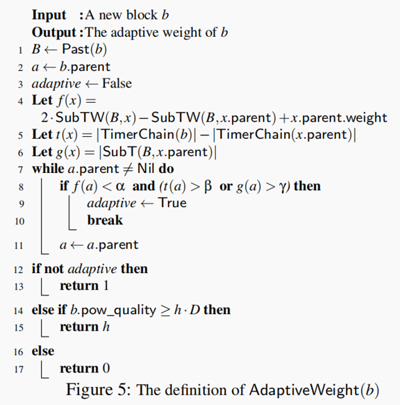
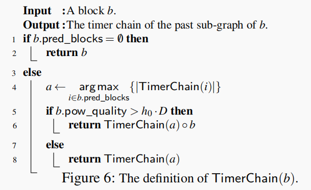

> 本文参考[A Decentralized Blockchain with High Throughput and Fast Confirmation](https://www.usenix.org/conference/atc20/presentation/li-chenxing)，7.15.2020

1.Conflux的安全性证明见这篇论文：

[GHAST: Breaking Confifirmation Delay Barrier in Nakamoto Consensus via Adaptive Weighted Blocks](https://arxiv.org/abs/2006.01072)

2.[Scaling Nakamoto Consensus to Thousands of Transactions per Second](https://arxiv.org/pdf/1805.03870)  ，18年发表，是Conflux系统的早期版本。

3.Conflux对于每个块取哈希的函数是Keccak-256，在子树权重相同时，选择最小hash值的块作为枢轴链上的块。

4.每个Epoch限制只能执行200个块。多于200个块时，只执行该epoch内的最新的200个块。

**25s以内，实际只有几秒，在confluxscan中甚至是1s中7个epoch。**

> 为抵抗Dos攻击：瞬时释放大量的块。

5.Conflux不使用flooding，而是SipHash(SHA3(Tx))+nonce。

6.块头大小为300Bytes~500Bytes。

### 6.函数解疑

PAST(B)不包括B，因为B不能够直接或间接引用自身。

## 1.Strawman Algorithm：Structured GHOST

## 2.Adaptive Weight

> h=600

检查parental tree上，从Genesis到b.parent路径上的所有块

1.检查块a是否足够安全。

2.检查块a是否足够老

- 足够的计时器滴答数，用计时器链的长度来估计每个块的时钟滴答数
- 或者块**a.parent**的子树上有足够数量的块

> h0=360,Quality(timer_block)>h0*difficulty

## 3.困难性调整

每5000个epoch，计算上一段时间内总的出块数，调整困难性以维持0.5s的出块间隔。

> Starting diffificulty (**d**0) 3*×*104 = 30000

存储snapshot从10000个epoch间隔调整到20000个epoch间隔，丢弃的是交易历史，全节点保留这些块的块头。

## link-cut tree

将处理时间从O(n)降到O(logn)

- 沿着树上的一个路径，对所有节点加减一个值（新加块的权重）
- 沿着树上的一个路径，找到最大或最小值
- 找树上的两个节点的最近共同祖先（LCA）

> 150W的块的图G中，用link-cut方法，处理块速度平均为5000blocks每s。

将树结构切分为多条路径。

增加一个块，判断是否更新Pivot Chain时，

先计算出LCA(b and p),p是当前pivot chain上的最后一个区块。

计算含p的子树权重是否仍占据优势，若是，不更新pivot chain

否则，从LCA block开始，向后向下计算子树权重变化。

## 实验结果介绍

### 验证共识协议扩展性时的实验环境：

15个全节点/虚拟机，关了签名校验和交易的执行。