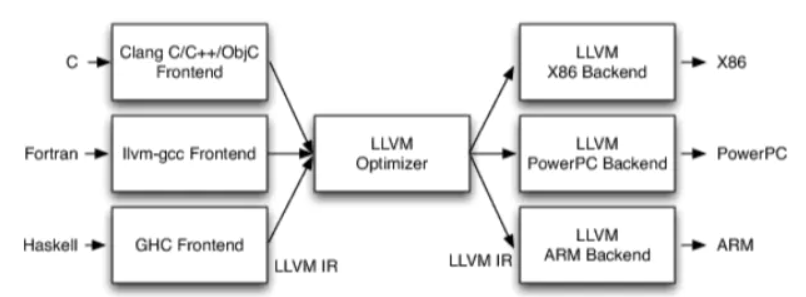

> 参考部分见https://developer.conflux-chain.org/docs/conflux-doc/docs/

> 代码部分见https://github.com/Conflux-Chain/conflux-rust/

UBuntu

```
$ sudo apt-get install clang libsqlite3-dev pkg-config libssl-dev cmake
$ apt install git
$ git config --global http.proxy http://127.0.0.1:1080
$ git config --global https.proxy http://127.0.0.1:1080
# download Conflux code
$ git clone https://github.com/Conflux-Chain/conflux-rust
$ cd conflux-rust
$ git checkout v1.1.0


# build in release mode
$ cargo build --release
```

468MB,git 34MB,clone repo 85.31MB.


---
Windows,Too difficult to configure

## -3、卸载rust

```
C:\Users\Paul C>rustup self uninstall


Thanks for hacking in Rust!

This will uninstall all Rust toolchains and data, and remove
%USERPROFILE%\.cargo/bin from your PATH environment variable.

Continue? (y/N) y

info: removing rustup home
info: removing cargo home
info: removing rustup binaries
info: rustup is uninstalled
```

## -2.Visual Studio 2015 with C++ support installed


## Rusr cargo和git走代理

在 `C:\Users\用户名\.cargo` 下创建 `config` 文件
内容为

```
[http]
proxy = "127.0.0.1:1080"

[https]
proxy = "127.0.0.1:1080"
```

```bash
#走代理
#没有作用的语句 
netsh winhttp set proxy 127.0.0.1:1080 "localhost;"
netsh winhttp reset proxy
#有用的
git config --global http.proxy http://127.0.0.1:1080

git config --global https.proxy http://127.0.0.1:1080
1080,http和https
8088，socks
#直接连接

git config --global --unset http.proxy 

git config --global --unset https.proxy 
```


## Build from Source Code

为了从代码编译运行conflux，需要三个条件：rust、clang和conflux_rust源码。

### 0.clone

```
$ git clone https://github.com/Conflux-Chain/conflux-rust
$ cd conflux-rust
$ git checkout v1.1.0
```

### 1.cargo clean

```
Caused by:
  拒绝访问。 (os error 5)
```

用powershell出现以上错误，而用cmd却没有。

### 2.cargo update

#### 遇到问题3

```
PS F:\Senior01\DiplomaPro\Code\conflux-rust> cargo update
    Updating git repository `https://github.com/Conflux-Chain/sqlite3-sys.git`
error: failed to resolve patches for `https://github.com/rust-lang/crates.io-index`
...
  fatal: unable to access 'https://github.com/Conflux-Chain/sqlite3-sys.git/': OpenSSL SSL_connect: SSL_ERROR_SYSCALL in connection to github.com:443
```

> 问题原因：https://www.kanzhun.com/jiaocheng/171998.html，主机解析为IPV6影响。
>
> 在MAC上可以**`networksetup -setv6off Wi-Fi`**，在Win10上，我把v2ray代理配置文件的服务器地址从IPV6改回IPV4地址即可。

更新成功后的文件变化可以参考(info\18.cargo_update后的内容.txt)

### 3.cargo build -- release

包含595个crates。Downloaded,Compile,

#### 遇到问题4：找不到编译平台

```
error: failed to run custom build command for `snappy-sys v0.1.0 (https://github.com/busyjay/rust-snappy.git?branch=static-link#8c12738b)`
--- stdout
 running: "cmake" "C:\\Users\\Paul C\\.cargo\\git\\checkouts\\rust-snappy-0ed33e4b7b96fc57\\8c12738\\snappy-sys\\snappy" "-G" "Visual Studio 16 2019" "-Thost=x64" "-Ax64" "-DCMAKE_INSTALL_PREFIX=F:\\Senior01\\DiplomaPro\\Code\\conflux-rust\\target\\release\\build\\snappy-sys-c118e1192ebdfdf1\\out" "-DCMAKE_C_FLAGS= -nologo -MD -Brepro" "-DCMAKE_C_FLAGS_RELEASE= -nologo -MD -Brepro" "-DCMAKE_CXX_FLAGS= -nologo -MD -Brepro" "-DCMAKE_CXX_FLAGS_RELEASE= -nologo -MD -Brepro" "-DCMAKE_ASM_FLAGS= -nologo -MD -Brepro" "-DCMAKE_ASM_FLAGS_RELEASE= -nologo -MD -Brepro" "-DCMAKE_BUILD_TYPE=Release"
-- Configuring incomplete, errors occurred!
 --- stderr
  CMake Error at CMakeLists.txt:2 (project):
    Generator

      Visual Studio 16 2019

    could not find any instance of Visual Studio.
```

可能是缺组件，或者是缺少环境变量配置。


环境变量没有问题，安装组件：


#### 遇到问题5：

`-- The C compiler identification is unknown`


1.安装LLVM并添加到PATH，

> 理解LLVM：https://www.jianshu.com/p/1367dad95445



- LLVM现在被作为实现各种静态和运行时编译语言的通用基础结构(GCC家族、Java、.NET、Python、Ruby、Scheme、Haskell、D等)

## 1.测试

>https://docs.soliditylang.org/en/v0.5.7/installing-solidity.html

官方提供的单元测试用rust编写，完整性测试用 Python3 (version>=3.6)编写。借助这些测试可以测试修改代码的成功性。

完整性测试依赖`eth_utils`、`sha3`、`jsonrpcclient`、`rlp`。

为了运行测试，需要下载solidity compiler version 0.5.2,为了下载solidity，需要VS2019安装v141组件和SDK8.1（官网下载安装）.

```bash
#安装solidity及其依赖
git clone --recursive https://github.com/ethereum/solidity.git
cd solidity
scripts\install_deps.bat
```

之后，

```bash
mkdir build
cd build
cmake -G "Visual Studio 15 2017 Win64" ..
```

之后，生成sln文件，双击在其中生成release版本文件即可。

也可以`cmake --build . --config Release`

```bash
crash_test.py
commission_privilege_test.py
erc20_test.py
blame_test.py
network_tests\node_db_ip_limit_test.py
light\get_storage_root_test.py
network_tests\session_subnet_limit_test.py
rpc_test.py
sync_test.py
network_tests\discovery_test.py
admin_control_test.py
expire_block_test.py
tx_consistency_test.py
crash_archive_test.py
fixed_supply_token_test.py
log_filtering_test.py
reorg_test.py
latest_confirmed_test.py
sponsored_tx_test.py
secondary_reward_test.py
fork_same_height_hiding_test.py
transaction_test.py
light\rpc_test.py
throttle_test.py
network_tests\session_ip_limit_test.py
transaction_epoch_bound_test.py
ghast_consensus_test.py
full_node_tests\remove_old_eras_test.py
light\tx_relay_test.py
issue1303_test.py
network_tests\node_reputation_test.py
message_test.py
light\sync_test.py
pubsub\epochs_test.py
full_node_tests\issue1513_test.py
crash_archive_era150_test.py
light\log_filtering_test.py
pubsub\newHeads_test.py
ghast_test.py
consensus_test.py
storage_rpc_test.py
state_maintain_test.py
full_node_tests\p2p_era_test.py
admin_at_creation_test.py
example_test.py
invalid_message_test.py
contract_bench_test.py
issue988_test.py
storage_root_test.py
vote_token_test.py
network_tests\p2p_throttling_test.py
pubsub\logs_test.py
withdraw_deposit_test.py
reentrancy_test.py
full_node_tests\sync_checkpoint_test.py
```

2.代码运行在CFX的测试网上，所以下载的程序后缀为testnet，与tethy的区别是启动节点、链id和toml文件的不同。

代码逻辑部分看的是：[v1.0.2-testnet](https://github.com/Conflux-Chain/conflux-rust/archive/v1.0.2-testnet.zip)，而实际运行时运行的是[v1.1.2](https://github.com/Conflux-Chain/conflux-rust/archive/v1.1.2-testnet.zip)

## 2.编译源代码时

这一项会卡住：Compiling librocksdb_sys v0.1.0

```
error: failed to run custom build command for `librocksdb_sys v0.1.0 (https://github.com/Conflux-Chain/rust-rocksdb.git?rev=586f186974a6083268fee95d72ffb2b0f2a9333b#586f1869)`
```

```
git config --global --add remote.origin.proxy ""
```

## 3.代码解读

cors\src\consensus\consensus_inner\mod.rs

- struct ConsensusGraphInner
- struct ConsensusGraphNode
- struct ConsensusGraphNodeData


每个节点都有一个内部索引，借助

```rust
//12+1个成员
pub struct ConsensusGraphNode {
    pub hash: H256,
    pub height: u64,
    pub parent: usize,
    difficulty: U256,
    is_heavy: bool,
    is_timer: bool,
    /// The total number of *executed* blocks in its past (not including self)
    past_num_blocks: u64,
    adaptive: bool,

    /// The genesis arena index of the era that `self` is in.
    ///
    /// It is `NULL` if `self` is not in the subtree of `cur_era_genesis`.
    era_block: usize,
    children: Vec<usize>,
    referrers: Vec<usize>,
    referees: Vec<usize>,
	/// Unlike the
    /// above fields, this information will only be available after the
    /// block is *preactivated* (after calling preactivate_block().
    pub data: ConsensusGraphNodeData,
}
```


```rust
pub struct ConsensusGraphNodeData {
//包含一个块随着共识图状态的发展而改变的所有额外信息
    pub epoch_number: u64,
    partial_invalid: bool,
	pending: bool,
```


- struct ConsensusGraphPivotData
