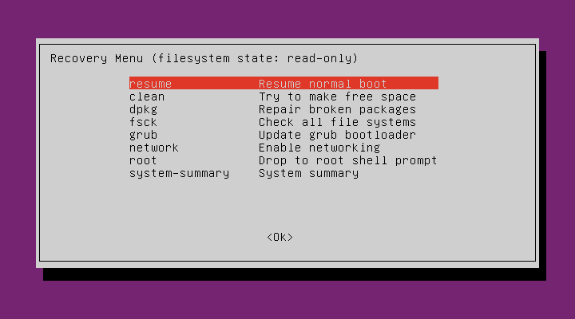
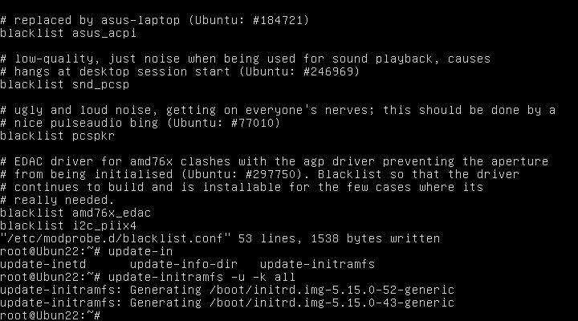

## 1.piix4_smbus ****SMBus Host controller not enabled

>  [weixin_46238869的blog](https://blog.csdn.net/weixin_46238869/article/details/119717890) 

1.在开机界面按住shift键，进入后选择[Advanced Option]-->[Recovery Mode]，获得恢复菜单如下；



2.选择[root] ，连敲两次回车，获得root命令行。


3.命令行中输入：

```
mount -o remount,rw /    #用可读写模式重新挂上根分区
vi /etc/modprobe.d/blacklist.conf   #修改模块黑名单
```


4.按住i，在文件末尾追加下面的黑名单，保存。

```
blacklist intel_powerclamp
blacklist i2c_piix4
```

5.更新镜像。

```
update-initramfs -u -k all
```



6. 最后输入reboot重启 


## 2.mtd device must be supplied

> [BugReport](https://bugs.launchpad.net/ubuntu/+source/systemd/+bug/1981622)
>
> [StackOverflow](https://askubuntu.com/questions/1417618/mtd-device-must-be-supplied-device-name-is-empty)

1. 这个消息是由于mtdpstore module的默认配置有问题。 
2. 不影响启动，在启动后，做一次update就可以消除这个问题。


## 3.nouveau unknown chipset

[显卡驱动不支持问题](https://www.linuxquestions.org/questions/linux-newbie-8/how-can-we-fix-this-nouveau-000-07-00-0-unknown-chipset-b76000a1-4175692213/)

```
Add nomodeset nouveau.modeset=0 to the kernel options to fix it.
```

[grub编辑](https://www.reddit.com/r/Ubuntu/comments/g37gvy/i_added_nouveaumodeset0_to_the_grub_cmdline/)


 1.Vmware-->【加速3D图形】 取消勾选


2.本机命令行：

```
netsh winsock reset
```

# 