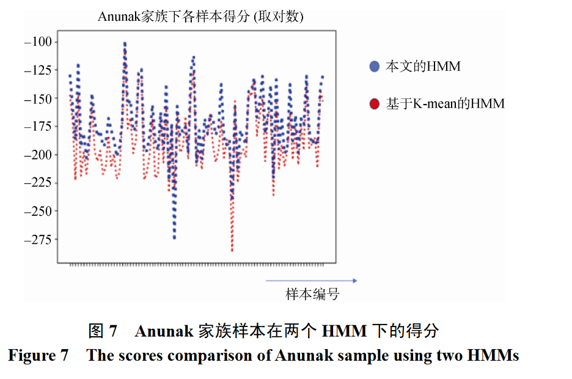

> 面向 APT 家族分析的攻击路径预测方法研究，信息学报，陈伟翔 1, 任怡彤 1, 肖岩军 2, 侯 锐 3, 田志宏 1 

IDS需要关联 APT 生命周期内的数 个阶段, 以此提高检测攻击能力。

## 1.要解决的问题

基因库--可靠数据获取方法

HMM----预测的攻击路径的可解释性

## 2.概念

### 攻击行为概述

“寻找入口点”、“C2 通信”、“权限提升”、“资 产发现”、“数据过滤”、

### APT 攻击路径的可见状态集

#### 注册表&服务

CS(create-service): 创建服务

MRV(modify-registry-value): 修 改注册表的行为; 

DRKV(delete-registry-key-value): 删除注册表关键信息的行为; 

#### 内核

CKO(create-kernelobject): 创建内核对象的行为;  

MMP(modify-memory-property): 修 改内存权限的行为; 

#### 进程

CP(create-process): 创建进程;

LL(load-library): 加载 库 ;

ESI(execshellcode-instr): 执行 shellcode 指令; 

EHI(exec-heapinstr): 执行堆指令;

WTPM(write-to-process-memory): 写入进程内存;

 ERI(exec-ret-instr): 执行 ret 指令;

 EEI(exec-esp-instr): 执行 esp 指令;

 CT(create-thread): 创建线程; 

#### 网络

SDQ(send-dnsquery): 发送 DNS 请求行为;

SNP(send-network-packet): 发送网络数据包;

LOP(listen-on-port): 监听端口。

CTS(connect-to-socket): 连接 socket;

#### 文件

CF(create-process): 创 建文件的行为;

 WTF(write-to-file): 写入文件的行为;

### 动态分析工具

Anubis、Norman、Joebox

### 基因库

基因(序列)：(MD5,env,object_1,object_2,action_name)按照时间排序

object_1 与 object_2 分别代表软件执行动作的对象 和路径

同一个 APT 家族下恶意软件基因集合, 称为一个 APT 家族的基 因库。

### 钻石模型

一个 APT 攻击包含“攻击者”、 “受害者”、 “能力”和“基础设施”4 个核心元 素。

“能力”是攻击者使用的工具或技术, 从 探查到最终目的达成, “技术”存在于每一个攻击阶 段, 每一个恶意动作对应的技术细节可体现出相应 战略意图。

“基础设施”是攻击者维持权限控制的通 道或者载体。

## 3.方法

## Smith waterman算法+

相似的公共子序列一定是得分最高的那一条。

 **比对序列为：A=GGTTGACTA，B=TGTTACGG** 

则两序列的长度分别为len(A) = n，Len(B)=m；
s(a,b)：字符a和字符b的相似分数，这里设置为3，不相等则为-3；

W1 = 2 ：一个空位罚分，这里设置为2（可根据需要设置） 

H：匹配分数矩阵如下。

1. 初始化算法分数矩阵H。A是列向量，B是行向量。使行i表示字符ai，列j表示字符bj；
2. 

3. 回溯，从矩阵H中分数最大的一项开始：
   若ai=bj，则回溯到左上角单元格
   若ai≠bj，回溯到左上角、上边、左边中值最大的单元格，若有相同最大值的单元格，优先级按照左上角、上边、左边的顺序
4. 根据回溯路径，写出匹配字符串：
   若回溯到左上角单元格，将ai添加到匹配字串A‘，将bj添加到匹配字串B’；
   若回溯往上走，此时A走了，B没走。将ai添加到匹配字串A’，将\_添加到匹配字串B’；
   若回溯到左边单元格，B走了，A没走。将\_添加到匹配字串A’，将bj添加到匹配字串B’。
5. 得到局部最优匹配序列，结束

### 数据处理

1.**APT基因库**要去重、去无效、去冗余（Smith-waterman局部序列对比算法去除相似基因，阈值为80%）。

->节省存储、简化算法复杂度

基因个体不重要，基因行为才重要。：(MD5,env,object_1,object_2,action_name)，去除md5，env作关键词替换，object1只保留可执行文件。

2.**公共基因：**对所有APT基因库中的基因进行相似度检测，相似度90%以上的基因序列作为公共基因。

恶意软件的通用动作。

3.**恶意行为基因库**：各个家族APT基因库-公共基因，之后合并各个家族基因库。

4.可观测状态集：**恶意软件行为可观测链：**恶意软件基因序列,与恶意行为基因库进行比较。保留相似度 Thres_hold 在 90%以上的基因序列的基因尾的动作名称，不包含基因段属性信息，从而保证可观测状态可计算属性。

#### 缺陷1：

恶意行为基因库进 行可观测链提取, 而这些基因序列来自于软件行为。

只能使用基因中 包含 C2 通信的部分进行关联和提取, 基因库的使用 率不足 30%,

5.隐藏状态集 资产发现 数据过滤 寻找入口 C2 通信

将测试集 中的样本放入各自的 APT 家族的 HMM 中计算下一 时刻攻击路径的隐藏状态和可观测状态的概率

### 展示结果时

将各个家族样本按照编号排序，把得分取对数，构成下面的得分图。

## 4.优势

### 1.精准定位到具体基因

****

能精准定位到具体基因, 能在一定程度上应对 恶意软件变种, 能在一定程度上应对 恶意软件变种

### 2.可同时对隐藏状态和可观测状态展开预测

### 3.在进行最终结果判定时, 将多个观测值作为判定结果

只要结果在观测值组里，就正确，可以提高实验表现，也能提供参考。

## 劣势

隐藏状态只有四个；

在 数据质量方面, 若一条观测链在多个模型下均展现 出极少或是单一的 APT 阶段, 就会严重影响 HMM 的构建。

在多个路径时，基因检测的识别准确率不如 HMM 检测法, 但是

