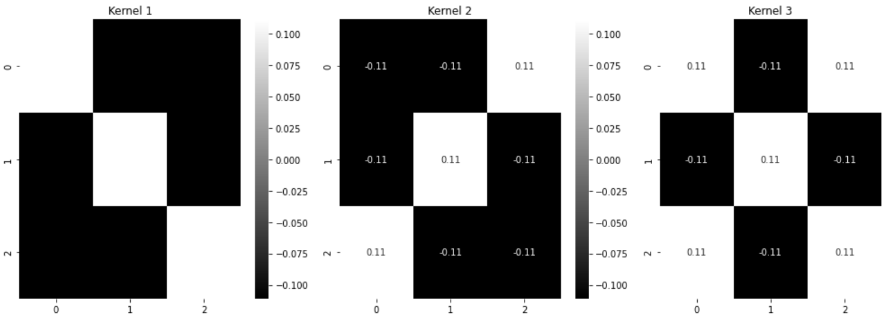
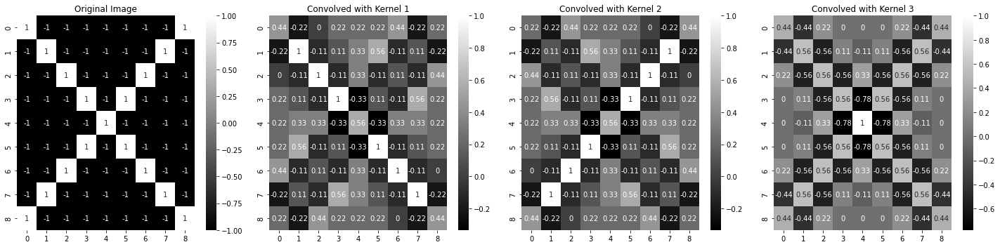

## 卷积核的作用

-  一个图像矩阵经过一个卷积核的卷积操作后，得到了另一个矩阵，这个矩阵叫做特征映射（feature map）。 

- 每一个卷积核都可以提取特定的特征，不同的卷积核提取不同的特征 

利用附录里的[卷积核测试代码](#卷积核效果测试代码)，

借助图中的三个卷积核，



分别可以提取X的左上右下、中间和右上左下特征。将图片X用三个卷积核计算，得到三个 特征矩阵 。

获得下面的热力图。



可以发现， 其中的值，

- 越接近为1表示对应位置和卷积核代表的特征越接近，

- 越是接近-1，表示对应位置和卷积核代表的反向特征越匹配，

- 而值接近0的表示对应位置没有任何匹配或者说没有什么关联。 

## GIN模型

### 1.模型结构


## 附录

### 卷积核效果测试代码

```python
import numpy as np
import matplotlib.pyplot as plt
import seaborn as sns
#热图用处
#相关性矩阵: 查看多个变量之间的关系。颜色可以帮助你快速识别哪些变量之间有强烈的正相关（例如，显示为深红色）或强烈的负相关（例如，显示为深蓝色）。

#混淆矩阵: 分类任务中，混淆矩阵表示出模型在每个类别上的表现。使用热图可以更容易地识别模型在哪些类别上表现不佳。

#数据密度: 如果你有两个维度的大量数据点，可以使用热图来查看哪些区域的数据点最多，哪些区域的数据点最少。
from scipy import signal

# 生成一个简单的示例图像
image = -1 * np.ones((9, 9), dtype=int)

# 将主对角线上的元素设置为1
np.fill_diagonal(image, 1)

# 将副对角线上的元素设置为1
np.fill_diagonal(np.fliplr(image), 1)

# 定义三个卷积核
kernel1 = np.array([
    [1, -1, -1],
    [-1,  1, -1],
    [-1, -1, 1]
]) /9 # \边缘检测
kernel2 = np.array([
    [-1, -1, 1],
    [-1,  1, -1],
    [1, -1, -1]
]) /9 # \边缘检测
kernel3 = np.array([
    [1, -1, 1],
    [-1,  1, -1],
    [1, -1, 1]
])/9  # X边缘检测

kernel4 = np.array([
    [0, -1, 0],
    [-1, 1, -1],
    [0, -1, 0]
]) /9 # 锐化

kernel5 = np.array([
    [1, 1, 1],
    [1, 1, 1],
    [1, 1, 1]
]) / 9  # 平均/模糊

# 对图像进行卷积操作
conv_image1 = signal.convolve2d(image, kernel1, mode='same')
conv_image2 = signal.convolve2d(image, kernel2, mode='same')
conv_image3 = signal.convolve2d(image, kernel3, mode='same')

# 可视化结果
fig, axarr = plt.subplots(1, 4, figsize=(20, 5))
#annot=True表示单元格中显示数据值	
sns.heatmap(image, ax=axarr[0], annot=True, cmap='gray')
axarr[0].set_title("Original Image")

sns.heatmap(conv_image1, ax=axarr[1], annot=True, cmap='gray')
axarr[1].set_title("Convolved with Kernel 1")

sns.heatmap(conv_image2, ax=axarr[2], annot=True, cmap='gray')
axarr[2].set_title("Convolved with Kernel 2")

sns.heatmap(conv_image3, ax=axarr[3], annot=True, cmap='gray')
axarr[3].set_title("Convolved with Kernel 3")

plt.tight_layout()
plt.show()
```

### GIN模型代码

> [CSDN小班课笔记专栏](https://blog.csdn.net/oldmao_2001/article/details/118853262)

```python
import torch
import torch.nn as nn
import torch.nn.functional as F
from dgl.nn.pytorch.conv import GINConv
from dgl.nn.pytorch.glob import SumPooling, AvgPooling, MaxPooling

#自定义节点更新特征的方式，这里是mlp+bn+relu，实际是对应原文公式4.1第一项
class ApplyNodeFunc(nn.Module):
    """Update the node feature hv with MLP, BN and ReLU."""
    def __init__(self, mlp):
        super(ApplyNodeFunc, self).__init__()
        self.mlp = mlp
        self.bn = nn.BatchNorm1d(self.mlp.output_dim)

    def forward(self, h):
        h = self.mlp(h)
        h = self.bn(h)
        h = F.relu(h)
        return h


class MLP(nn.Module):
    """MLP with linear output"""
    #num_layers:共有多少层
    #input_dim：输入维度
    #hidden_dim：隐藏层维度，所有隐藏层维度都一样
    #hidden_dim：输出维度
#...

class GIN(nn.Module):
    """GIN model初始化"""
    def __init__(self, num_layers, num_mlp_layers, input_dim, hidden_dim,
                 output_dim, final_dropout, learn_eps, graph_pooling_type,
                 neighbor_pooling_type):
        """model parameters setting
        Paramters
        ---------
        num_layers: int这个是GIN的层数
            The number of linear layers in the neural network
        num_mlp_layers: intMLP的层数
            The number of linear layers in mlps
        input_dim: int
            The dimensionality of input features
        hidden_dim: int
            The dimensionality of hidden units at ALL layers
        output_dim: int
            The number of classes for prediction
        final_dropout: float最后一层的抓爆率
            dropout ratio on the final linear layer
        learn_eps: boolean在学习epsilon参数时是否区分节点本身和邻居节点
            If True, learn epsilon to distinguish center nodes from neighbors
            If False, aggregate neighbors and center nodes altogether.
        neighbor_pooling_type: str邻居汇聚方式，原文公式4.1的后半部分
            how to aggregate neighbors (sum, mean, or max)
        graph_pooling_type: str全图汇聚方式，和上面的邻居汇聚方式可以不一样
            how to aggregate entire nodes in a graph (sum, mean or max)
        """
        super(GIN, self).__init__()
        self.num_layers = num_layers
        self.learn_eps = learn_eps

        # List of MLPs
        self.ginlayers = torch.nn.ModuleList()
        self.batch_norms = torch.nn.ModuleList()

        for layer in range(self.num_layers - 1):#GIN有几层，除了最后一层每层都定义一个MLP（num_mlp_layers层）来进行COMBINE
            if layer == 0:#第一层GIN，注意输入维度，
                mlp = MLP(num_mlp_layers, input_dim, hidden_dim, hidden_dim)
            else:
                mlp = MLP(num_mlp_layers, hidden_dim, hidden_dim, hidden_dim)

            #更新特征的方式是ApplyNodeFunc，邻居汇聚方式为neighbor_pooling_type
            #具体参考：https://docs.dgl.ai/api/python/nn.pytorch.html#ginconv
            self.ginlayers.append(
                GINConv(ApplyNodeFunc(mlp), neighbor_pooling_type, 0, self.learn_eps))
            self.batch_norms.append(nn.BatchNorm1d(hidden_dim))

        # Linear function for graph poolings of output of each layer
        # which maps the output of different layers into a prediction score
        self.linears_prediction = torch.nn.ModuleList()

        
        #以下代码是将每一层点的表征保存下来，然后作为最后的图的表征计算
        for layer in range(num_layers):
            if layer == 0:
                self.linears_prediction.append(
                    nn.Linear(input_dim, output_dim))
            else:
                self.linears_prediction.append(
                    nn.Linear(hidden_dim, output_dim))

        self.drop = nn.Dropout(final_dropout)

        #图表征消息汇聚的方式
        if graph_pooling_type == 'sum':
            self.pool = SumPooling()
        elif graph_pooling_type == 'mean':
            self.pool = AvgPooling()
        elif graph_pooling_type == 'max':
            self.pool = MaxPooling()
        else:
            raise NotImplementedError
```


