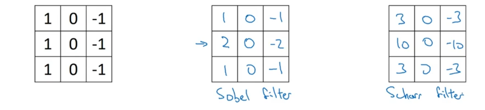
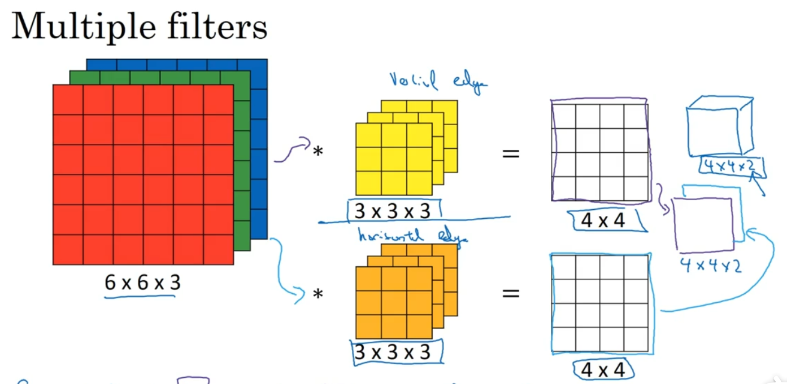

> [吴恩达深度学习-卷积神经网络](https://www.bilibili.com/video/BV1e54y1b7uk?p=4)

## 1.介绍

Neural Style transfer神经风格转换：

通过NN把内容图像按照风格图像重绘。

参数过多，训练时对内存和计算量的需求过大；

数据获得的太少，导致过拟合；

## 2.卷积计算

image-->filter--->image

```python
nn.Conv2d#conv-forward
```

<!-- more -->

### 垂直边缘检测器


三种边缘检测器

旋转90°，变为水平检测器；

### Pading

f(filter的长和宽）总是奇数，方便对称填充，有个特殊点。

n+2p-f+1===n; 使得Padding后的图形，在做卷积操作后的输出维度保持不变

此时p=(f-1)/2

## 3.Strided Convolution

> https://www.bilibili.com/video/BV1e54y1b7uk?p=5&spm_id_from=pageDriver

## 4.Convolutions on volumes

高维上的卷积


$$
(6 ×6 ×3)*  (3 ×3 ×3)-->4 ×4
$$


