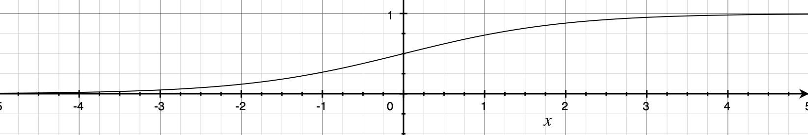

# Logistic regression逻辑回归

二分类算法；

- image-->matrices-->feature vector-->{0,1}；
- many images-->X-->Y；

<!-- more -->

## 1.Notation


$$
training\ set:<x,y>,x∈R^{n_x},y∈\{0,1\};
\\
m\ trainging\ examples:(x^{<1>},y^{<1>}),(x^{<2>},y^{<2>}),...,(x^{<m>},y^{<m>})
\\
X=[x^{<1>},x^{<2>},...,x^{<m>}]
\\
Y=[y^{<1>},y^{<2>},...,y^{<m>}]
$$

```python
#m_train、m_test
X.shape
(nx,m)
#Label
Y.shape
(1,m)
```

## 2.激活函数

使模型可以拟合非线形函数。

###  Sigmoid激活函数




### **tanh**

过原点的单调递增曲线，值域为[-1,1]


> [激活函数](https://m.thepaper.cn/baijiahao_11444171)

和Sigmoid对比：


### Relu激活函数


线性、非饱和，可以克服学习过程中的梯度消失问题，加快训练速度。

### SoftMax


>https://www.zhihu.com/question/23765351

SoftMax Loss的缺点：

1、随着分类数目的增大，分类层的线性变化矩阵参数也随着增大；

2、针对封闭集分类问题，学习到的特征是可分离的，不适用于开放集这种所学特征没有区分性的分类问题。   ----> SM-SoftMax

## 3.学习器

基于训练数据迭代的更新神经网络权重。

### 3.1 梯度下降过程

随机梯度下降保持单一的学习率更新所有的权重，学习率在训练过程中并不会改变。

在用梯度下降法做参数更新的时候，模型学习的速度取决于两个值：

一、**学习率**；

二、**偏导值**。


### 3.2 Adam学习器

Adam 通过计算梯度的一阶矩估计和二阶矩估计而为不同的参数设计独立的自适应性学习率。

> 学习率：反向传播时修改权重的比率。

### Softmax运算：

将输出映射到(0,1)，成为一个个的概率值，累加为1。选取输出结点时，选择概率最大的结点作为预测目标。

重训练

更新：
