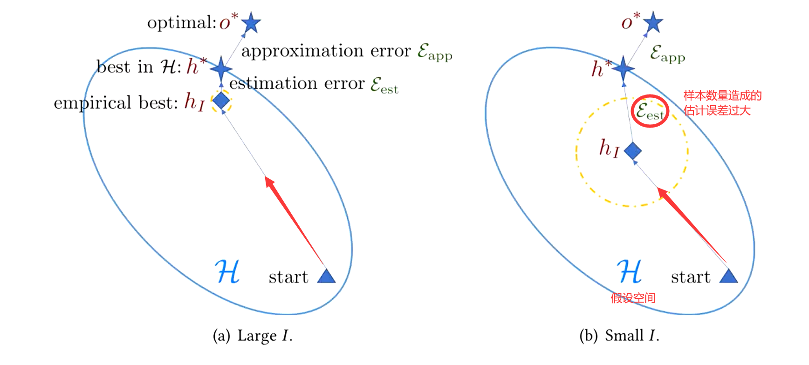
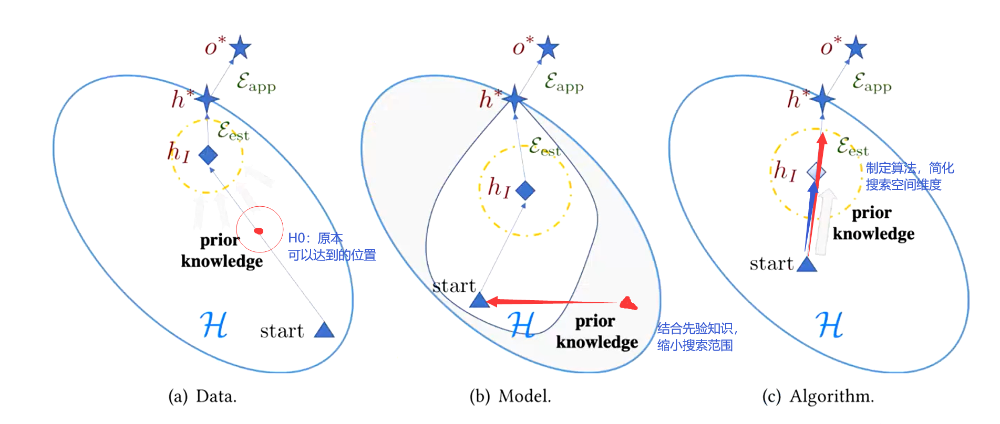
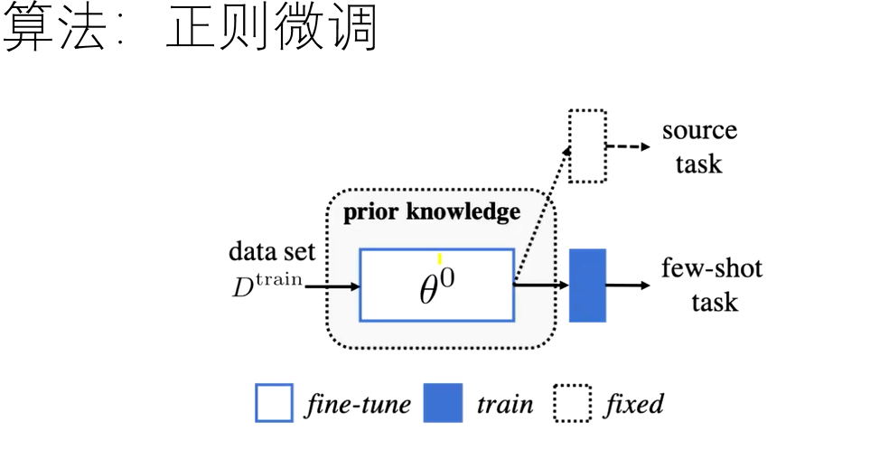
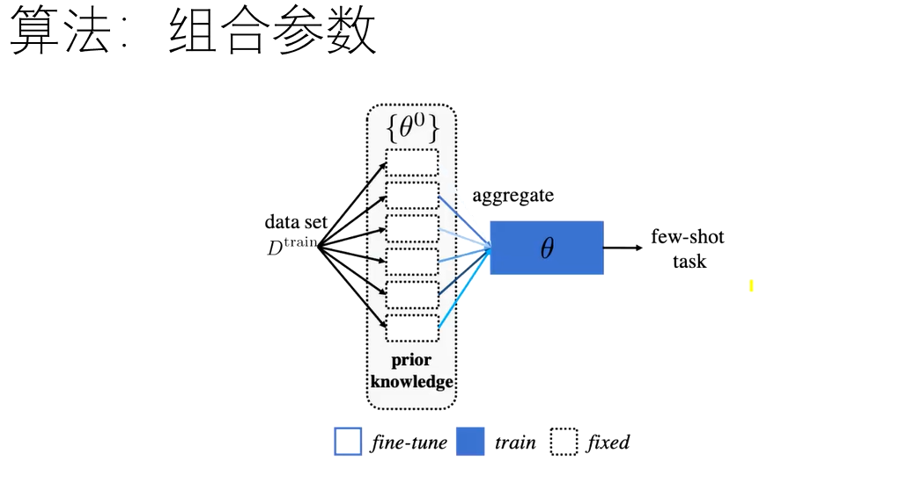
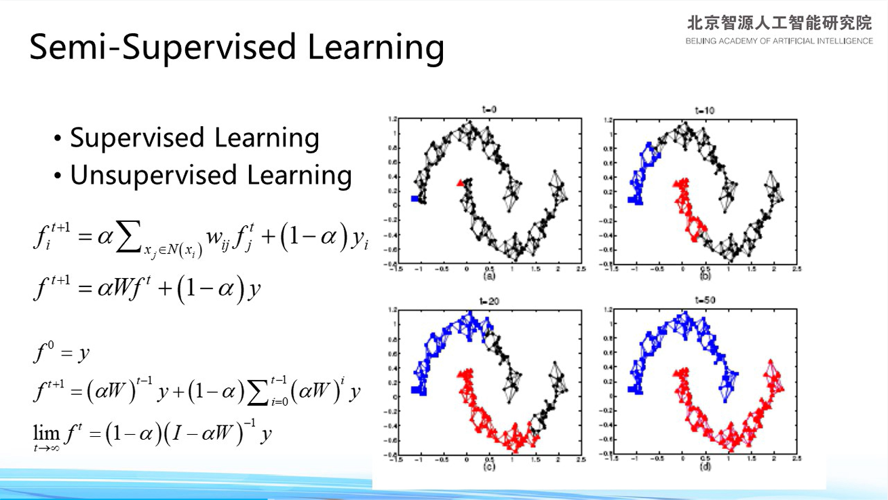
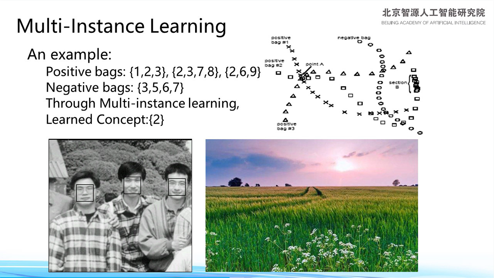
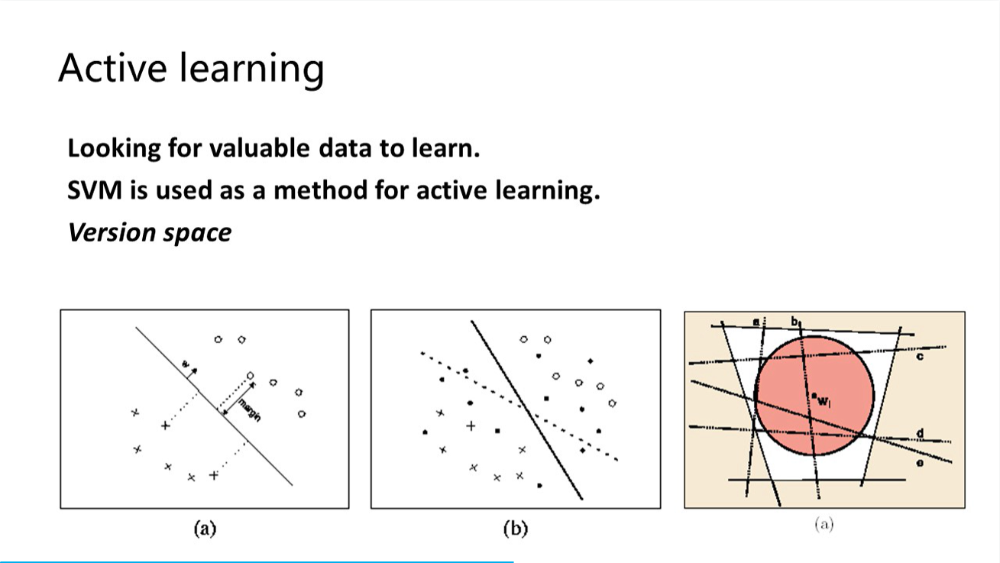
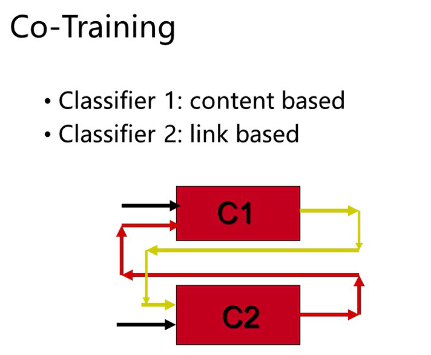

## A类

- CCS  ACM Conference on Computer and  Communications Security  ACM

- TIFS     IEEE Transactions on Information Forensics and Security IEEE
- S&P  IEEE Symposium on Security and Privacy  IEEE 

- USENIX Security  USENIX Security Symposium  USENIX Association
- NDSS Network and Distributed System Security Symposium ISOC

## B类

- TOPS  ACM Transactions on Privacy and Security  ACM 
- Computers & Security  **Elsevier**
- JCS  Journal of Computer Security  **IOS Press**
- CSFW IEEE Computer Security Foundations Workshop  IEEE 
- RAID International Symposium on Recent Advances in Intrusion Detection  Springer
- ESORICS  European Symposium on Research in Computer Security  **Springer**
- ACSAC  Annual Computer Security Applications Conference  IEEE
- DSN  International Conference on Dependable Systems and  Networks  IEEE/IFIP 可靠系统和网络

只关注这13个会议期刊，其他的在资源匮乏的时候，可以去看四家出版社或者arxiv上的论文。

## 可读论文

> [清华张长水教授团队所做论文](http://bigeye.au.tsinghua.edu.cn/paperlist.html)
>
> [Up主借鉴的小样本学习的论文]( https://github.com/WenMoLiuBai/Meta-Learning-and-Few-shot-Learning )

## 定义

> A compelling case of this approach is classifying objects classes that have not yet been used in the training set, namely Zero-shot Learning.

零样本学习：可辨别训练集里没有的新类的样本。

## 小样本学习的目标：

学会学习，**找不同**，能够判断未见过的事物。

学到基础类别的知识，进而能够学会分类同一个数据集中的新类。

基于少量样本便可完成类别的判断

**少量标签数据**，训练得到**良好泛化能力**的模型。

> [ B站-liupengyuanblcu ](https://www.bilibili.com/video/BV1Jh411X7FG)

## 问题产生的原因：

### 训练数据少：

1.标注数据cost很大，

2.有些数据的获取很难

3.有些数据本身就很少

当前模型的训练基于**经验风险最小化**，用经验风险代替期望风险，所以训练数据少时，模型误差很大。

<!-- more -->

## 解决问题的三个角度

> 借助先验知识减小经验风险

- 数据角度  
- 模型角度
- 算法角度

## 数据角度

- 造数据（专家经验：了解数据结构和数据特点；手动制订生成**规则**；通过模型学习学会数据的**自动变换**）

- 加数据  无标签数据（半监督和无监督学习得到**伪标签**）、相似数据集（对新数据集的采集样本加权平均得到新的**聚合样本**参与原数据集的训练）

### 图像数据增强的常用手段

幽影、缝合、蒙太奇、遮盖、组合

## 模型角度

- 多任务学习(multi-task learning) 利用多个任务去相互辅助对方学习

- 嵌入式学习(embedding learning)
  - 任务不变（对所有任务都一样）
  - 任务特定的（对每个任务都要学习一个新的学习器）
  - 结合任务不变和任务特定的
  
- 借助额外**记忆**(external memory)学习  
  
  **知识存放于记忆；用时检索；不断更新**
  
  - 人的记忆
  - 神经图灵机NTM
  
- **生成模型**(generative models)

  - part and releation
  - super class
  - 潜变模型 latent variable  自编码Auto-Encoding；贝叶斯(Bayes)推理

## 为什么以上模型可以简化搜索空间？

| 策略       | 学得的先验知识                   | 如何限制搜索空间                                             |
| ---------- | -------------------------------- | ------------------------------------------------------------ |
| 多任务学习 | 数据集里的其他任务               | 共享参数（多个任务用一套参数）                               |
| 嵌入式学习 | 任务嵌入到一起                   | 将样本**映射到较小的嵌入空间**中，其中可轻易划分相似和不相似样本 |
| 额外记忆   | 嵌入层与记忆交互                 | 借助记忆的训练数据限定样本以合并特定任务的信息               |
| 生成模型   | 借助先前的训练得到参数的先验知识 | 限制了样本分布                                               |

## 算法角度

1.微调fine-tune已存在模型     **正则**、组合、新参数微调

2.微调元学习器的参数  元学习器已经学到了任务的分布，这个通用参数足够优秀，离目标已经很接近了。进而通过梯度下降和**考虑不确定性**去微调

3.加入一个元优化器指定搜索步骤(search steps)

### 正则微调

经典？？？

### 组合参数微调

对于已经学到的参数，选取当前任务最相关的几个参数组合用于当前任务；

### 新参数微调

改动原模型的某几层，只学习改动的这几层的参数即可。

### 元优化器

不再用固定的元学习器，自己训练一个。

> 语义嵌入和数据增强中的小样本学习，2019年12月4日 报告人：付彦伟、何旭明 https://www.bilibili.com/video/BV1SJ41167sW

## 小样本学习常用框架

>[极市平台ValseWebinar-元学习与小样本学习](https://www.bilibili.com/video/BV11E411x7ho)
>
>Few-Shot lmage Recognition by Predicting Parameters from Activations ,Siyuan Qiao,Chenxi Liu, Wei Shen，Alan L Yuille,CVPR 2018, Salt Lake City,Feb 18,2020

### 1.m-shot n-way

### 2.基于预训练模型用小样本适应

预训练模型是在Large-scale的数据集上得到

目标：在D_few上表现良好,对模型在D_large上的性能影响小，经过少量训练即可快速加入新的类别进行推理和适应。

## 小样本学习可以借鉴的其他机器学习思路

>[小样本学习 | 张长水](https://www.bilibili.com/video/BV1jt411c7XV)，2019-07-31，**绕过或者简化标注数据这一流程的技术。**

在semantic space 语义空间中随机添加噪声生成数据。

prototypical learning 原型学习，测试样本与各个原型之间的距离。

### 层次聚类方法

### crowd sourcing

09年时技术，crowd sourcing，在众包的情况下做机器学习：

图像验证码智商税从此而来。

### **半监督学习(semi-)**

1.**标签传播**将所有无标注数据标注。

要给出少量的标注数据，给出一个函数能够不断迭代，给出解证明其收敛，使得**标签传播**将所有无标注数据标注。

2.半监督学习，通过交互的方式，做图像分割很完美。

[医学图像的分割](Yangqiu Song, Changshui Zhang, Jianguo Lee, Fei Wang, Shiming Xiang, Dan Zhang. Semi-Supervised Discriminative Classification with Application to Tumorous Tissues Segmentation of MR Brain Images. Pattern Analysis and Applications (PAA),Volume 12,Page 99-115,2009)

3.颜色迁移和背景填充

### 多事例学习Multi-instance Learning

打很弱的标签，不需要很精准。告诉模型一部分图像有人脸，但不知道是谁；一部分图像完全没有。-->假设：映射空间中密集位置是模型要学习的特征--->最终，模型能够找到人脸。

### 

标注最有价值（判断标准和学习方法相关；如SVM是在分界线边缘的）的那部分数据，使得解空间迅速缩小。

### 多标签学习

可以学习到标签间的从属关系

City--car

----road

----building

### 协同训练

靠C1给的很确信的分类数据去训练C2，靠C2标注的很确信的分类数据去训练C1，可大幅提高两个模型的准确性（我的评价：不知道和多任务学习有何异同）

## 稀疏学习 

**或许可以用于标注程序中的payload部分**

 减少标注量，还可以用于混叠图像分离（边缘的稀疏性是一个很重要的特征）

- Low Rank  用于数据推荐

### **Transfer Learning**

很大的一个框架，把这件事的经验迁移到另一件事情

