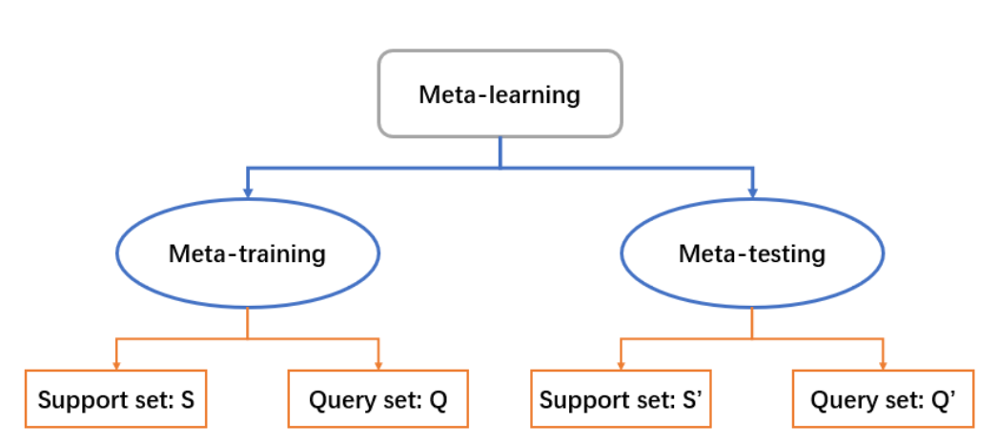
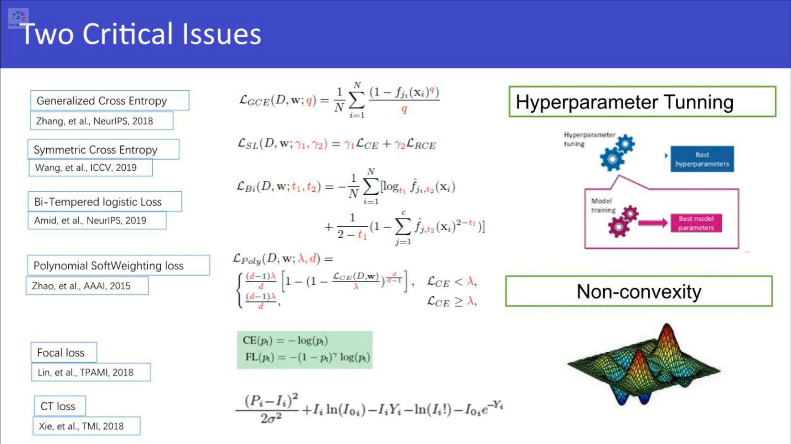

> [Shusen Wang](https://www.bilibili.com/video/BV1Et4y1i7pu)
>
> [小样本学习研究综述-赵凯琳,靳小龙,王元卓-中国科学院-...](https://www.bilibili.com/video/BV1a5411P7vF)
>
> [有限元笔记10-个人的有限元学习经验分享](https://www.bilibili.com/video/BV1TU4y1e7R5)
>
> [迁移学习](https://www.bilibili.com/video/BV1qv411571z)
>
> [智源LIVE第4期│李文斌:基于局部表征学习的小样本学...](https://www.bilibili.com/video/BV12U4y1N7ha)
>

> 注：元学习不等同于小样本学习；虽然有人把它们混用。 meta learning 是学习如何学习，few-shot learning 是要达到的目标，后者常常借助前者，以至于有人说Few-shot Learning 是 Meta Learning 在监督学习领域的应用。，但实际上少样本学习包含的范围比较大，两者更准确地说属于有交集但不完全重合的关系。

## 参数概念

> 知乎-[小样本学习中的一些基本概念](https://zhuanlan.zhihu.com/p/84290146)
>
> [元学习(meta learning)和小样本学习(few-shot learning)](https://blog.csdn.net/weixin_44422920/article/details/124229002)

 在 FSL 中，经常用到的一类方法被称为 Meta-learning。 

> （1）**support set** :每次训练的样本集合很小，的数据集，用以提供参考信息，不足以训练大型神经网络。
>  （2）**query set** :用于与训练样本比对的样本，一般来说query set就是一个样本。Query data的类别属于support data中的类别，Q的类别可以在S中看到，但在训练数据集里看不到。 
>
> （3）在support set中，如果有n个种类，每个种类有k个样本，那么这个训练过程叫n -way k-shot ，如下图就是5-way 1-shot。 

FSL 通常会被分成 N-way k-shot 问题，特指 **Meta-testing **中的Support Set S'的情况，对于训练过程中的S和Q没有任何要求。

对于训练过程，要根据query set S，每次放入一个样本得到其预估分类，和真实标签做损失后更新模型；

其中，N 指的是 **Meta-testing 过程中的样本类别数**，k 指的是 Meta-testing 的过程中每一类有多少个样本，

 S' 和 Q' 是如何得到的？如上图所示，假设 Testing data 所代表的大的矩形框对应着原始的测试数据，这些数据可能包含有很多类。现在，我们从中随机选出 N 个类，每个类都可能含有很多个样本。然后，我们再从这 N 个类中，每类都随机选出 k+x 个样本（x 代表可以选任意个，但必须满足 k+x 不超过每个类最大的样本个数），其中的 k 个样本将被用作 Support set S'，另外的 x 个样本将被用作 Query set Q'。由此，我们便得到了 Meta-testing 过程中需要用到的两个数据集。

> - 测试数据的样本规模 N*(k+x)，x为任意值。
>
> -  S 与 Q 中的样本通常是不会重合的，S' 与 Q' 亦然。 

## 元学习Meta learning 

传统监督学习： 对于一个给定训练数据集，通过训练使模型可以识别训练数据集，并将其泛化到测试数据集中。要求测试数据集中数据标签类别包含在训练数据集中。
meta learning： 目的是让模型learn to learn，使模型可以区分不同的事物。意思是让模型自己学会学习。通过一张待测试图像，其类别不包含在训练数据集中，但包含在support set中，通过待测试图像与support set中每张图像计算他们之间的相似度，将与support set中相似度最高的类别作为query图像的类别，完成模型的预测。

## 

>https://zhuanlan.zhihu.com/p/334641593

##  **多任务学习（MTL）：**

**一般来说，优化多个损失函数就等同于进行多任务学习（与单任务学习相反）。**

联合学习（joint learning）、自主学习（learning to learn）和带有辅助任务的学习（learning with auxiliary task）等都可以指 MTL。

## **迁移学习：**

> 将相关任务的训练数据中的可泛化知识迁移到目标任务上。
> 也就是不同领域的知识迁移的过程，源领域——>目标领域。
> 领域指的是一个样本空间(x,y)(x,y)及其数据分布p(x,y)p(x,y)。只要三者中有不同，就是不同领域。
> 说人话就是，**输入-输出-数据分布相同**，才是两个相同的标准机器学习任务。换句话说就是一个数据集你用不同模型跑跑。

源域有大量标注好的数据，目标域没有数据，这时候就用源域训练好的模型去直接test目标域。

## 一些处理数据和标签噪声与不平衡 的误差函数

## 元学习模型

借助训练时的元知识

[A. Santoro,神经图灵机变种](Santoro, A.; Bartunov, S.; Botvinick, M.; Wierstra, D.; Lillicrap, T. Meta-learning with memory-augmented  neural networks. In Proceedings of the 33rd International Conference on International Conference on Machine Learning, New York, NY, USA, 19–24 June 2016; Volume 48, pp. 1842–1850.)

[O.Vinyals,Matching Network]( ) 

[G. Koch et al.,孪生网络]()

> 基于小样本学习的图像分类技术综述,刘颖等,自动化学报,2021,47(2):297-315

以建模方式为标准，分类为  卷积神经网络模型 和 图神经网络模型。

- 卷积网络模型
   - 迁移学习  基于特征;基于关系;基于共享参数
   - 元学习  基于度量;基于优化;基于模型
   - 对偶学习  自**编码**机
   - 贝叶斯学习
- 图神经网络模型
   - 非欧几里得数据-->应用于欧几里得数据