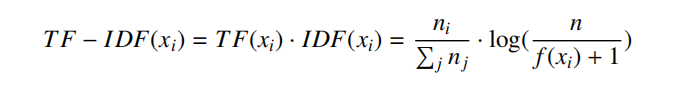

> [下载链接](https://www.researchgate.net/publication/350960578) 用多原型模型做未知家族识别的全新小样本恶意代码分类方法

Peng Wang,《A Novel Few-Shot Malware Classification Approach for Unknown Family Recognition with Multi-Prototype Modeling》,Compyter&Securitty,April,2021. 

## 概念

## 基础知识

多序列比对Multiple Sequence Alignment

## 方法

meta learning based few-shot learning (FSL)基于元学习的小样本学习

模型名：SIMPLE (Supervised Infifinite Mixture Prototypes LEarning)监督无限混合原型系统

**设计：**基于从动态分析中获得的API调用序列（API invocation sequences），引入多原型建模来为每个家族生成多个原型。以增强泛化能力。

**idea来源：**同家族的行为有相同，也有不同，即经常会匹配多个子模式并满足多模态数据分布。

## 模型结构：

API invocation sequences--->word embedding--->LSTM（保留序列信息）----> clustering（聚类）--->每个恶意家族的多原型表示。

​																		少量样本的监督标签信息
  																			   ↓
[无限混合原型IMP(infifinite mixture prototypes)]( K. R. Allen, E. Shelhamer, H. Shin, J. B. Tenenbaum, Infifinite mixture prototypes for few-shot learning, in: 36th International Conference on Machine Learning, ICML 2019, Vol. 2019-June, 2019, pp. 348–357. arXiv:1902.04552.)：聚类数目无需事先确定，模型容量能够根据任务数据自适应推断以平衡简单和复杂的数据分布。↓

​																			更合理的恶意样本家族的原型

<!-- more -->

## 实验

每个家族5个样例，在新样本家族的5种分类任务上都达到了90%的准确率(accuracy)。

## Abstract

### 传统学习方法的挑战

-  scarce samples：新发现家族的样本收集困难，而用小批量样本，模型会过拟合，或者激烈振荡（ oscillate drastically）不收敛；
- dynamic recognition：动态识别问题，旧分类器缺乏增量识别新家族的能力，要求从头开始重训练。
- signature-based analysis：需要专家设计签名，无法识别变形或者多态的样本（polymorphic or metamorphic）
- Open Set Recognition Problem (OSR)开放集识别问题，对新样本需要保持快速响应能力，从已经收集的样本中构建对应的分类器。

### 元学习框架

（在嵌入层）能够学习到关于恶意软件的高级的先验知识并基于少量样本和多原型的比较构建特定于任务的分类器。

## 1.Introduction

SIMPLE:无需额外参数，实施简单，准确率高于其他baseline model.

### 创新点：

1.借助元学习解决稀缺恶意样本和动态恶意家族识别难题，在推理(inference)过程中仅需要一次转发(one-time forward)

2.原型(prototypes)灵活产生

3.大量实验，优于传统的动态识别方法和已有的小样本分类模型。

## 2.Related Work

### 1.恶意软件分类：

1.是否2.贴家族标签

静态检测对于 encryption, packing, polymorphism, obfuscation, meta-morphism会出错。

动态检测对于反沙箱、诱导执行的软件成功率减弱。

### 2.小样本学习

度量学习 metric based

- Matching Networks
-  Prototypical Networks
-  Induction Networks
-  Hybrid Attention-Based Prototypical Networks(HABPN) 
-  ConvProtoNet
- FEAT
- IMP（Infifinite mixture prototypes）
- **MAML**
  - Inner loop  使用少量样本经过几个优化步骤快速适应新任务
  - Outer loop  在元学习阶段优化meta loss（计算高阶导数）

### 3.小样本做恶意代码分类

《MANNWARE: A malware classifification approach with a few samples using a memory augmented neural network, 》用MANN的FSL架构做恶意代码分类

《 ConvProtoNet: Deep prototype induction towards better class representation for few-shot malware classifification》：考虑恶意软件的多模态分布+CNN提取聚类原型

## 3.Preprocessing &Fearure Extraction

### 3.1数据集  

打标签方法：VT+[AVclass](https://software.imdea.org/~juanca/papers/avclass_raid16.pdf)

- VirusShare No177 的二进制文件，127个家族，每个家族随机取20个。

  ​		训练集按照**家族**划分*D* *train* : *D* *val* : *D* *test* = 73 : 20 : 20 

- APIMDS的API序列,102个家族，每个家族随机取20个。

  		​         训练集按照家族划分*D* *train* : *D* *val* : *D* *test* = 62 : 20 : 20 

### 我的问题

元学习是为了在未知类上获得好的分类结果，那么他在已知类上的效果如何呢？？？

### 3.2 API Sequence Extraction

Cuckoo 沙箱，又遇见了，说明它对于elf文件执行确实好。

- 只保留API名，而丢弃了参数和返回值；
- 同一个进程的调用序列，拼接到成线性序列。
- 个人定制报告模块
- 丢弃**序列长度小于10**的样本，比如得到结果Segmentation fault，实际上是执行失败

### 3.3 API Preprocessing &Word Embedding

- 去除冗余调用。**对于同样的API多次出现，只保留两次。**

- 采用[N-gram](https://zhuanlan.zhihu.com/p/32829048），增加了序列表示的多样性。从m（原来不同的序列个数）-->m^n
- 计算每个n元组合的Term Frequency - Inverse Document Frequency (TF-IDF) ，**只保留前l的TF-IDF的的n-gram项，减少总体序列长度。**

- 所有的n-gram项用词典索引代替。
- **截断序列长度**到t，以保证矩阵的对齐和运算的方便，由此带来的影响->
  - t越长，可能越精确，处理越慢；也可能模型负担重，精确率下降--->速度和精确率的权衡-->合适的t值-->APIMDS中就隐含透露了t>500无用；本实验中的最佳t值是200.
- 在词嵌入阶段使用预训练模型,而非随机初始化，以获得语义信息，加速训练过程；GloVe。

## 研究方向

仅仅序列作为输入是不足的-->静态的统计特征，文件头大小，输入表信息，PE文件不同节表的熵值；动态的执行信息：调流执文

2.家族内样本的增加带来更多先验知识，家族数量的增加更贴近工业界应用。

3.样本规模增加后，嵌入层可以变复杂。

4.如何更简单的拿到大量有代表意义的特征？

概括上面的内容，**未来工作即增加对样本的个人研究，增加对样本的收集，增加对样本有效信息的提取。**