> [下载链接](https://arxiv.org/pdf/2110.13409&usg=AOvVaw0q_jW9kL_Td8wyHwDgsnBy)，用于分类混淆恶意软件的基于任务感知的元学习**孪生网络**，2021

Zhu, Jinting & Jang-Jaccard, Julian & Singh, Amardeep & Watters, Paul & Camtepe, Seyit. (2021). Task-Aware Meta Learning-based Siamese Neural Network for Classifying Obfuscated Malware. 

> [相关论文](..\Few-Shot06)A Few-Shot Meta-Learning based Siamese Neural Network using Entropy Features for Ransomware Classification

本文的    **特征嵌入层**       适合    **三种类型的控制流混淆的**     恶意软件分类

## 创新点

1、引入熵特征，处理控制流混淆。

2、用两个损失函数分别刻画类间方差和类内方差。为衡量嵌入损失，

- 对于类间方差，在binary loss基础上加入二次嵌入损失
- 对于类内方差，中心损失与对比损失，使得样本对能聚类使得边界更明显。

输入：熵特征，(样本对,样本对标签)

输出：类内距离

​																				图5 模型结构

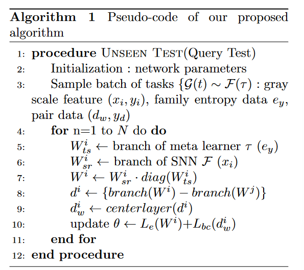

### 孪生网络：

含两个相同的子网络，所以叫孪生，输入(样本对,样本对标签)，训练获得一个相似度函数以在测试时判断两张图片是否相同，使用监督的交叉熵损失。

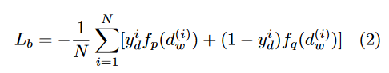

每个子网络的CNN结构，用于找到一个嵌入层进行降维表示。

这个嵌入层，训练阶段用于优化损失；测试阶段，用于生成相似性分数。

**模型架构的优势：处理类别不平衡问题，分类新类别时无须再训练网络。**

### 熵特征：

使用香农公式计算字节的出现频率：

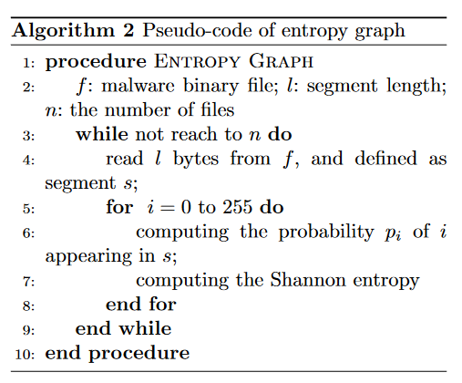

- 将二进制文件分段segment。
- 对于每个段，计算每个字节值（00h-ffh)的频率，计算该段的熵yi。
- 将熵值表示为stream，最后重塑为大小为(254,254,1)的熵图。通过VGG-16，转化为4096维的特征。

## 实验：

模型，4000万参数规模。

嵌入空间的表示；N-way匹配准确率，AUC (Area Under The Curve) ROC (Receiver Operating Characteristics) 曲线；  (5,10,15) way (1,5) shot；   

Andro-dumpy datasets

### 数据集

13个家族的906个二进制恶意软件。

> wook Jang J, Kang H, Woo J, et al (2016) Andro-dumpsys: Anti-malware system based on the similarity of malware creator and malware centric information. Computers Security 58:125 – 138. https://doi.org/http: //dx.doi.org/10.1016/j.cose.2015.12.005, URL http://www.sciencedirect.com/science/ article/pii/S016740481600002X

混淆变种的合成。每个家族的变种数量，（）里是加上作者的混淆方法后的样本种类数和数量。

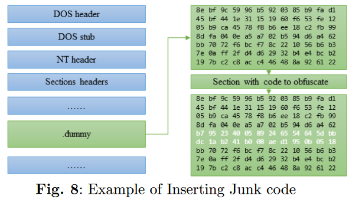

### 程序转图片

1.字节-->uint8--->2D vector---->固定宽度的变长灰度图---->双线性插值（bilinear interpolation method），生成固定尺寸的图片（105,105）。

> 插值部分可参考：Malvar HS, He Lw, Cutler R (2004) Highquality linear interpolation for demosaicing of bayer-patterned color images. In: 2004 IEEE International Conference on Acoustics, Speech, and Signal Processing, IEEE, pp iii–485

### 图片增强到每个家族至少30个

### 结果

1.训练阶段的损失变化

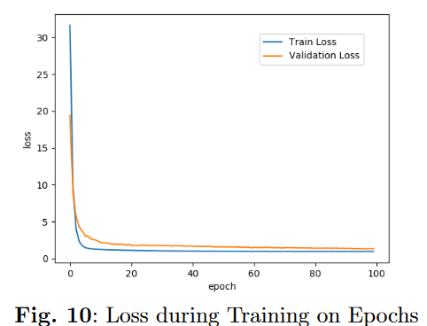

2.超参数调参

3.嵌入空间映射表示

**二维主成分分析**，实现训练结果的可视化。

<table><tr>
<td>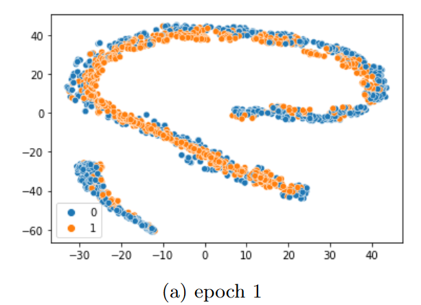</td>
<td>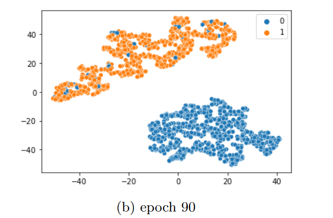</td>
</tr></table>

​																基于HTML实现的图片并排

训练后，样本对几乎完全被区分开来。

4.本文的准确率比benchmark更好。

1-shot			5-way    10-way  15-way

5-shot            	5-way    10-way  15-way

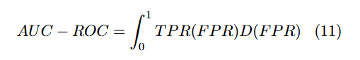

5.本文的AUC-ROC面积比通用的SNN更大。

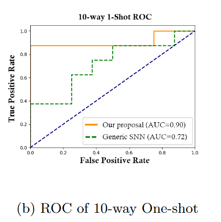

## 先前工作的缺点：

小样本学习

先前的小样本学习工作只学习到  语义特征嵌入，并且，这些语义描述并不清晰，很难理解这些信息是如何被用于特征嵌入的。

**过去：**基于对比损失，或 没有考虑正类和负类之间的距离    ->  无法缩小类内方差intra-class variance，**缩小同类距离。**

**改进：**正负样本对必须被超平面有效区分开。--->混合损失--->同时改善类内方差，正负样本对间隔，**扩大类间的距离。**

特征嵌入

之前的模型倾向于捕获到恶意软件家族里明显的**共有特征**，一个家族的特有行为倾向于被视为**噪声**，却不能捕获**特征的细微差异**，而这正是发现混淆变体的的关键。

## 本文关注的控制流混淆的类型

**功能不变，语义不变，但是编译出来的形式改变。**

1.函数逻辑打乱  例如：code_fragment1->code_fragment2->code_fragment3，变为code_fragment1->code_fragment3->code_fragment2.

2.插入垃圾代码

3.函数分割  将一个函数分成片放入控制流中。

## 问题1：混合损失？

### Center loss

找到类的中心样本，并尽可能将有相似特征的训练样本尽可能靠近样本中心。

中心损失没有把含有不相似特征的训练样本分离开。

### 改进：

度量学习，在包含正样本中心点和负样本中心点的联合嵌入表示上，靠近正图像对，远离负图像对。

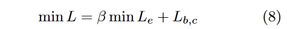

学习对比损失引起的过拟合的影响。

Lb,c表示中心损失的二元交叉熵损失

不改变特征空间中特征的属性。因此，该层的优化不会对网络更深的层产生负面影响。？？？

## 问题2:熵特征的引入有什么好处？

熵特征，衡量了给定程序的概率分布的不确定性，这个分布不受恶意软件**函数逻辑顺序改变**的影响，所以对于混淆软件**有效**。

**字节概率分布不受控制流改变的影响。**

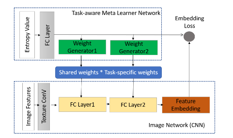

根据恶意软件家族特征调整CNN的特征嵌入权重：利用子网络1（基于熵特征的**任务感知**元学习网络）   确定   子网络2（图像分类网络）的权重参数。

所有的样本家族share一个高维的(m,n)的参数W-sr；对于每个家族，生成一个task-specific低维的参数Wts。

## 问题3：为什么图片尺寸设置为105？

