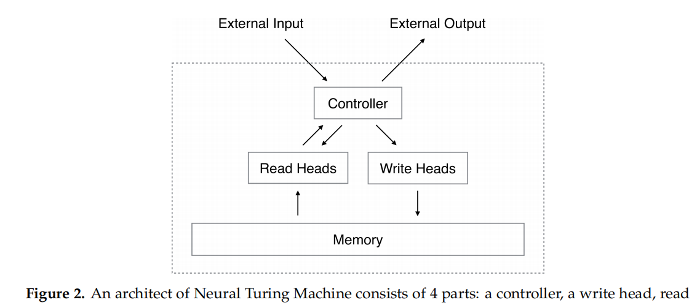
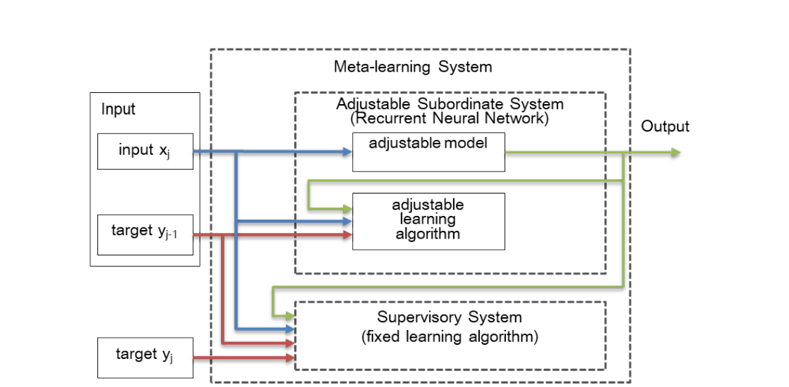
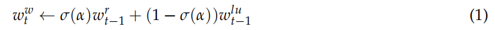
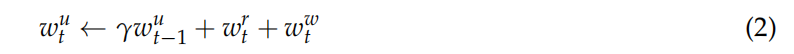
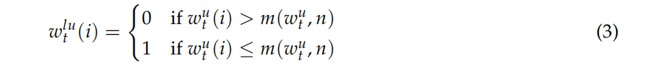
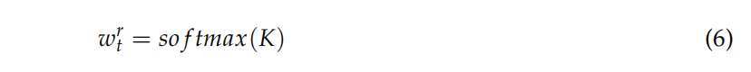
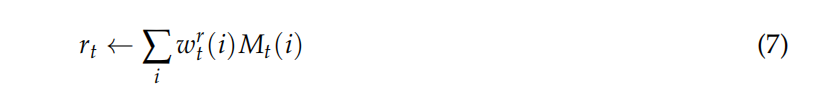

[下载链接](https://www.researchgate.net/publication/338662042_MANNWARE_A_Malware_Classification_Approach_with_a_Few_Samples_Using_a_Memory_Augmented_Neural_Network)  MANNWARE：用记忆增强网络的小样本恶意软件分类方法,2020，小样本学习做恶意代码分类开山作

Tran, Kien & Sato, Hiroshi & Kubo, Masao. (2020). MANNWARE: A Malware Classification Approach with a Few Samples Using a Memory Augmented Neural Network. Information. 11. 51. 10.3390/info11010051. 

## 方法

修改了内存存取能力memory access capabilities的神经图灵机[NTM]()  +NLP(word2vec, n-gram)

<!-- more -->

## 数据集

FFRI  2017 and APIMDS

## Abstract

 One-shot/Few Shot:“data-hungry” 问题

小样本多分类任务

> For example, on the APIMDS dataset, it was able to guess 78.85% correctly after seeing only nine malware samples and 89.59% after fine-tuning with a few other samples. 

## Introduction

从先前的经验或者已学的知识那里学会如何学习。

1.学会元知识（任务之间的差异）

2.将元知识适用于新问题（模型微调权重参数）

- MANN 循环模型
- 度量学习
- 元优化(模型不可知元学习MAML)

本文的循环模型架构：

### NTM

NTM的两种内存编码机制：基于内容的、基于地址的

 Least Recently Used Access (LRUA)：最少、最近使用的内存的地址

一个NTM由四部分构成。

1.第t步的写权重向量，是上一步的读权重向量和最少使用权重向量的**两点连线直线上的点。**

2.使用权重<---γ*上一步的使用权重+当前步骤的读向量+写向量

3.最少使用权重向量各个分量的确定。

4.controller输出一个查询键向量kt，根据写权重向量、查询向量和上一步的内存向量，得到内存向量。

**内存向量，支持了网络的短期记忆。**

5.查询向量与所有内存单元Mt(i)计算得到K。

6.对K向量做softmax归一化，得到读权重向量。

**权重更新，让网络具备长期记忆。**LSTM的Controller优于FFN。

7.读向量的计算，内存单元和读权重的乘积的累加。

8.NTM网络的输出

### Related Works

小样本检测恶意软件的两种相关方法：

- 异常检测（将多个正常类和一个异常类分隔开，是二分类任务的比较基线）    
- 领域适应

​													域适应方法概图

第二种域内，使用第一个域内得到的适应性模型去训练，或者直接进行测试。

API调用序列（借助 Detour library、EasyHook这种进程hook库收集。）-->

n-gram APIs-->特征向量：程序的所有word2vec(n-gram的API序列向量片)的平均值

## 机器翻译

### 词嵌入：

单词的数字表示，以捕捉其上下文语义。

### 独热编码的弊端：

1.词典维度增加时，维度爆炸 

2.表示与数据相关，无法用不同的字典进行迁移学习，得到新模型；无法增删词典中的数据。

3.词的意义（相同的用处、意思相近的词距离也近）没有表示出来

### word2vec Model

>https://towardsdatascience.com/nlp-101-word2vec-skip-gram-and-cbow-93512ee24314

Continuous Bag-of-Words (CBOW)：根据上下文预测中间词。

Continuous Skip-grams：用输入词预测上下文(上下文的分布式表示)。

Skip-gram:适合训练数据少的时候，即使很小的短语也能表达很好。

CBOW：训练起来快，在常用词上表现相较Skip-gram更好。