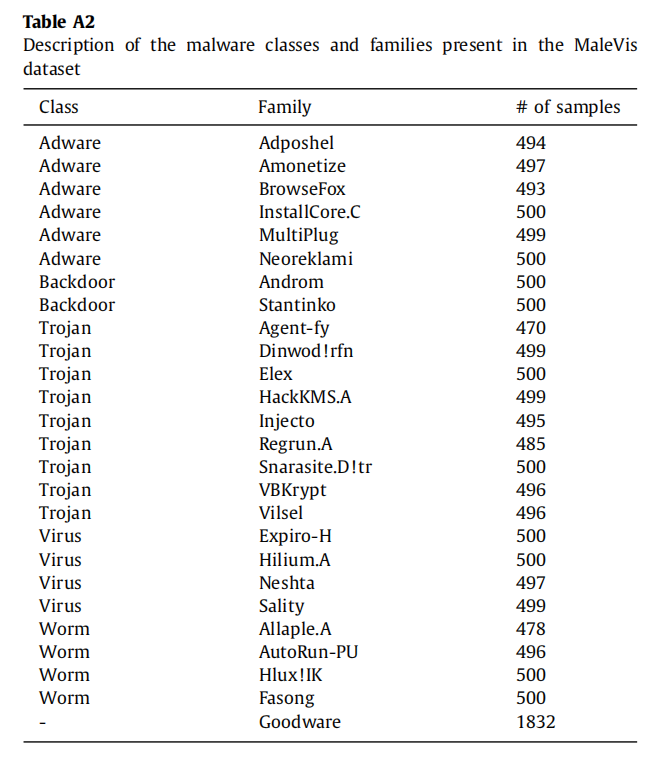
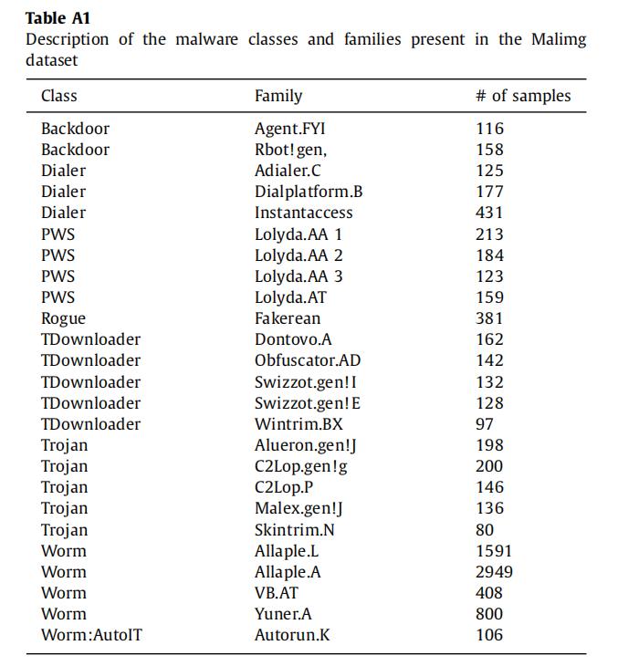

>Pedro H. Barros, Eduarda T.C. Chagas, Leonardo B. Oliveira, Fabiane Queiroz, Heitor S. Ramos, Malware‐SMELL: A zero‐shot learning strategy for detecting zero‐day vulnerabilities,Computers & Security,Volume 120,3 June 2022,102785,ISSN 0167-4048,【B刊】

可以划分到嵌入式学习、度量学习里。

## 基础知识

- 数据无关的度量值（Euclidean, Cosine, and Manhattan)

### 度量学习

从数据中构造任务特定的度量函数，使得相同标签的样本在Latent feature space中足够靠近，不同标签的样本在潜在空间中尽可能远离。

### SNN

孪生网络，经过一个非线性的映射函数变换(待学习的加密器f θ ），f θ中的特征提取函数将样本对映射为潜在表征向量。

输入：样本对，标签（similar,dissimilar)  同类样本就打similar标签，否则打dissimilar。

## 数据集

### MaleViz：

涉及26个（25恶意+1良性）类的字节图像的语料库，14226 images.

### Malimg：

9339 samples from 25 malware families, obtained through experiments of mixtures of  network and the Windows操作系统恶意软件

>Nataraj, L., Karthikeyan, S., Jacob, G., Manjunath, B.S., 2011. Malware images: Visualization and automatic classifification. In: Proceedings of the 8th International Symposium on Visualization for Cyber Security. Association for Computing Machinery, New York, NY, USA.

## 解决的问题：

过去的映射函数没有学习到样本对之间的信息。

## 采用的方法：

将数据对映射到一个相似空间。正则函数避免过拟合。

## 研究方向

