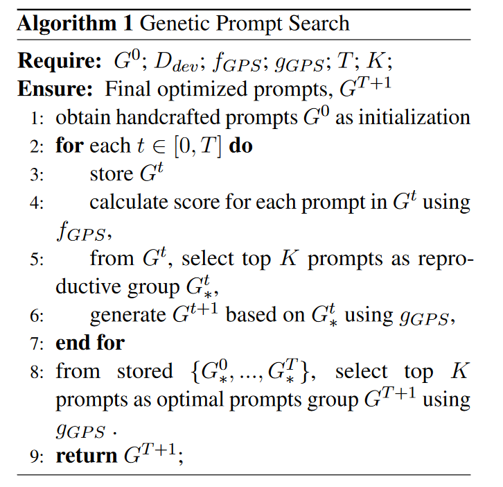

[GPSCode-06](https://github.com/hwxu20/gps)

- Hanwei Xu, Yujun Chen, Yulun Du, Nan Shao, Wang Yanggang, Haiyu Li, and Zhilin Yang. 2022. [GPS: Genetic Prompt Search for Efficient Few-Shot Learning](https://aclanthology.org/2022.emnlp-main.559). In *Proceedings of the 2022 Conference on Empirical Methods in Natural Language Processing*, pages 8162–8171, Abu Dhabi, United Arab Emirates. Association for Computational Linguistics.

## 背景

用自然语言指令设置提示词，可以提高零样本设置中大型语言模型的任务性能。当前工作通过手动重写或基于梯度的调整来改进此类提示词。 然而，

手动重写非常耗时并且需要主观解释，

而基于梯度的调整对于大型模型的计算要求极高，并且需要完全访问模型权重，这对于基于 API 的模型可能不可用。

基于提示词的方法有利于小样本泛化，但是之前的都是手动设置，与之前的T0等方法不同，本文将各种来源的提示词作为种子，用遗传算法去进行提示词搜索，无须参数、无须梯度。

## 术语介绍

intrinsic dimension(本征维)： 在多维信号的信号处理中，信号的本征维描述了生成信号的良好近似需要多少变量。 

Ablation Study（消融实验）： 在深度学习论文中，ablation study往往是在论文最终提出的模型上，**减少一些改进特征**（如减少几层网络等），以验证相应改进特征的必要性。 

LM-BFF [5](Gao et al., 2021b)：： better few-shot fine-tuning of language models ，更好的适合小样本微调的语言模型。

DINO[22]:通过指令获得数据集的方法，Datasets from Instructions

T0:多任务encoder-decoder模型，针对不同下游任务，人为设计不同的提示词预训练后获得。

T5LM-XXL :XXL(11B)级参数规模的T5语言模型，

**soft prompts和hard prompts**： 模板的制作分为手工创建模板和自动化生成模板，而自动化生成模板又分为离散提示（又叫做硬提示）和连续提示（又叫做软提示） 

### 以下均为需要微调参数的方法

BBT(Black-Box Tuning)： 无梯度的微调方法，搜索连续空间中的最佳软**提示词嵌入**，而不是搜索离散的文本提示词。

MT(Model Tuning)：在**每个任务上对整个**预训练语言**模型**进行微调的通用范式

PT(Prompt Tuning)：预训练模型被冻结，**只训练额外的连续软提示词**的梯度引导的微调方法

### 无须微调参数的方法

- ICL(In-Context Learning):上下文学习，大规模预训练模型进行小样本学习的通用方法。

  由标注的样本和**手动模板**组成的**范例**被用来帮助模型理解test tasks的含义。

  缺陷：需要人工提供手动提示词，对标记数据敏感，表现不稳定。

- GRIPS（  Gradient-free Instructional Prompt Search) ：无梯度指令提示搜索，基于编辑的优化提示词搜索方法，主要用于简单的基于编辑的操作（例如增、删、交换、释义）

## 提示词重新生成方法

- BT:回译(back translation)。将提示词从英语翻译到其他 11 种语言，然后将它们翻译回英语。包括中文、日语、韩语、法语、西班牙语、意大利语、俄语、德语、阿拉伯语、希腊语、粤语，
- 完形填空（cloze）。利用LM-BFF[5]里的模板生成方法，使用T5（transformer）文本到文本预训练模型生成模板。对每个输入样例及其表达器（verbalizer）用占位符作为前缀和后缀生成模板，让T5去补全这些占位符。采用波束搜索(beam search)生成多个候选提示词。与论文[5]不同的是，本文的方法里是没有参数更新的，所以完型填空的效果并不好。所以本文中，使用人工提示词作为初始模板，用占位符代替一些随机的标记，然后让T5填空。选出在校验集（Ddev）时平均结果最好的提示词。
- SC:续写句子（sentence continuation）。采用和论文[22]中一样的根据指令生成数据集方法，采用模板“Write two sentences that mean the same thing. Sentence 1: Manual Prompt, Sentence 2:" 交给预训练模型去续写。采用了GPT2-XL (1.5B)和 T5LM-XXL (11B)作为提示词生成模型。

这些方法不需要人工定义编辑规则，而且生成的提示词语义流畅。

### 提示词打分

Close: 按照[5]里的方法，用校验集(D_dev)上的平均对数打分；

BT和SC：不适用平均对数，采用校验集(D_dev)上的准确率评价。

## 创新点：提示词遗传搜索算法

离散的词空间中找到高表现的硬提示词。

​									Table4  五种小样本学习方法在四个评价指标上的比较

> 这里的代价消耗是训练和提示词搜索的联合损失。
>
> MT缺乏服务效率，因为保存MT需要对于每个任务都保存整个模型，造成巨大的存储开销。所有参数都需要调整，其使用的Adam等优化器要求存储额外的动量和方差项。
>
> PT和BBT只需要调整提示词嵌入层。
>
> ICL使用很长的序列长度来串联例子，推理昂贵，尤其是在范例数目多的时候。那为什么这里的代价只是1x？？？
>
> 可以看到，本文提出的方法GPS提供Serving Effiency、不需要参数更新、极大的减少了计算代价，还能取得接近于整个模型调优的效果。获得了60.12的准确率。
>
> 
>
> 

## 实验设置

### 数据集（NLP的）

> T0语言模型的10个测试任务

- 自然语言推理任务（natural language inference）：ANLI R1, ANLI R2, ANLI R3, CB, RTE

- 共指解析（coreference resolution）：WSC, Winogrande
- 语句补全（sentence completion）：COPA, HellaSwag
- 词义消歧（word sense disambiguation）：WiC

| 方法  | 参数设置                                                     |
| ----- | ------------------------------------------------------------ |
| PT    | Adafactor Optimizer，lr=0.05                                 |
| MT    | Adafactor Optimizer，,lr=5e-5=0.00005                        |
| BBT   | 本征维度=500，pop size=20，使用交叉熵损失；         软提示词标记数量为1 or 50时结果最好 |
| ICL   | 每个task随机从训练集挑2个样本                                |
| GRIPS | 复用arXiv:2203.07281.里的超参数，将初始提示词换成T0的        |

T0、BBT、PT、MT采用相同的人工提示词集，GRIPS和GPS自己搜索提示词。

实验结果是三种不同的数据划分方式的平均结果，脚注是一种方法在一个数据集的三种数据划分下的标准差。

划线部分给出了小样本学习下参数微调得到的最好结果，加粗部分给出了参数冻结方法的最好结果。

​										Table3 GPS产生的提示词的解释 

>

## 我的未来工作

GPT-3表明，在超大规模预训练语言模型上使用提示词进行小样本学习效果良好；

> Brown et al., Language models are few-shot learners. NIPS,2020

但对于每个特定任务找到最优化的提示词很困难。

To模型来源于这篇论文——Sanh et al., 2021. Multitask prompted training enables zero-shot task generalization.

> [2]Tom Brown, Benjamin Mann, Nick Ryder, Melanie Subbiah, Jared D Kaplan, Prafulla Dhariwal, Arvind Neelakantan, Pranav Shyam, Girish Sastry, Amanda Askell, Sandhini Agarwal, Ariel HerbertVoss, Gretchen Krueger, Tom Henighan, Rewon Child, Aditya Ramesh, Daniel Ziegler, Jeffrey Wu, Clemens Winter, Chris Hesse, Mark Chen, Eric Sigler, Mateusz Litwin, Scott Gray, Benjamin Chess, Jack Clark, Christopher Berner, Sam McCandlish, Alec Radford, Ilya Sutskever, and Dario Amodei. 2020. Language models are few-shot learners. In Advances in Neural Information Processing Systems, volume 33, pages 1877–1901. Curran Associates, Inc.
>
> [5]Tianyu Gao, Adam Fisch, and Danqi Chen. 2021b. Making pre-trained language models better few-shot learners. In Proceedings of the 59th Annual Meeting of the Association for Computational Linguistics and the 11th International Joint Conference on Natural Language Processing (Volume 1: Long Papers), pages 3816–3830, Online. Association for Computational Linguistics.
>
> [6]Xu Han, Weilin Zhao, Ning Ding, Zhiyuan Liu, and Maosong Sun. 2021. Ptr: Prompt tuning with rules for text classification.
>
> [17]Archiki Prasad, Peter Hase, Xiang Zhou, and Mohit Bansal. 2022. Grips: Gradient-free, edit-based instruction search for prompting large language models. arXiv preprint arXiv:2203.07281.
>
> [19]Colin Raffel, Noam Shazeer, Adam Roberts, Katherine Lee, Sharan Narang, Michael Matena, Yanqi Zhou, Wei Li, and Peter J. Liu. 2020. Exploring the limits of transfer learning with a unified text-totext transformer. Journal of Machine Learning Research, 21(140):1–67.
>
> [22]Timo Schick and Hinrich Schütze. 2021. Generating datasets with pretrained language models. Computing Research Repository, arXiv:2104.07540.