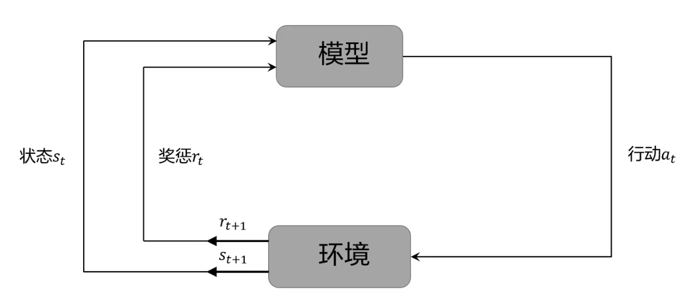
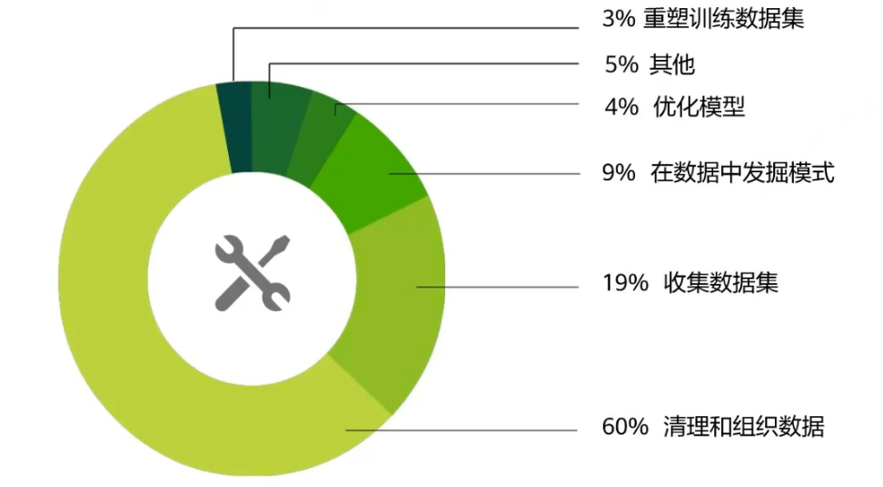

> 参考[华为HCIA-AI课程](https://education.huaweicloud.com/courses/)，该篇笔记所涉及内容都是**概论**，赶时间时**不要看**此文。

## 学习算法

学习：程序在任务T上以P的性能随着经验E自我完善 。

```c
输入：任务T、性能度量P、经验E
输出：自我完善的程序
```

## 什么时候用？

- 问题涉及到大量数据，但是数据分布未知；
- 问题解决方案复杂；
- 规则十分复杂或者无法描述；

<!-- more -->

- 数据本身随着时间变化，需要程序不断适应
- 任务规则会随着时间改变


## 用来做什么？

分类、回归（预测房价）、聚类；

分类是已知分类去给数据指定标签；而聚类是指定类型数量对未标注的数据，根据数据的内在相似性，将其划分。比如：图片检索、用户画像。

## 机器学习算法分类

- 监督学习：已知**标签**的样本集，去找特征的规律，特征之间的依赖规律。


- 无监督：没有标记的样本，学习算法对其建模。

  ​	例如聚类——用户画像，发现数据的内在价值。

  ​	K-means

  

- 半监督：让学习器利用大量未标记数据辅助少量有标记数据进行学习

  - 有标签的数据一开始训练模型；对未标记数据作一个伪分类，选效果好的一批；

  

- 强化  ：模型从环境到行为映射的学习，以使奖励（强化）信号函数值最大。

  - 教师信号：环境提供强化信号（通常为标量信号）对动作的好坏作评价，该信号不会告诉强化学习如何产生正确动作。



- 强化学习的最佳行为

为了更好的完成学习任务，找到完成任务的最佳行为，针对的对象是机器或者机器人。

## 重点

好数据才有好结果。

机器学习中的工作量占比



