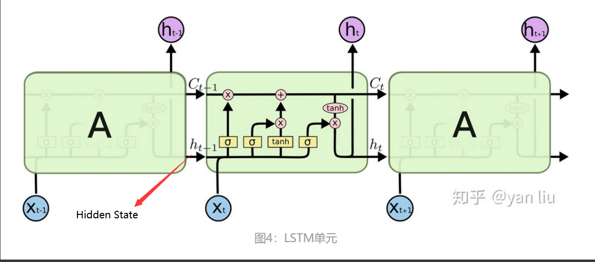
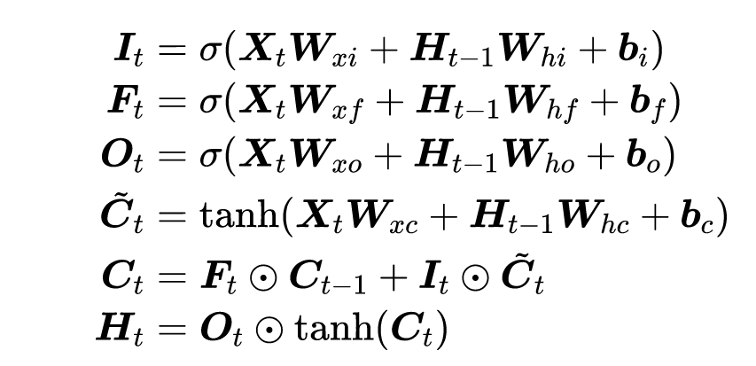
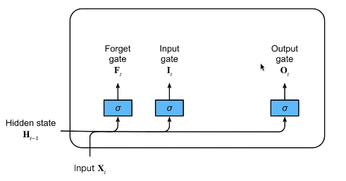
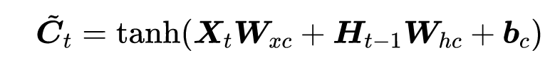
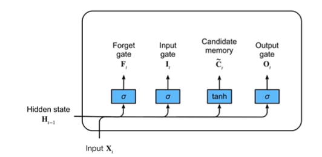
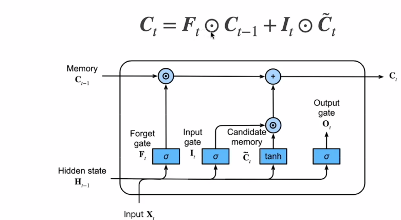

## RNN

RNN是一个链式结构，每个**时间片**使用的是**相同的参数**。常用的是LSTM和GLU。

输入数据要序列化；

具有记忆性、时间维度上权值共享且图灵完备，能够以极高的效率学习序列中的非线性特征。


​                                                                            1-1   循环神经网络示例


```latex
h_{t}=\sigma\left(x_{t} \times w_{x t}+h_{t-1} \times w_{h t}+b\right)
```

其中，w_{h t}，为状态权重。

### 存在的问题

**长期依赖问题**：

隐藏状态h_t只能存储有限的信息，当记忆单元存储内容多时，它会逐渐以往之前所学到的知识（着数据时间片的增加，RNN丧失了连接相隔较远的层之间信息的能力）。

长期依赖的现象也会产生很小的梯度。

**梯度消失。梯度爆炸**

权值矩阵循环相乘导致。因为RNN中每个时间片使用相同的权值矩阵，相同函数的多次组合会导致极端的非线性行为。

- 处理梯度爆炸可以采用梯度截断的方法。所谓梯度截断是指将梯度值超过阈值\theta的梯度手动降到\theta 。虽然梯度截断会一定程度上改变梯度的方向，但梯度截断的方向依旧是朝向损失函数减小的方向。
- 处理梯度消失？？

### 解决办法

引入门控机制，选择性遗忘一些无用信息，从而控制信息的累积。

## LSTM总结

> 参考https://easyai.tech/ai-definition/lstm/

1997年由Hochreiter & Schmidhuber提出

>Hochreiter, S, and J. Schmidhuber. “Long short-term memory.” Neural Computation 9.8(1997):1735-1780.

## 






## LSTM详细内容

5月26日

### 1.门(F、I、O)

LSTM 可以通过所谓“门”的精细结构向细胞状态添加或移除信息。


门可以**选择性地以让信息通过**。它们由 S 形神经网络层和逐点乘法运算组成。

S 形网络的输出值介于 0 和 1 之间，表示有多大比例的信息通过。0 值表示“没有信息通过”，1 值表示“所有信息通过”。


一个 LSTM 有三种这样的门用来保持和控制细胞状态。

- 忘记门(Forget gate)：将值朝0减少。
- 输入门(Input gate)：决定是否忽略掉输入数据；
- 输出门(Output gate)：决定是否使用隐状态；




### 2.候选记忆单元（增加的部分）

**没有用到任何Gate**

读法：C_tilda





### 3.**记忆单元**Ct


Ct的范围比较大，需要tanh规范到-1到1之间。

LSTM 的关键是细胞状态，即图中上方的水平线。

细胞状态有点像传送带。它贯穿整个链条，只有一些次要的线性交互作用。信息很容易以不变的方式流过。




### 4.隐状态Ht

让隐藏状态放在+1到-1之间，避免梯度爆炸，降低模型复杂度。


## QA

### 1.计算模型占用显存

取决于调用的库，对框架的优化，所以最好直接查看实际GPU占用；


## 