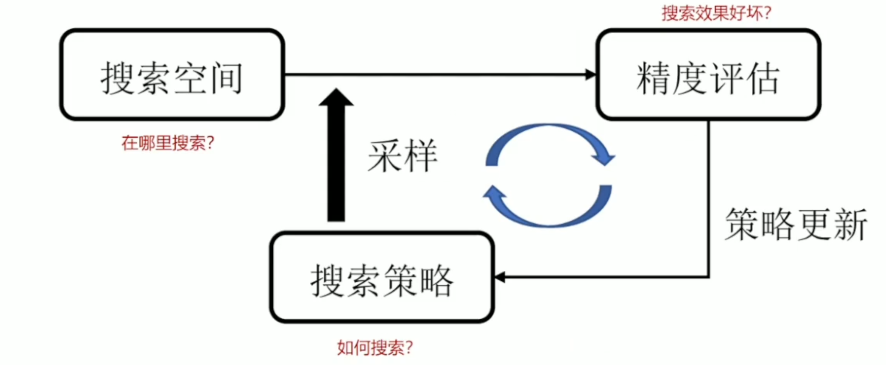
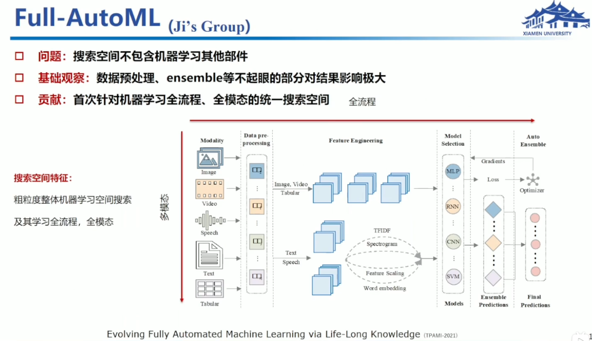
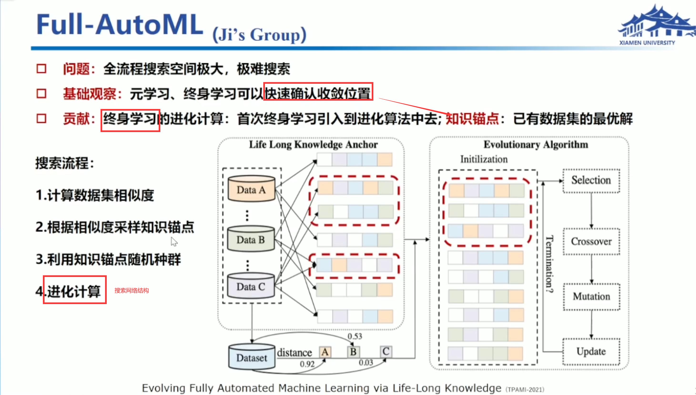
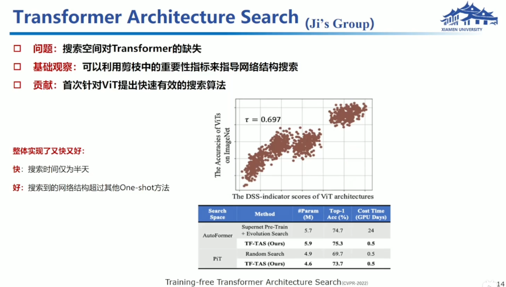

## 神经网络结构搜索

> [厦大-纪荣嵘教授](https://www.bilibili.com/video/BV18Y4y1r7tb)

### 主要流程

1.基于细胞的：

谷歌2018年的策略，把公共结构做成cell，借助这些cell组合出需要的模型。

Zoph, Barret, et al. "Learning transferable architectures for scalable image recognition."Proceedings of the IEEE conference on computer vision and pattern recognition.2018.

2。基于链式的：

---

全局视角：

## NAS的进化计算

从种群出发，然后一定概率进行变异，杂交，交给环境，利用环境去做出选择，然后再进行迭代。

Genetic CNN

搜索策略:进化算法，将网络结构编码为01序列的基因，通过俄罗斯转盘选择、复制、交叉、变异产生后代.

当搜索变深时，内存开销增大，要裁剪掉大量操作。