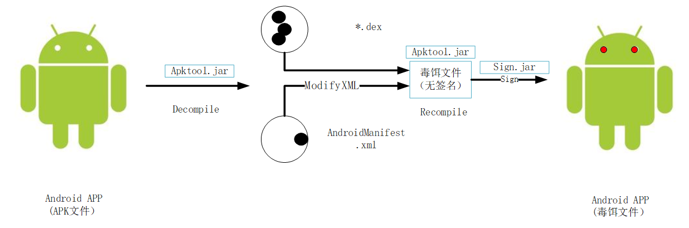
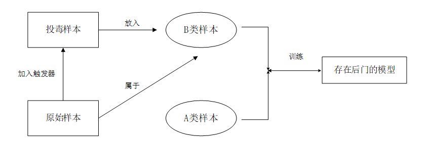
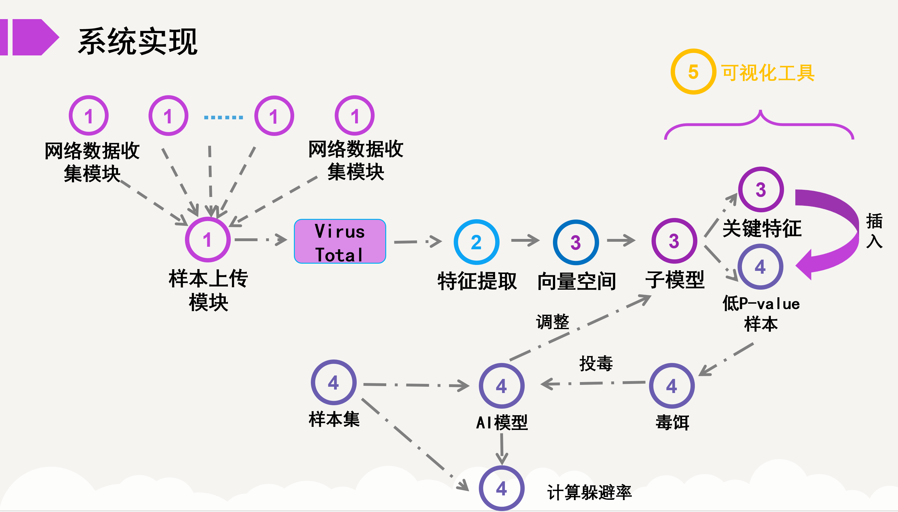

# 创新点

## 扩展攻击对象

### 原来：

针对图片，给图片增加扰动；

> 该图来源[网络](https://baijiahao.baidu.com/s?id=1646884927969073605)

若是扩展到文件，无法修改样本标签，因为对于可执行文件，存在大量的检测平台，恢复样本标签。

### 现在：

针对安卓样本分类检测模型的攻击。办法是不去修改apk文件的标签。

编写python脚本完成毒饵文件制作过程。

## 改进后门攻击

### 原来：

需要控制样本标签；攻击难度高

### 修改后：

无需控制样本标签；降低攻击难度，这套策略拿来就可以用

## 改进对抗攻击

### 原来：

黑盒环境下时，由于原始特征集的缺失，攻击效果下降；

需要攻击者在目标模型上**进行大量的查询**来获得**大量反馈**。

### 现在：

采用了`Conformal Prediction`统计学习算法计算，得到容易影响子模型的边缘样本，借助边缘样本获取关键特征，借助样本的可迁移性，**极少的查询**便可偷取目标模型的决策方式。

## 项目技术路线

