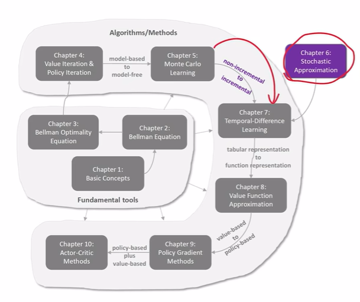
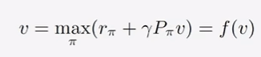
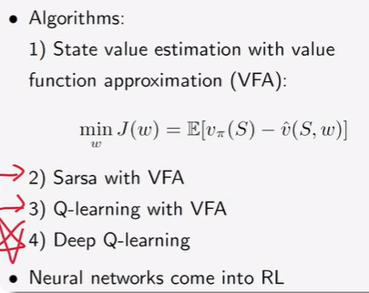
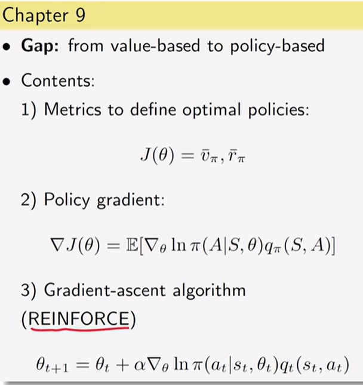

机器学习里除了监督和无监督学习做分类回归，还有强化学习算法用于做决策。

灵感来源于：神经科学和心理学，用外界反馈和暗示加强心理偏向。

## Chap1 强化学习原理图

state value，状态值用于评价一个策略好坏。

>[西湖大学RL课程-B站](https://www.bilibili.com/video/BV1sd4y167NS)

### 奖励值的设置

在正数代表奖励的情况下，0不惩罚，也是一种鼓励。

Reward(s,a)，奖励考虑当前状态和行为。

Trajectory（轨迹）:状态-动作-奖励 链。

return 是一个轨迹所有的奖励加起来的值。

如return=0+0+0+1=1

而在第9格时所有动作的收益将会一直加一，1+1+1+1+...+1=∞

为避免结果无穷大，引入折扣率，即discount `γ`∈[0,1]，

此时的dicount return=0+γ0+γ^2*0+γ^3\*1+...+γ^n\*1=γ^3\*1\\(1-γ)

γ趋近于0，短视。

## Chap2 贝尔曼方程

## Chap3 贝尔曼最优公式

找最优策略，即能够找到的最大状态值对应的策略。

不动点原理=>{最优的策略存在（不一定唯一） ，最优的状态值唯一}

## Chap4 优化策略

> 值更新->策略更新->值更新->...，互相促进，最终得到最优策略和最佳状态值。

值迭代

策略迭代

截断策略迭代

## Chap5 Monte Carlo学习

蒙特卡罗

## Chap6  随机近似

增量：来一次采样，就可以用它更新估计。

Robbins-Monro算法

**SGD**

SGD、BGD、MBGD

## Chap7 时序差分方法

TD（Temporal Difference）学习状态值   

Sarsa：用TD的思想学习action value

Q-learing：直接计算优化的action values；off-policy算法

on-policy :Behavior Policy（生成经验数据）和Target Policy目标策略相同

off-policy:两个策略可以不同

## Chap8  Value Function  Approximation

引入函数，让神经网络有机会进入到强化学习。

找一个状态值的近似函数v_hat(S,w)

DQN：两个网络、经验回放

## Chap9 策略梯度学习

**Policy Gradient是一种On-policy的算法**

## Chap10 Actor-Critic

Policy Gradient的一种方法，只是critic部分强调了值的作用。

4）从随机的动作选择策略转到确定性的，就是DPG。

3)通过**重要性采样**可以把on-policy策略变为off-policy策略。