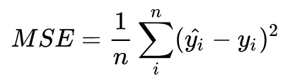
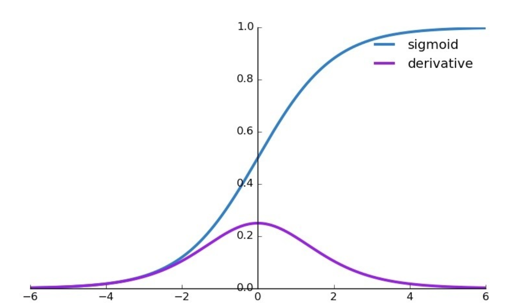
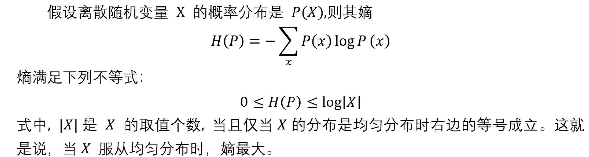
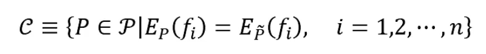
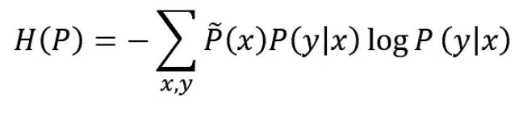
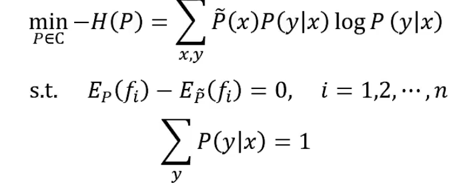
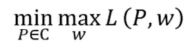
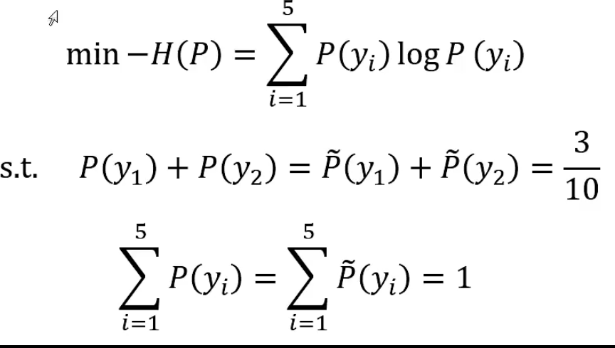
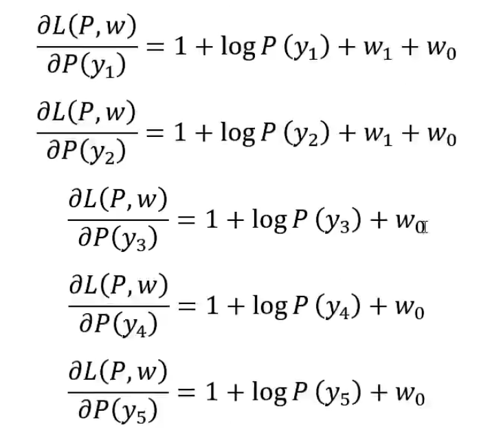
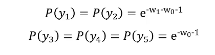

## 1.准则函数

把要最小化或最大化的函数称为目标函数（objective function）或准则（criterion）。

当对其进行最小化时，我们也把它称为代价函数（cost function）、损失函数（loss function）或误差函数（error function）。

> [知乎：飞鱼Talk](https://zhuanlan.zhihu.com/p/35709485)

- Classification Error（分类错误率）  错误分类占比
-  Mean Squared Error (均方误差)，
- Cross Entropy Loss Function（交叉熵损失函数）

> Loss Func可以用来判断模型在样本上的表现；

### 1.1 Mean Squared Error (均方误差)，



<!-- more -->

- 前提是估计噪声服从高斯分布

  

- 缺点就是其偏导值在输出概率值接近0或者接近1的时候非常小，这可能会造成模型刚开始训练时，偏导值几乎消失。导致模型在一开始学习的时候速率非常慢，而使用交叉熵作为损失函数则可以避免这样。

### 1.2 交叉熵损失函数（Cross Entropy Loss Function）


M分类的N个样本:对于每个样本i,计算各个分类标签yic与标签概率pic的log值的积的和值。计算出的L是正数，L越小，模型的表现越好。

```python3
from sklearn.metrics import log_loss 
```


## 2.最大熵模型

> 参考[b站课程](https://www.bilibili.com/video/BV1bU4y1o7vs?p=40)

**MaxiMum Entropy model：所有可能的概率分布中，熵最大的是最好的。**

模型首先满足约束条件， 对于不确定的部分假定其等可能，所以等概率表示了对于事实的无知。



定义：


最大熵模型：

找出C中条件熵最大的模型。

形式化为最优化问题，求等价的约束下最小值：



引进拉格朗日乘子w0,w1,...,wn，定义拉格朗日函数L(P,w)。将约束最优化问题转换为无约束最优化的对偶问题。


最优化的原始问题：

​		

### 它的对偶问题：

> 通过求解对偶问题找到原始问题的解：


**对偶函数的极大化等价于最大熵模型的极大似然估计，其证明部分请参考视频43min以后内容。这里不做记录。**

先求出最小的拉格朗日函数L(P,w)，再对其求最大值。


### 举例使用

设Y有5个取值，A,B,C,D,E，估计取各个值的概率。

- P(A)+P(B)+P(C)+P(D)+P(E)=1

- P(A)+P(B)=3/10

以y1,y2,...,y5分别表示A~E，得到最大熵模型学习的最优化问题：



定义拉氏函数


求偏导：

(*)

令各个偏导为0，解得P(y1)~P(y5)

，代入拉格朗日式子里，

得到

再求解上式关于w的极大化问题：

对上式分别用w0,w1求偏导，并令其导数为0.得到w0和w1后，将其带回*式得到最终的P(y0)~p(y5)。

可以证明，等概率时，熵也是最大的。


