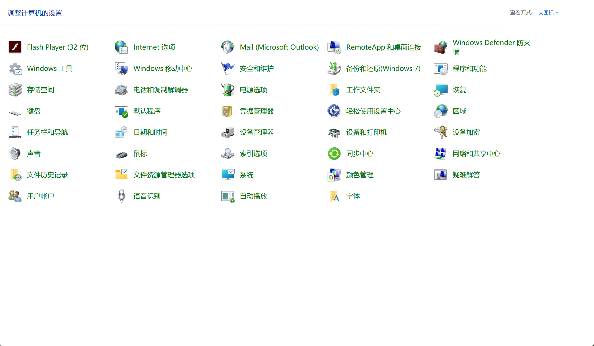

## 1.新建环境

```
conda create -n tf2.9 python=3.10
```

## 2、激活环境

```
conda activate tf2.9
```

## 3、查看电脑显卡驱动

打开控制面板，发现里面没有NVIDA控制面板选项的，大概率是没有NVIDA cuda驱动的，需要去NVIDA官方下载对应驱动。



## 4.(可选)NVIDA官方下载对应驱动

> 选择界面：https://developer.nvidia.com/cuda-downloads

 [cuda_12.1.0_531.14_windows.exe](https://developer.download.nvidia.com/compute/cuda/12.1.0/local_installers/cuda_12.1.0_531.14_windows.exe)

下载后双击安装，等待安装成功；

## 5.下载 tensorflow_gpu-2.9.0 


命令行打开到Computed-Tomography-AI目录，执行下面的命令。

```
(tf2.9) D:\DataSet\Github\Computed-Tomography-AI>
pip3 install -i http://pypi.douban.com/simple/ -r requirements.txt --trusted-host pypi.douban.com
```

安装其他版本，可以去 [tf官网]( https://tensorflow.google.cn/install/source_windows?hl=en#gpu )查看tensorflow、python、tensorflow-gpui、cuda、cudnn的对应关系 。

## 6.在对应环境中安装CUDAToolkit 

## 6.1conda挂代理或者换源

在这里进行换源，加速下载：

```
conda config --add channels https://mirrors.tuna.tsinghua.edu.cn/anaconda/cloud/msys2/
conda config --add channels https://mirrors.tuna.tsinghua.edu.cn/anaconda/cloud/conda-forge
conda config --add channels https://mirrors.tuna.tsinghua.edu.cn/anaconda/pkgs/free/
conda config --set show_channel_urls yes
```

## 6.2 conda下载cudatoolkit

```
 conda install cudatoolkit=11.2
```

## 7.conda下载CuDnn

```
conda install cudnn=8.1
```

## 8.(可选)手动下载CudaToolKIt和CuDnn

>https://anaconda.org/conda-forge/cudatoolkit/11.2.2/download/win-64/cudatoolkit-11.2.2-h933977f_9.tar.bz2

```
conda install --use-local cudatoolkit-11.2.2-h933977f_9.tar.bz2
```


## 9.验证是否安装成功

命令行下

```
(tf2.9) D:\DataSet\Github\Computed-Tomography-AI>python
>>>import tensorflow as tf
>>>tf.test.is_gpu_available()

```


 返回true说明没有问题。 

现在，所有的依赖项已经下载并配置成功。


