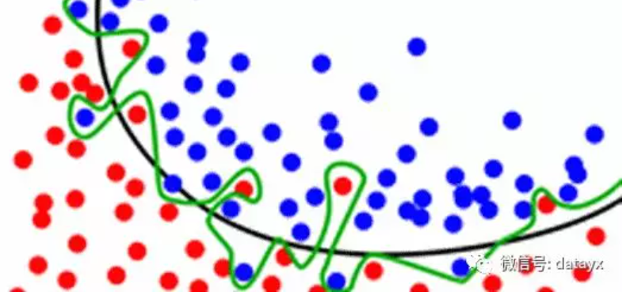
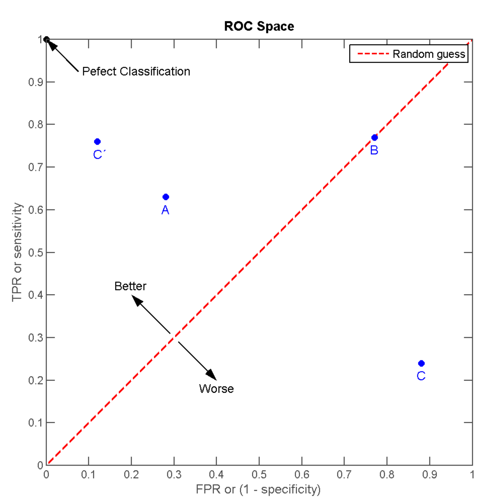

stacking&blending

> [机器学习比赛大杀器 ---- 模型融合](https://www.6aiq.com/article/1536427413103)，目前只看到**排名平均**部分。

1.可以集成提交文件（对预测结果的文件进行集成）

2.投票集成(预测结果为类别时)  少数服从多数， 概率意义上相加值大于原来的准确率。

3.集成低相关度的模型（即使其性能较差）也可以提升模型的性能。

## 4.加权投票

> 原理理解：三个臭皮匠才可以稍微的对诸葛亮的看法做点改进。

通常我们希望模型越好，其权重就越高。比如，我们将表现最好的模型的投票看作3票，其它的4个模型只看作1票。

原因是：当表现较差的模型需要否决表现最好的模型时，唯一的办法是它们集体同意另一种选择。我们期望这样的集成能够对表现最好的模型进行一些修正，带来一些小的提高。

## 5.Average

更愿意叫做"bagging Sumissions"。打包提交。

> 脚本：https://github.com/MLWave/Kaggle-Ensemble-Guide/tree/master/src

**平均预测常常会降低过拟合**

图中黑线比绿线有更好的分割，绿色线已经从数据点中学习了一些噪声。

**平均多个不同的绿线， 使其更接近黑线。**

我们的目标不仅是去记住这些训练数据(这里有比在随机森林里更加有效的方法来存储数据)，而且还要去对我们没有看到的数据进行良好的泛化。

>https://zh.wikipedia.org/wiki/ROC%E6%9B%B2%E7%BA%BF

## ROC空间

Receiver operating characteristic接收者操作特征

ROC空间将伪阳性率（FPR）定义为 *X* 轴，真阳性率（TPR）定义为 *Y* 轴。

- 伪阳性率(FPR, false positive rate)

又称：错误命中率，假警报率 (false alarm rate)

FPR = FP / N = FP / (FP + TN)

- 真阳性率 (TPR, true positive rate)

又称：命中率 (hit rate)、敏感度(sensitivity)

TPR = TP / P = TP / (TP+FN)

**则(0，1)是完美情况，FP错误的肯定为0，FN错误的否定为0.**

离左上角越近，即x越小、y越大，模型预测准确度越好；

三种模型中，A>B>C但是只要把C当作一个相反结果预测机，则C'>A>B；

## ROC曲线

调整二分类模型的阈值，得出不同的FPR和TPR，将这些点全部作在一个ROC空间里，就成为**特定模型的ROC曲线**。

- **在同一个分类器之内**，**当阈值设置为最高时**，**没有样本被预测为阳性**，FPR=0,TPR=0；**得出ROC坐标系左下角的点 (0, 0)。**
- 当阈值设置为最低时，所有样本均为阳性，FPR=FP/N=FP/(TN+FP)=1；TPR=TP/(TP+FN)=1；**得出ROC坐标系右上角的点 (1, 1)。**
- **随着阈值调低，FP、TP增大，FN、TN减小；ROC点** 往右上（或右／或上）移动，或不动；但**绝不会往左下(或左／或下)移动**。

## AUC曲线下面积

Area Under the Curve of ROC，作为评价模型优劣的指针；取值范围为[0,1]

**AUC值越大的分类器，正确率越高。**

从AUC判断分类器（预测模型）优劣的标准：

- AUC = 1，是完美分类器，采用这个预测模型时，存在至少一个阈值能得出完美预测。绝大多数预测的场合，不存在完美分类器。
- 0.5 < AUC < 1，优于随机猜测。这个分类器（模型）妥善设置阈值的话，能有预测价值。
- AUC = 0.5，跟随机猜测一样（例：丢铜板），模型没有预测价值。
- AUC < 0.5，比随机猜测还差；但只要总是反预测而行，就优于随机猜测。

