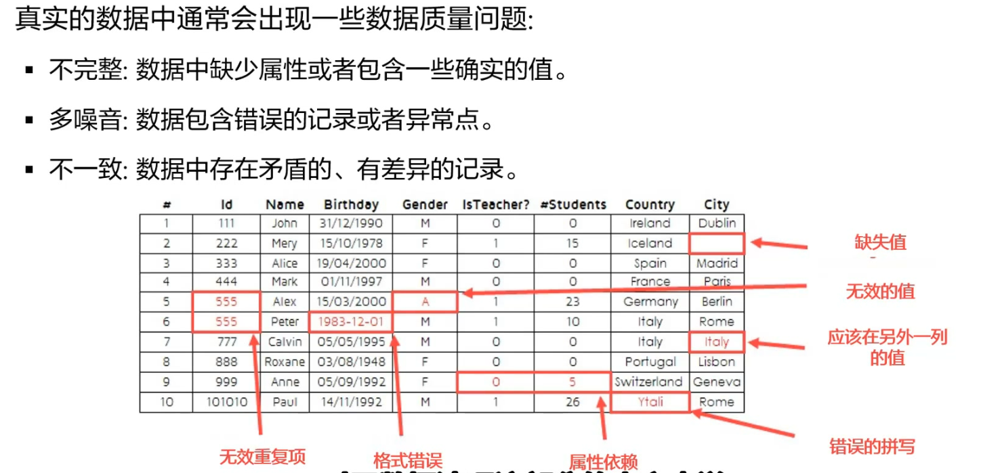

## 1.相关库

## 2.数据等级

- 非结构化-->结构化数据

结构化数据要从定类别开始，-->定序(引入比较与排序)-->定距(可以加减)-->定比(引入绝对零度,增加乘除)

## 3.数据分析

### 1.数据质量分析

缺失值  80%数据全部丢失，30%的缺失（做填充）

异常值  均值填充

一致性分析    （训练集和测试集的逻辑分布要是一致的）

### 2.数据特征分析

- 分布分析     数据要选分布宽度比较低的
- 对比分析     均值、方差
- 统计量分析  sum
- 周期性分析   一般用在时间序列上
- 贡献度分析  
- 相关度分析  

### 3.函数工具

| 函数名      | 函数功能                                                     | 所属扩展库   |
| ----------- | ------------------------------------------------------------ | ------------ |
| interpolate | 一维、高维数据插值                                           | Scipy        |
| unique      | 去除数据中的重复元素，得到单值元素列表，它是对象的方法名（此功能可以用集合的办法去重） | Pandas/Numpy |
| isnull      | 判断是否空值                                                 | Pandas       |
| notnull     | 判断是否为非空值                                             | Pandas       |
| PCA         | 对指标变量矩阵进行主成分分析                                 | Scikit-Learn |
| random      | 生成随机矩阵                                                 | Numpy        |

## 4.数据规约

### 属性规约

属性的合并、提取和删除、归纳、主成分分析

- 合并  {A1,A2,A3}--->{A};{B1,B2.B3}--->{B}  **数据降维**
- 逐步向前选择   从空属性集开始 ，每次从原属性集中选一个当前最优的属性加到现在的集合中，直到无法选择出最优属性或满足一定阈值约束为止。
- 逐步向后删除  从全属性集开始，...(与逐步向前选择恰好相反)
- 决策树归纳  用决策树对初始数据进行分类归纳学习，决策树上没有的属性可以认为是无关属性，删除之。
- PCA，用较少的变量去解释原始数据中的大部分变量，即将很多相关性很高的变量降低相关性，变为不相关或者独立的变量

### 数值规约

​	数据标准化

## 5.数据变换

- 简单函数变换
- 规范化   把数据变成0，1，数据标准化减少噪声的影响
- 连续属性离散化
- 属性构造
- 小波变换
- 傅里叶变换

## 6.数据集成

合并多个数据源的数据，让数据没有偏见

- 实体属性识别
- 冗余属性识别

## 7.数据清洗

删除原始数据集中的无关数据、重复数据，平滑噪声数据，筛选值与挖掘主题无关的数据，处理缺失值、异常值等。

### 缺失值处理

- 均值、中位数、众数
- 使用固定值
- 最近邻插补
- 回归方法
- 插值法
  - 拉格朗日插值                                                                                                                                                                                                                                                                                                                                                                          
  - 牛顿插值
### 异常值处理

- 删除
- 视为缺失
- 平均值