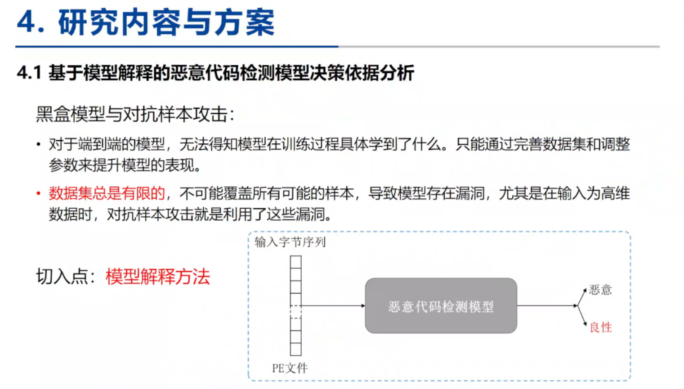

[AV-Test](https://www.av-test.org/en/statistics/malware/)

> 乔延成

## 恶意代码对抗样本研究存在的困难

图像对抗样本
·数值是连续的
·限制:添加的扰动人类无法察觉恶意代码对抗样本
·字节数据、系统调用等特征数值是离散的(基于梯度的方法无法使用)·限制:添加的扰动不能影响恶意代码的原有功能

- 恶意代码检测模型决策依据分析
- 恶意代码对抗样本检测方法
- 恶意代码对抗样本攻击方法

