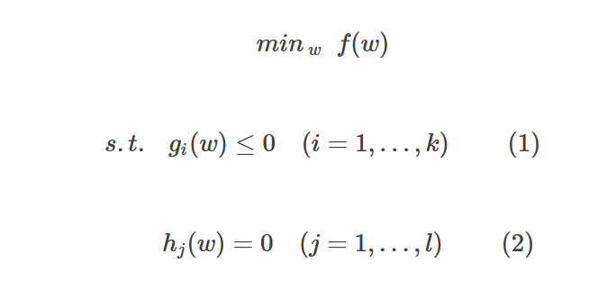

>https://zhuanlan.zhihu.com/p/77750026

## 1.支持向量

构造超平面的样本，它们是两个类别中距离超平面最近的样本。

支持向量   超平面的确定先后次序？

## 2.对偶问题

## 3.SVM优化

## 4.软间隔

## 5.核函数

## 附录

凸优化

若二阶导数在区间上非负，则称为**凸函数**

若二阶导数在区间上恒大于0，则称**严格凸函数**

假设f、g、h在定义域内是连续可微的，且目标函数f和不等式约束函数g是**凸函数**，等式约束h是**仿射函数**（线性函数），则约束最优化问题称为凸优化问题。

