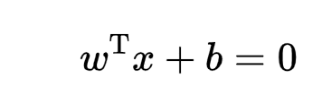

**学习策略：间隔最大化。**形式化为一个凸二次规划(convex quadratic programming)问题，等价于正则式的合页损失函数的最小化问题。

由简到繁：

- 线性可分——>学习线性的分类器——>线性可分（硬间隔）支持向量机；
- 数据近似线性可分-->软间隔最大化-->学习线性的分类器-->线性支持向量机；
- 数据线性不可分-->kernel trick+软间隔最大化-->非线性支持向量机（等价于在高维空间中学习线性支持向量机)；

## 1.超平面：

## 2.函数间隔和几何间隔

因为超平面wx+b=0，所以对于点(xi,yi)，(wxi+bi)能够表示点距离超平面的远近，其与yi的乘积的符号可以用来表示分类的正确性(-1表示分类错误，分类正确时)。

所以ri=yi(wxi+bi)定义为超平面关于样本点(xi,yi)的函数间隔；超平面关于训练集T的函数间隔为所有超平面关于每个样本点的函数间隔的最小值。

r'=min(ri)

函数间隔规范化（**确保超平面不变的时候，间隔也是确定的**）后，即w=w/||w||,b=b/||w||，函数间隔`r'`变为**几何间隔**`r`。

**约束优化问题为：**求解能够正确划分训练数据集并且使得几何间隔最大的超平面。

**约束：**正确划分训练数据集==任意样本的距离大于最小距离==yi(w/||w||·xi+b/||w||)  >=`r`==      yi(w·xi+b)  >=`r'`

**求解**：max几何间隔`r`==max {r'/||w||}    ，由于**w和b可以等比例放缩**，所以可令r'=1，此时最优化问题为调整w和b以最大化**1/||w||**，在约束条件y_i(w·x_i+b) ≥1下，而该式等价于下面的凸二次规划(convex quadratic programming)问题求解

之所以构造成二次规划问题，是为了方便之后的求导。

## 3.间隔最大化

学习算法思想：让几何间隔最大化，即max r ，以足够确信对超平面周围的点正确分类，通过求解上个分段的最优化问题，解得超平面(w\*,b\*)。

由此得到分类决策函数为f(x)=sign(w\*x+b\*)1.支持向量

## 4.支持向量

**在线性可分情况下才存在。**构造超平面的样本，它们是两个类别中距离超平面最近的样本。支持向量的yi(w·xi+b)  =1，或者说yi(w·xi+b) -1=0

## 5.对偶问题

·

## 附录

### 内积

**完备性**就是说任意柯西列的极限仍然在这个空间中。

完备的内积空间称为**希尔伯特空间**。它是欧几里德空间（距离、内积、向量所具有的线性性质）的一个推广，其不再局限于有限维的情形。或者，如果**一个空间**是**线性的**，**完备的**，并且**规定了范数**，**内积**和**距离**的，就叫做希尔伯特空间。

向量的长度叫做模，将模的概念推广，只要满足正定性、齐次性和三角不等式的映射就叫做范数。

L0范数是指向量中非0的元素的个数。(L0范数很难优化求解)

L1范数是指向量中各个元素绝对值之和

L2范数是指**向量各元素的平方和然后求平方根**，通常意义的模长。

### 凸优化

若二阶导数在区间上非负，则称为**凸函数**

若二阶导数在区间上恒大于0，则称**严格凸函数**

假设f、g、h在定义域内是连续可微的，且目标函数f和不等式约束函数g是**凸函数**，等式约束h是**仿射函数**（线性函数），则约束最优化问题称为凸优化问题。

