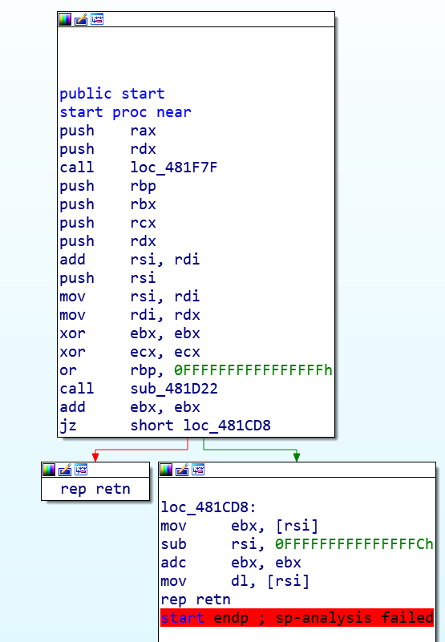
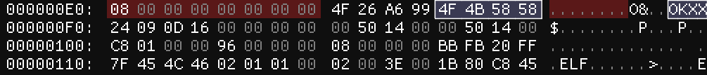
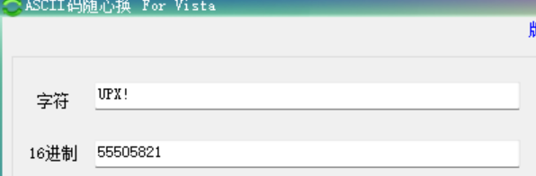

xctf的一道Go语言逆向题，涉及AES加密和base64换表加密。

用IDA打开g0Re报告`SP-Analysis failed`错误。



## 静态检测

将文件拷贝到kali后，静态检测一番。

```
$ file g0Re               
g0Re: ELF 64-bit LSB executable, x86-64, version 1 (SYSV), statically linked, no section header

readelf -hlS --w g0Re
```

报告如下错误：

```
readelf: Warning: Section 49 has an out of range sh_link value of 2302008908
Section Headers:
  [Nr] Name              Type            Address          Off    Size   ES Flg Lk Inf Al
  [ 0] <no-strings>      00010102: <unknown> 00000001003e0002 481cb0 000040 400003      0   0 15762873573703680
readelf: Warning: [ 1]: Link field (533963) should index a symtab section.
readelf: Warning: [ 3]: Unexpected value (1482181455) in info field.
```
strings找到一些特征字符串
```
┌──(kali㉿kali)-[~/idawork]
└─$ strings -a  -tx g0Re|grep -E '\s{4,30}'
     ec OKXX$
    13e FN{o
    1e6 r mL
    284 dRe6eYPgXygMd
    295 fSCPpMP/C9DU36D2kliiYS5D9wKG/E_p
    2b9 XkJb3WwcGMbUPd63r/bG8gVDS6EsZ5vv
  81e18 $Info: This file is packed with the                                           
  81e67 $Id:  
```

猜测是UPX加壳，但是UPX标志被抹去了。

## UPX! 标志被抹除

unpack时会依次在三个地方检查UPX_MAGIC_LE32（即"UPX!"）：

```
1、在倒数第36字节偏移处检查，如果特征值不符就会转入throwNotPacked()异常抛出函数，打印not packed by UPX；
2、".ELF"魔数前36字节处，如果这里的特征值不符就会转入throwCantUnpack()异常抛出函数，打印l_info corrupted；
3、 在倒数第46字节偏移处检查，如果特征值不符就会转入throwCompressedDataViolation()异常抛出函数，打印Exception: compressed data violation；
```



结合上面的规则2，可以很清晰地判断出出题人用`0KXX`代替了`UPX!`。



在对应的三个位置处换上UPX!魔数。


upx脱壳。

```
┌──(kali㉿kali)-[~/idawork]
└─$ upx -d g0Re_upx 
                       Ultimate Packer for eXecutables
                          Copyright (C) 1996 - 2020
UPX 3.96        Markus Oberhumer, Laszlo Molnar & John Reiser   Jan 23rd 2020

        File size         Ratio      Format      Name
   --------------------   ------   -----------   -----------
   1331200 <-    534092   40.12%   linux/amd64   g0Re_upx

Unpacked 1 file.
```


## 输入flag后的处理流程

```
_int64 __usercall sub_48CD80@<rax>(__int64 i%16@<rdi>, __int64 key[i%16]@<rsi>, __int64 a3@<r14>, __int128 a4@<xmm15>)
```

1.aes   2.base64    3.简单运算


##  aes加密 密钥获取

```
动态调试获取密钥：wvgitbygwbk2b46d
```

启动ida服务端。

```sh
#端口，密码，详细模式
#若希望同时维护几个调试实例，就要在不同端口启动调试服务器。
./linux_server64 -p23946 -p23946 -v
IDA Linux 64-bit remote debug server(ST) v1.22. Hex-Rays (c) 2004-2017
Listening on 0.0.0.0:23946...

```


Hex窗口与RSI同步。


## base64换表加密

```
 strings -tx g0Re_upx|grep -E '[A-Z]{10,64}' 
 12c040 456789}#IJKLMNOPQRSTUVWXYZabcdefghijklmnopqrstuvwxyz0123ABCDEFGH
```

## 解密脚本

```python
#-*-encoding:utf-8
import base64
import string
string1 = "456789}#IJKLMNOPQRSTUVWXYZabcdefghijklmnopqrstuvwxyz0123ABCDEFGH"
string2 = "ABCDEFGHIJKLMNOPQRSTUVWXYZabcdefghijklmnopqrstuvwxyz0123456789+/"
#ascii字符范围
def filter_printable_chars(flag):
    filtered_flag = ''
    for byte in flag:
        if byte in string1:
            filtered_flag+=byte
        #else:
            #print("ERROR")
            #break
    return filtered_flag

enc=[    0xE6, 0xCE, 0x89, 0xC8, 0xCF, 0xC5, 0xF5, 0xC9, 0xD2, 0xD9,   0xC0, 0x91, 0xCE, 0x7F, 0xAC, 0xCC, 0xE9, 0xCF, 0xB7, 0xC0,   0x96, 0xD4, 0xEA, 0x92, 0xE2, 0xD7, 0xDF, 0x84, 0xCB, 0xA5,   0xAE, 0x93, 0xA6, 0xCA, 0xBE, 0x97, 0xDF, 0xCE, 0xF0, 0xC9,   0xB7, 0xE1, 0xAE, 0x6B, 0xC4, 0xB1, 0x65, 0xDB, 0xCE, 0xED,   0x92, 0x93, 0xD6, 0x8C, 0xED, 0xC3, 0xA3, 0xDA, 0x94, 0xA5,   0xAA, 0xB2, 0xB5, 0xA7, 0x55]
key=b"wvgitbygwbk2b46d"
base = ""
for i in range(len(enc)):    
    base+=chr(((enc[i]-key[i%16])^0x1a) &0xff)
print(base)#uB8EAyfxAmOEvQlrhCJM8hk1qonHskb55NM4qvmxZeY#xg5mMm10x0nF6b3iRdeYÄ

#过滤base64编码表里的字符
str1=filter_printable_chars(base)
result=base64.b64decode(str1.translate(str.maketrans(string1,string2)))

#AES解密
from Crypto.Cipher import AES# 
aes = AES.new(key,mode=AES.MODE_ECB)
print(aes.decrypt(result)) #b'flag{g0_1s_th3_b3st_1anguage_1n_the_wOrld!_xxx}\x01'
```


## 反汇编算法

- 1.线性扫描反汇编 关键是确定代码起始位置，之后线性扫描整个代码段，并逐条反汇编每条指令。不会识别分支来解释控制流。
  - 优点：覆盖程序的所有代码段；
  - 缺点：假设代码段中全是代码，没法处理代码段中混入的数据。
- 2.递归下降反汇编。根据指令间的引用关系决定是否反汇编，在一个代码块内部，还是使用线性扫描算法。
  - 优点：大部分情况下可以区分代码和数据。
  - 缺点：无法处理间接代码路径。

IDA pro是递归下降反汇编器。

```c
//add、xor、mov、栈操作push
case 顺序流指令:
	线性扫描反汇编
//jnz、ja
case 条件分支指令:
	反汇编两个路径，直接反汇编下一条指令对应的分支，将跳转目标指令的地址加入延迟反汇编地址列表。
//jmp
case 无条件分支指令:
	确定跳转目标，反汇编目的地址；对于无条件分支后的字节不作处理。
，
//call
case 函数调用指令:
	运行方式类似于无条件跳转，但是其后的返回地址会被直接反汇编，将跳转目标指令的地址加入延迟反汇编地址列表。
//ret,
case 返回指令:
	获取接下来将要执行的指令信息；有时需要从栈顶获取，而静态反汇编器不具备访问栈的能力。此时反汇编器会开始处理延迟反汇编地址列表。
```

## 反汇编出问题的情形

1.对于无条件分支指令，例如jmp eax这样的运行时才能确定跳转地址的指令，需要人工赋值。

2.call指令，在函数内部篡改了函数返回地址。

```asm
foo proc near
	inc  dword ptr[esp];
	retn
endp
//错误的反汇编
E8 F7 FF FF FF call foo
05 89 45 F8 90 add eax,90F84589h

//正确的反汇编
E8 F7 FF FF FF call foo
05 				db  5
89 45 F8 		mov [ebp-8],eax
90 				nop
```

3.ret没有提供返回地址。


 IDA遇到的函数返回语句，检测到其栈指针值不为0。


## 反汇编的困难

1.编译，和自然语言的翻译一样是一个多对多操作。除了C编译器，还有Go、Python、Delphi编译器、WinAPI库，反编译器非常依赖语言和库。

2.编译过程中会丢失命名和类型信息。反汇编后最多知道变量的位数，类型信息需要通过变量的用途确定。


## 一些静态工具用法

- Linux:ldd；  nm展示符号，C++filter、展示重定义。

- OSX:otool；  处理MACH-O。

- Windows:VS里的dumpbin /dependents  ；objdump

### ldd显示依赖库

```
┌──(kali㉿kali)-[~/idawork]
└─$ ldd linux_server64 
        linux-vdso.so.1 (0x00007fff323bf000)
        libdl.so.2 => /lib/x86_64-linux-gnu/libdl.so.2 (0x00007fbfef767000)
        libthread_db.so.1 => /lib/x86_64-linux-gnu/libthread_db.so.1 (0x00007fbfef75c000)
        librt.so.1 => /lib/x86_64-linux-gnu/librt.so.1 (0x00007fbfef751000)
        libpthread.so.0 => /lib/x86_64-linux-gnu/libpthread.so.0 (0x00007fbfef730000)
        libstdc++.so.6 => /lib/x86_64-linux-gnu/libstdc++.so.6 (0x00007fbfef515000)
        libm.so.6 => /lib/x86_64-linux-gnu/libm.so.6 (0x00007fbfef3d2000)
        libc.so.6 => /lib/x86_64-linux-gnu/libc.so.6 (0x00007fbfef1f6000)
        /lib64/ld-linux-x86-64.so.2 (0x00007fbfef782000)
        libgcc_s.so.1 => /lib/x86_64-linux-gnu/libgcc_s.so.1 (0x00007fbfef1d6000)

```

### dumpbin /dependents 

```dos
Dump of file baby.exe

File Type: EXECUTABLE IMAGE

  Image has the following dependencies:

    KERNEL32.dll
    msvcrt.dll
    msvcrt.dll

  Summary

        1000 .CRT  C runtime Lib
        1000 .bss
        1000 .data
        1000 .debug_abbrev
        1000 .debug_aranges
        1000 .debug_frame
        2000 .debug_info
        1000 .debug_line
        1000 .eh_frame
        1000 .idata
        1000 .rdata
        3000 .text
        1000 .tls
```

### strings 

-t 显示字符的文件偏移

-a 使得strings扫描整个文件，而非只有文件中可加载的、经初始化的部分

-e 搜素其他字符编码，如Unicode


几乎不会用到的工具：x86流式反汇编器，ndisasm和diStorm。