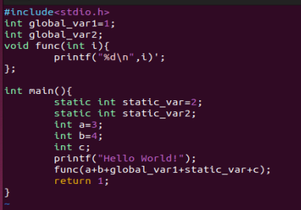

> 俞甲子等，《程序员的自我修养——链接、装载与库》，北京：电子工业出版社，2009年6月第2版。

不放过任何一个字节。

> 利用工具：gcc、readelf、objdump、size，cl
>
> strace ./run跟踪程序的运行

## objdump

```
 objdump -j .got -h add.so  看一下.got的段信息.
-s 将段的内容以16进制打印
-d 将所有包含指令的段反汇编
- h 展示区块头的信息
```

## gcc命令 

```
-E 预处理、
-S 编译、
-c 汇编、
-o 链接
```

## readelf

```
-hlS 
```


## 3.1 目标文件的格式

目标文件：源代码编译后但还未链接的那些中间文件（.o或者.obj）

静态链接库：把很多目标文件捆绑形成一个文件，再加上一些索引，可以简单理解为一个包含很多目标文件的文件包。


```
file xxx.so
x86_64,version 1(SYSV) 
```

表明该文件的兼容性，采用了Unix System V的格式规范，即COFF文件。

**注**：Unix最早的可执行文件格式为a.out，无法应对共享库等概念，所以设计了COFF来解决它。

COFF的贡献：目标文件里引入了段机制，不同文件可以有不同数量和不同类型的段(Section节或者Segment段)；定义了调试数据格式。


## 3.2为什么分段

指令和数据分段的好处：

1、给程序指令区域单独设置可读权限，防止程序被改写。

2、利用局部性原理提高缓存的命中率。现代CPU缓存也设计成数据缓存和指令缓存分离。

3、在内存中有多个程序副本时，通过**内存共享**，节省内存空间。只读数据（指令；图像、文本资源）可以共享；而每个副本进程的数据区域不一样，是进程私有的，属于Private Bytes。


如图所示，Win7的exploer.exe在运行中，此刻占据的总虚存为338 740KB，它的私有数据部分占了51 360 KB，即共享部分数据占了287 380KB，也就是280多MB的空间，极大的节省了内存空间。

## 3.3 段概述

ELF Header，描述整个文件的文件属性，包括文件是否可执行、是静态链接还是动态链接还是可执行文件（给出入口地址)、目标硬件和目标操作系统，还包括一个段表 Section Table：一个描述各个段在文件中偏移位置及段的属性的数组。
|                   |                                                              |
| ----------------- | ------------------------------------------------------------ |
| .bss              | 为节省存储空间，只记录**未初始化**数据预留的空间大小，而不存储其内容，因为其默认全部为0. |
| .data             | **初始化的**全局变量和局部静态变量                           |
| .text、.code      | 代码段                                                       |
| .rodata、.rodata1 | 只读数据段，比如字符串常量、全局const变量                    |
| .comment          | 存放编译器版本信息，比如字符串："GCC:(GNU) 4.2.0"            |
| .note             | 额外的编译器信息，程序公司名、发布版本号等                   |
| .debug            | 调试信息                                                     |
| .line             | 调试时的行号表，源代码行号与编译后指令的对应表               |
| .eh_frame         | 存储异常处理框架（Exception Handling Frame）的相关信息。包括异常处理函数的调用关系、异常处理函数的地址、堆栈展开信息等。 |
| SHT               | 表示 "Section Header Table                                   |


### 其他段 .got和.plt

| .dynamic    | 动态链接信息                                                 |
| ----------- | ------------------------------------------------------------ |
| .hash       | 符号哈希表                                                   |
| .strtab     | String Table，字符串表                                       |
| .symtab     | Symbol Table，符号表                                         |
| .shstrtab   | Section Header String table,段名表，集中管理段名称。不存储用户自定义的字符串，而是存储与 ELF 文件结构相关的字符串 |
| .plt\\.got  | (Procedure Linkage Table,过程链接表)，是动态链接的跳转表，用于延时加载；                       全局入口表 Global Offset Table |
| .init,.fini | 程序初始化与终结代码段                                       |

> .表示这些段名由系统保留，应用程序自定义段名不能加.，否则容易跟系统保留段名冲突。
>
> 一个elf文件中可以有多个.text的段。
>
> 一些已遗弃的段名：.sdata、.tdata、.sbss .lit4 .lit8 .reginfo .gptab .liblist .conflict

> [再看动态链接中的PLT和GOT - 读懂原理与细节](https://zhuanlan.zhihu.com/p/558522498)

### BSS段

Block Started by Symbol Table  ，最初是美航符号汇编程序（1950s）的一个伪指令，被IBM保留并引用到Fortran 汇编器，用于定义符号并且为该符号预留给定数量的未初始化内存空间。

因为bss段没有内容，所以它在文件中不占据空间；但是，程序运行时，要占内存空间。




借助size命令，查看代码段和数据段长度。


借助objdump查看各段基本信息，`-x`查看详细信息。


```
VMA Virtual Memory Address 运行地址，PC指针所指，程序真正运行的地址空间
LMA Load Memory Address 加载地址，程序实际存储的地址空间，大部分时候LMA=VMA。
```


解释：一个初始化的全局变量+一个初始化的局部静态变量，所以.data的Size为8；同理，.bss大小为8；因为两个printf里共有13+4共17个字符（每个字符串尾还有一个\0），所以这里的rodata大小为0x11.

各个段属性的第二行中，CONTENTS表示该段在文件中存在，可以看到BSS段没有CONTENTS，它在ELF文件中不存在内容。

### 测试

```
static int x1=0;//则x1应该放入.bss段里，因为未初始化的值就是0，放入.bss可以节省空间。
```


## 3.5 链接的接口-符号

链接如同拼积木，目标文件B引用A中定义的函数和变量，需要其具备独特的名字。

链接过程中，我们将**函数和变量**称为符号；其名称称为符号名。


