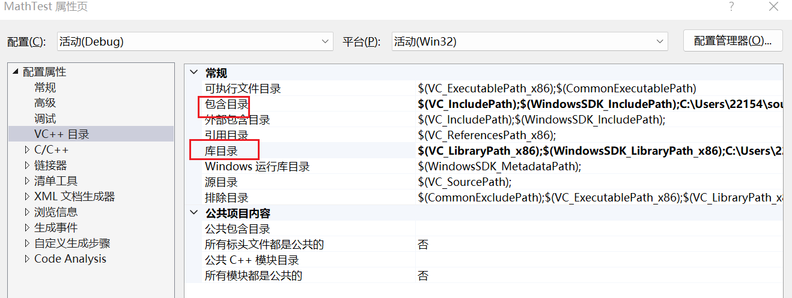

## DLL 模块

- .dll
- .ocx, （Ole Control Extension） ，OCX控件，新的应用程序基本不再使用。
- .cpl,控制面板程序 ，双击即可启动。

微软的补丁，通常是待更新的dll积累到一定程度后的一个Service Packs软件更新包。

ELF的动态链接可以运行时加载，Win下用这种技术用得更多，例如ActiveX。

Win32以后，进程有独立的地址空间，一个dll文件在不同的经常内部拥有不同的私有数据副本。

**ELF的代码段是地址无关的，而DLL的代码并不是地址无关。**

### DLL共享利用点：

DLL共享数据段实现进程间通信，此时，dll中往往有两个数据段，一个是把共享的数据单独拿出来作为一个段的进程间共享数据段，另一个私有。

GUEST权限的用户可以通过修改DLL里的共享数据，影响到其他使用该 DLL文件的进程。因此，DLL共享数据段实现进程间通信应该尽量避免。

## Dll开发

```C++
//防止C++编译器进行符号修饰
// dllmain.cpp : 定义 DLL 应用程序的入口点。
#include "pch.h"

BOOL APIENTRY DllMain( HMODULE hModule,
                       DWORD  ul_reason_for_call,
                       LPVOID lpReserved
                     )
{
    switch (ul_reason_for_call)
    {
    case DLL_PROCESS_ATTACH:
    case DLL_THREAD_ATTACH:
    case DLL_THREAD_DETACH:
    case DLL_PROCESS_DETACH:
        break;
    }
    return TRUE;
}

extern "C" __declspec(dllexport) double Add(double a, double b)
{
    return a + b;
}

// 减法函数
extern "C" __declspec(dllexport) double Subtract(double a, double b)
{
    return a - b;
}

// 乘法函数
extern "C" __declspec(dllexport) double Multiply(double a, double b)
{
    return a * b;
}
```

```
>dumpbin /EXPORTS Dll1.dll

    ordinal hint RVA      name

          1    0 000110A0 Add
          2    1 00011271 Multiply
          3    2 000111C7 Subtract
```

​	.lib文件是一组目标文件的集合。

````
//加载静态链接库
#pragma comment(lib,"../Debug/libMathFunctions.lib")
````

## 加载动态链接库

>https://www.cnblogs.com/houkai/archive/2013/06/05/3119513.html

### 隐式链接

1.2. 修改包含目录(.h所在文件)和库目录(.lib所在目录)



3.项目->属性->配置属性->链接器->输入-> 在“附加依赖项”里添加“testdll.lib”（

若有多个 lib 则以空格隔开） 

```c++
#include <iostream>
#include <windows.h>

// 函数原型（导入DLL中的函数）
extern "C" __declspec(dllimport) double Add(double a, double b);
extern "C" __declspec(dllimport) double Subtract(double a, double b);
extern "C" __declspec(dllimport) double Multiply(double a, double b);

int main() {
    double x = 10;
    double y = 5;

    // 调用DLL中的加法函数
    double sum = Add(x, y);
    std::cout << x << " + " << y << " = " << sum << std::endl;

    // 调用DLL中的减法函数
    double difference = Subtract(x, y);
    std::cout << x << " - " << y << " = " << difference << std::endl;

    // 调用DLL中的乘法函数
    double product = Multiply(x, y);
    std::cout << x << " * " << y << " = " << product << std::endl;

    return 0;
}

```

Ctrl+F7编译通过，但是程序运行就报错，

还需要将testdll.dll复制到当前项目生成的可执行文件所在的目录。 

### 显示链接

 项目菜单——项目属性——配置属性——常规——高级——字符集，将使用Unicode字符集改为未设置即可。 

```c++
#include <iostream>
#include <windows.h>
using namespace std;
int main()
{
    typedef double (*pAdd)(double a, double b);
    typedef double (*pSubtract)(double a, double b);

    HMODULE hDLL = LoadLibrary("Dll1.dll"); //加载dll文件，需要把dll拷贝到当前目录 
    if (hDLL != NULL)
    {
        pAdd fp1 = pAdd(GetProcAddress(hDLL, MAKEINTRESOURCE(1))); //得到dll中的第一个函数
        if (fp1 != NULL)
        {
            cout << fp1(2.5, 5.5) << endl;
        }
        else
        {
            cout << "Cannot Find Function " << "add" << endl;
        }
        pSubtract fp2 = pSubtract(GetProcAddress(hDLL, "Subtract")); //使用了externC，所以不用考虑C++修饰符
        if (fp2 != NULL)
        {
            cout << fp2(5.5, 2.5) << endl;
        }
        else
        {
            cout << "Cannot Find Function " << "Subtract" << endl;
        }
        FreeLibrary(hDLL);
    }
    else
    {
        std::cout << "Cannot Find " << "Dll1.dll" << std::endl;
    }
    return 1;
}
```

