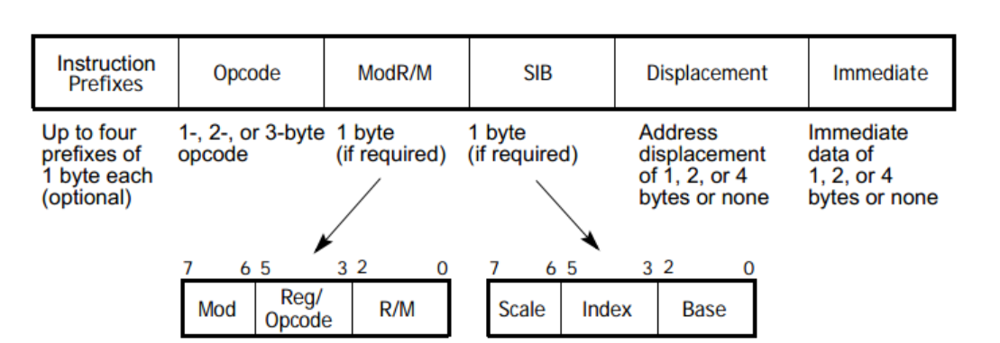
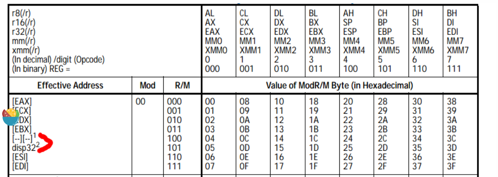

>https://www.kanxue.com/chm.htm?id=13855&pid=node1000002

## 指令集

- MIPS  长度固定的指令，是RISC，处理器通过硬连线实现 

- x86(IA-32)，长度变化，用CISC的指令集，CISC的处理器需要用微指令配合运行。但是当下Intel实际处理器的结构都已经变成了risc结构了，risc的结构实现流水线等特性比较容易。 


 cisc的寄存器数量较少，指令能够实现一些比较特殊的功能，例如Win32汇编语言对应的8086的一些寄存器： AX-DX，CS、DS、ES、SS。

GNU编译的elf文件对应到RISC的寄存器，会有很多通用寄存器。


 虚拟模式需要使用一些特殊的寄存器、为了支持分页需要使用页表寄存器等，为了加速内存的访问需要使用TLB，加速数据和指令的访问而使用data cache和instruction cache等 

> jmp $是为了让程序停在这一行，防止程序跑飞（跑飞的程序危害很大！有可能把数据当代码或者把代码当数据！）

### 仿真工具

 用synplify综合的电路，然后用debussy+modelsim仿真 

## IA-32的指令格式



前缀部分可选，分为四个group。

 操作数前缀用于设置 锁总线和重复前缀 、段重写和分支预测、操作数宽度、地址宽度。

### Opcode

1. x86的opcode最短是1个字节，最长是3个字节。 

2. x86对于源操作数和目的操作数是暗含在opcode里面的。 

```
88 11 BL(011) CL(001)     88 D9 MOV CL, BL               MR   
8A 11 011 001             8A D9 MOV BL(011),CL(001)      R<--M
```

3. 二字节通用opcode是0fh+一字节的编码；但是二字节的SIMD opcode是三字节长度，即一个强制前缀+0fh+一字节的操作码。 

4. 同样的，三字节的通用opcode，是0fh+二字节的编码。SIMD opcode格式是强制前缀+0FH+二字节编码。 

 5.个别的SIMD指令不需要强制前缀来引导，比如addps(0FH+58H) 

>  `addps`指令中，`ps`代表"packed single-precision floating-point" 。
>
> XMM （eXtended MultiMedia ） 寄存器是SSE（Streaming SIMD Extensions）指令集中的一种寄存器。
>
> 它可以同时存储4个单精度浮点数，每个数占用32位，总共128位。
>
> 对应的，MM寄存器是64位的。
>
> `addps`指令将分别对应位置上的单精度浮点数相加，并将结果存储回目标XMM寄存器中。 

```asm
0F 58 01  addps xmm0,xmmword ptr[ecx] //从内存位置ecx处取128位单精度浮点数值加到xmm0 寄存器中的128位单精度浮点数上
```

### Mod R/M

切分为3个位域，233.

 mod:提供寻址模式，11=寄存器寻址 其余都是内存寻址
 reg/opcode：  
  两种作用，第一种是提供寄存器寻址；另一种为某些opcode提供补充说明。
 R/M：
  结合MOD位域，提供内存/寄存器寻址。 

 R/M=100& MOD≠11 作为SIB的转义码 。

例如，

```
编码mov eax(000)，ebx(011)
89H       11        011    000  89 D8                MR
8BH       11        000    011  8B C3                RM
//x86把源和目的操作数隐藏在opcode里面
```



###  SIB

 同modr/m类似，SIB字节也是采用233切分成三个位域，名字分别叫Scale、Index、Base。SIB的名字也来自这三个位域名字的首字母缩写。
 SIB字节由 R/M=100& MOD≠11 引导出来。
1.SIB确定的寻址方式是[base+Index* Scale +disp]， 

> esp作为index时候，index自动被忽略,即此时scale因子视为0 ， 寻址计算方法是[base+disp] 

2.disp意思是后面尾随的若干个displacement字节。 

```
mov eax，[0x1]可以编码为以下形式：
a）采用moffs32编码
   opcode moffs32
   A1    01 00 00 00
   A1    40H
b）采用MODR/M引导的disp
  opcode   mod   reg   r/m  displacement
  8B       00    000   101  01 00 00 00H
  8B       05H              01 00 00 00H
c）采用SIB引导的disp
  opcode   mod   reg   r/m  scale    index  base   displacement
  8B       00    000   100    01     100    101  01 00 00 00H
  8B       04H                65H                01 00 00 00H
```

