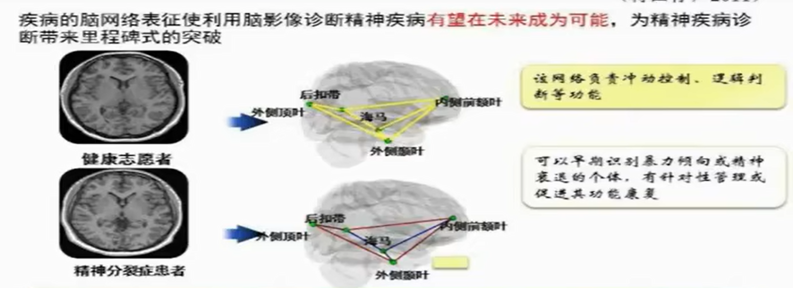

> 课程链接：北大 钱铭怡教授 [变态心理学](https://www.bilibili.com/video/BV1ZK41167vh)

## 一.课程内容

Abnormal Psychology异常心理发生、发展变化的规律和原因。

- 描述：异常表现、与正常现象的区别、障碍、预后
- 原因：考察生物、心理、社会方面的因素
- 治疗：途径及效果等  （心理咨询、心理治疗、临床心理学课程里重点介绍；神经解剖：神经系统疾病）

心理障碍继续加重、时间长了会变成精神病。（错，例如强迫症，需要看此人的症状表现是其他病比如分裂症的前期表现，还是仅仅为强迫症）

### 几个概念：

- 神经病(neuropathy)：神经系统出现障碍时表现出的疾病。例如：脊髓出现问题
- 精神/心理障碍(mental disorders)：精神分裂、心境障碍、神经症、焦虑障碍、人格障碍、社交障碍等。
- 精神病(psychosis)：患者的心理功能严重受损，自知力（例如幻听却不自知）缺失，不能应付日常生活要求并保持与现实 的接触的一组情况。例如精神分裂症。
- psychological disorders心理障碍:偏重于说明重 性精神病、器质性精神障碍以外的那些更多地由心理原因所致的障碍

2009年，Phillips的调查就显示，中国成年人群精神障碍总现患率为17.5%；女性、40岁以上在心境障碍和焦虑障碍上都更严重；物质滥用尤其是酒依赖上，男性超过女性，农村超过城市。

>2012年，《中华人民共和国精神卫生法》通过。

### 正常和异常的判断

1.患者自身认识，研究者主观判断；
2.社会文化传统；
3.心理测量学，以统计的视角判断离群情况，一般重点关注分布的两端；
4.病因和症状存在与否，现象学的标准（无法通过化验等精准手段判断）

<!-- more -->

### 《中国精神障碍分类与诊断标准第3版(*CCMD*-3)》 里的四项标准

症状标准、

严重标准（干扰到正常生活）、

病程标准(得病时间是否达到标准)、

排除标准（排除他病才能确定某种疾病）

>流浪儿童被拐卖，训练手快，在油锅里面捞肥皂。

### 美国多轴诊断体系

DSM-5   Diagnostic and Statistical Manual of Mental Disorders 

五轴：1.临床障碍；2.人格障碍和精神发育迟滞；3.一般医学状况；4.心理和环境问题；5.功能的总体评估

> ICD-10 世界卫生组织的诊断标准

### 历史

18-19世纪，西方的行为分析、催眠等治疗方式出现

中国和欧洲，都有驱魔方式治疗精神病的传统。

成书于公元前3世纪到公元3世纪的中医典籍《内经》（分为《素问》和《灵柩》）中集中了名医对异常行为的记载和论述：狂躁、 谵妄 、癫疾。

---

## 二.心理异常的理论模型

Kraepelin的精神病学分类方法提供了分类依据和标准。 

###  2.1生物学角度

遗传对精神疾病的作用比较显著，精神分裂症的子女和孙子女的患病率明显提高。

 神经递质、去甲肾上腺素

大脑的前额叶和情绪调节； 

### 下丘脑和边缘系统

下丘脑控制饥、渴和性方面的欲望，调节体温和参与情感唤醒状态。

边缘系统，联同下丘脑，控制着如交配，战斗和体验快乐这类行为。

杏仁核是边缘系统的一部分，参与情感的反应，包括正性反应，如热恋的反应，和复性反应，如战斗或逃跑。

海马作为边缘系统的一部分，同时控制**情绪和记忆**，所以情感强烈的经验（情感冲击大的条件反射一下子就能形成）更能记住。
>左侧颞顶连合区的功能主要是区分自我与他人研究者推测，精神分裂症患者颞顶皮层过度活动会导致他们感觉到有人在做某个动作。

### 2.2心理学角度

心理动力学，弗洛伊德。

自我：看看现实是否允许。自我作为（被本我、超我、现实）夹在中间的个体很累。

超我：

### 性心理的不同发展阶段:

| 口欲阶段   | 快感来源:口腔活动           | (0-I岁左右)   |
| ---------- | --------------------------- | ------------- |
| 肛欲阶段   | 快感来源:忍受与排便         | (1-3岁左右)   |
| 性器欲阶段 | 快感来源:对双亲的爱恋或嫉妒 | (3-6岁左右)   |
| 潜伏期阶段 | 快感来源:对外部世界的兴趣   | (6-12岁左右)  |
| 青春期阶段 | 快感来源:对异性的兴趣       | (12-18岁左右) |

无意识中本我想做的事情，超我、现实的压抑，这些需求被自我妥协地表现出来。

## 三.心理障碍与自杀

psychotic disease 要先做药物治疗，再做心理治疗、

Affect Disorder==Mood Disorder 心境障碍(情感性精神障碍)

### 关键词：

Depression 抑郁，兴趣减退，睡眠问题，

Dysthymia 恶劣心境(超过2年)，总是不开心

Mania：躁狂，多有 热情、冲动鲁莽的行为

Hypomania: 轻度躁狂，工作中可能会很高产，情绪很high。但

Manic-depression 躁狂-抑郁：high的情绪burnout，陷入到Depression和躁狂的循环中。

Cyclothymia 环性心境障碍

## 四.精神分裂症

不管是什么原因导致的，最后大脑皮层都会发生器质性或者功能性的病变（神经科学）。

而由于皮层（管理认知）功能的多样性，精神分裂症的症状也各有不同。

> 幻听：颞叶；
>
> 幻视：
>
> 幻嗅
>
> 情绪由皮层下管理。  

