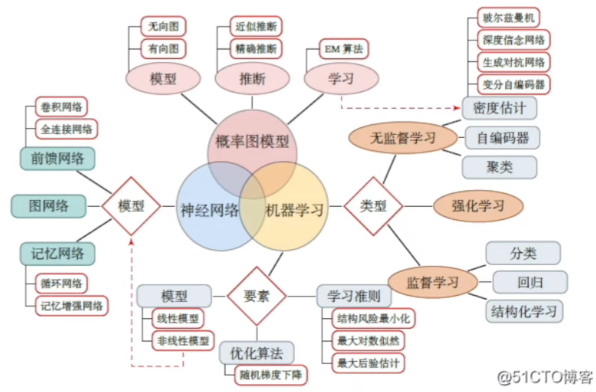

```
Hello，Professors! I'm very glad to be here for interview.I'm PaulC from Gansu Province.Last year I Graduated from Beiguan University， my major is xxx.

During my bachelor period，I'm very interested in many major courses especially practical ones，like Vulnerability Exploitation, Penetration Test Fundamentals and Malware Analysis，from where I learned many useful practical skills to exploit vulnerabilities ,detect and analyse computer viruses.

I am an optimistic person,likeing to try new things.During my bachelor period，I'm interested in Cyber security,AI and BlockChain.So I attended a ctf team called xxx ,played a lot of ctf games，did two projects on topics related to machine learning and blockchain respectively.

In my daily life,I Like making friends with different people,traveling around the country.In my spare time,I read books.Books can really give me a chance to experience different life.It feels good.

I also have some cons. For example, three minutes of heat, I will be affected easily by the environment,and that's why I really want to attend your group,a place full of academic atmosphere.

In the process of preparing for the re-examination, I have been doing  an internship mainly about using machine learing methods to assure cloud hosting security.

That's all.Thank you for your time.
```

硕士论文：自己尝试解题/提出一个好问题。

在Reseach Interest上待足够久的时间

一张解释AI各种专业名词关系的好图：


