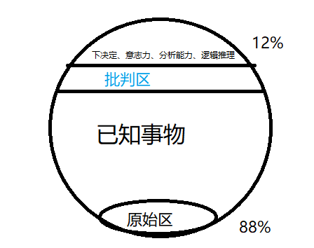

意义：更好地了解自己，了解他人。

## 方法论

在对方没有察觉到的情况下，不断地**重复**或者**强调**话语、画面，声音、色彩、手部动作都可以作为暗示。

> 暗示要被对方的感官所觉察到，声色味触觉都可；

观察——推断——质疑——再观察。

观察一个人：行为模式+思维模式+情绪模式。

从小物件的观察出发，锻炼自己回忆细节，对其整体和局部的记忆能力，记住事实而非推论。

### 如何与潜意识沟通？

**有意识**地去**做**，**强化**它，让它成为**习惯**、**本能**，进而再次转化为**潜意识**的状态。

在迷糊(困倦、醉酒)的时候，重复给自己暗示。

### 观察人的什么？

表情、鼻子朝向、眼球运动方式；

微表情、微反应。

习惯性动作；

语言用词（口头、书面）；

配饰、房子布置；

朋友圈、昵称头像。

##  理论

心理结构分为  意识、前意识和潜意识。

**否认**：抵御由外界所引发的内心焦虑而产生的一种“心理防御”机制，人在否认时常常处于“无意识(下意识)状态”。

人的动物性/原始心智：在面对危险时，战斗或者逃跑。

催眠的原理指通过信息**过载**产生，使**批判区的抑制功能失调**，触发原始区战斗逃跑的反应机制，进入高暗示感受性状态，从而打开潜意识的绿色通道。 

人类有一对植物神经包括交感神经和副交感神经，当我们交感神经持续兴奋的时候就会紧张并触发战斗反应，从而产生焦虑。反之，如果是副交感神经系统持续兴奋就会触发副交感神经系统兴奋，这样就会产生抑郁。

人在对未来充满不确定性，接收大量无法即时处理的信息时，容易陷入焦虑状态。在高度的焦虑状态下，潜意识会自动接替意识功能。例如：在焦虑状态下的人会觉得六神无主、慌乱、不知所措，自己的举动不受自己掌控。

人喜欢 控制感、存在感、安全感以及认同感。例如：  qq空间的点赞让我获得的是一种认同感。